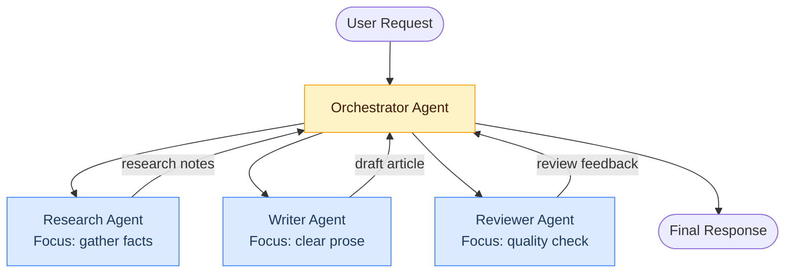

# Concepts: Multi-Agent Systems

## The Problem

A single agent trying to do everything becomes unwieldy. Consider building a research report:

- **Research** requires knowing how to gather, filter, and structure raw information
- **Writing** requires a different voice, tone, and focus on readability
- **Review** requires a critical eye and checklist-driven thinking

If you stuff all of this into one system prompt, the agent is torn between competing instructions. It tries to be a researcher, a writer, and a reviewer at the same time — and does each poorly.

**Specialization is the solution.** Separate agents with focused system prompts outperform a single generalist agent on complex, multi-phase tasks.

---

## The Intuition: The Product Team

Think of how a product team works:

| Role | Responsibility |
|------|---------------|
| PM (Orchestrator) | Breaks work into tasks, routes them, assembles results |
| Designer (Specialist) | Handles all design work — doesn't touch code |
| Engineer (Specialist) | Handles all implementation — doesn't design UI |
| QA (Specialist) | Reviews and tests — doesn't write features |

The PM doesn't do the work directly. They coordinate. Each specialist has a narrow, deep focus. The PM assembles their outputs into a coherent whole.

**Your orchestrator agent is the PM. Your specialist agents are the team.**

---

## How It Works

### 1. Orchestrator-Worker Pattern

The most common multi-agent architecture:

- **Orchestrator**: receives the user request, breaks it into sub-tasks, routes each to the appropriate worker, assembles the final result
- **Workers**: specialized agents with narrow system prompts; they receive a task and return a result

The orchestrator never executes tasks directly — it delegates. Workers never communicate with the user directly — they only receive task inputs and return outputs.

### 2. Peer-to-Peer Communication

Agents communicate directly with each other, without a central orchestrator. More flexible, but harder to reason about. Useful for simulations and debate-style systems (e.g., two agents arguing different positions).

### 3. Shared State / Blackboard

All agents read from and write to a shared context dictionary. The orchestrator writes the task; workers write their results. Later agents read earlier agents' outputs.

```python
state = {
    "goal": "Research and write about EV adoption",
    "research": None,   # filled by ResearchAgent
    "draft": None,      # filled by WriterAgent
    "review": None,     # filled by ReviewAgent
}
```

### 4. Message Passing

Structured messages are passed between agents. Each message has a `from`, `to`, `type`, and `payload`. More explicit than shared state, easier to debug, but requires more boilerplate.

### 5. Parallelism

Independent agents can run concurrently with `ThreadPoolExecutor` or `asyncio`. For example, a research agent gathering data from three sources can run all three at once:

```python
from concurrent.futures import ThreadPoolExecutor

with ThreadPoolExecutor(max_workers=3) as pool:
    futures = [pool.submit(agent.run, task) for agent, task in agent_tasks]
    results = [f.result() for f in futures]
```

This reduces end-to-end latency significantly for I/O-bound tasks.

---

## Architecture Diagram



---

## Key Terms

| Term | Definition |
|------|-----------|
| **Orchestrator** | The agent that coordinates task routing and assembles final output |
| **Worker / Specialist** | An agent with a narrow, focused system prompt for a specific type of task |
| **Multi-agent system** | A system with two or more collaborating LLM agents |
| **Shared state** | A mutable context dict that all agents read from and write to |
| **Message passing** | Structured communication between agents with explicit sender, receiver, and payload |
| **Specialization** | Giving each agent a focused role so it performs that role better than a generalist |
| **Parallelism** | Running independent agents concurrently to reduce latency |

---

## When Multi-Agent Beats Single-Agent

| Use case | Why multi-agent wins |
|----------|---------------------|
| Research → Write → Review | Each phase needs a different "mode" of thinking |
| Data from multiple independent sources | Sources can be fetched in parallel |
| Long pipelines with more than ~5 steps | System prompt for a single agent becomes too complex |
| Quality assurance on LLM output | A second agent reviewing the first catches more errors |

## When Single-Agent Is Better

| Use case | Why single-agent wins |
|----------|----------------------|
| Simple one-phase tasks | Coordination overhead outweighs any benefit |
| Tight latency budget | Each agent hop adds latency |
| Strong dependencies between all steps | Parallel execution is not possible anyway |

---

## Interview Angle

**"When would you use a multi-agent system vs a single agent?"**

The key trade-off is **specialization vs coordination overhead**. Multi-agent wins when:
1. Different phases of the task require fundamentally different reasoning styles
2. Some tasks can run in parallel (reducing latency)
3. A second agent reviewing the first's output catches errors a self-review misses

Single-agent wins when the task is simple, the latency budget is tight, or all steps are tightly sequential with no parallelism opportunity.

In production, start with a single agent. Add specialists only when you observe clear quality degradation at a specific phase or when latency is unacceptable for I/O-bound work.

---

## Common Mistakes

| Mistake | What Goes Wrong | Fix |
|---------|----------------|-----|
| Agents with overlapping responsibilities | Two agents both try to write the final draft; outputs conflict | Define strict, non-overlapping role boundaries in each system prompt |
| No coordination mechanism | Agents produce independent outputs that don't compose | Use shared state or explicit message passing; the orchestrator assembles results |
| Shared mutable state without locks | Parallel agents race on the same dict key | Use thread-safe structures or immutable pass-by-value for concurrent agents |
| Orchestrator does the work itself | Defeats the purpose; a single agent would be simpler | Orchestrator only routes and assembles; workers execute |

---

Next: [Patterns — Multi-Agent Systems](./patterns.mdx)
