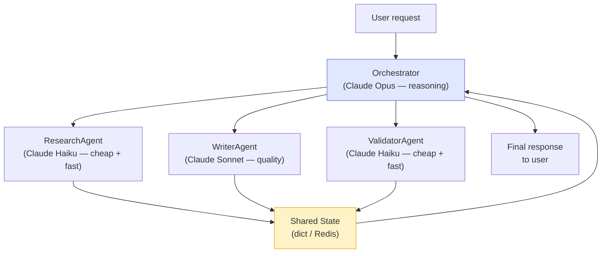

# Patterns: Multi-Agent Systems

---

## Pattern 1: Orchestrator-Worker with Roles

The simplest and most common pattern. Each agent has a distinct role encoded in its system prompt. The orchestrator calls them in sequence.

```python
from utils import get_anthropic_client

client = get_anthropic_client()
MODEL = "claude-3-haiku-20240307"

class BaseAgent:
    def __init__(self, name: str, system_prompt: str):
        self.name = name
        self.system_prompt = system_prompt

    def run(self, task: str) -> str:
        response = client.messages.create(
            model=MODEL,
            max_tokens=512,
            system=self.system_prompt,
            messages=[{"role": "user", "content": task}]
        )
        return response.content[0].text

class ResearchAgent(BaseAgent):
    def __init__(self):
        super().__init__(
            name="Researcher",
            system_prompt=(
                "You are a research assistant. When given a topic, "
                "provide the key facts and data points in bullet form."
            )
        )

class WriterAgent(BaseAgent):
    def __init__(self):
        super().__init__(
            name="Writer",
            system_prompt=(
                "You are a professional writer. "
                "Turn research notes into a clear, concise paragraph."
            )
        )

class Orchestrator:
    def __init__(self):
        self.researcher = ResearchAgent()
        self.writer = WriterAgent()

    def run(self, topic: str) -> dict:
        research = self.researcher.run(f"Research: {topic}")
        article = self.writer.run(
            f"Write a paragraph based on these notes:\n{research}"
        )
        return {"topic": topic, "research": research, "article": article}

# Usage
orch = Orchestrator()
result = orch.run("The history of Python")
print(result["article"])
```

**When to use:** Any pipeline with clear sequential phases where each phase needs a different reasoning style.

---

## Pattern 2: Shared State Dictionary

All agents read from and write to a shared state dict. The orchestrator initialises the state; workers populate their section.

```python
from typing import Optional

def research_agent(state: dict) -> dict:
    """Reads state["goal"], writes state["research"]."""
    topic = state["goal"]
    response = client.messages.create(
        model=MODEL,
        max_tokens=512,
        system="You are a research assistant. Return bullet-point facts.",
        messages=[{"role": "user", "content": f"Research: {topic}"}]
    )
    state["research"] = response.content[0].text
    return state

def writer_agent(state: dict) -> dict:
    """Reads state["research"], writes state["article"]."""
    notes = state.get("research", "")
    response = client.messages.create(
        model=MODEL,
        max_tokens=512,
        system="You are a professional writer. Write clear prose.",
        messages=[{"role": "user", "content": f"Write based on:\n{notes}"}]
    )
    state["article"] = response.content[0].text
    return state

def reviewer_agent(state: dict) -> dict:
    """Reads state["article"], writes state["review"]."""
    draft = state.get("article", "")
    response = client.messages.create(
        model=MODEL,
        max_tokens=256,
        system="You are an editor. Review for clarity and accuracy.",
        messages=[{"role": "user", "content": f"Review this:\n{draft}"}]
    )
    state["review"] = response.content[0].text
    return state

def run_pipeline(goal: str) -> dict:
    state = {"goal": goal, "research": None, "article": None, "review": None}
    state = research_agent(state)
    state = writer_agent(state)
    state = reviewer_agent(state)
    return state

result = run_pipeline("Benefits of renewable energy")
print(result["review"])
```

**When to use:** Pipelines with 3+ agents where each agent needs to reference earlier outputs without explicit argument passing.

---

## Pattern 3: Parallel Agent Execution

Independent agents run concurrently using `ThreadPoolExecutor`. Results are collected when all finish.

```python
from concurrent.futures import ThreadPoolExecutor, as_completed

class SourceAgent(BaseAgent):
    def __init__(self, source_name: str):
        super().__init__(
            name=f"Source-{source_name}",
            system_prompt=f"You are analyzing data from {source_name}. Summarise the key points."
        )

def run_agents_parallel(topic: str, sources: list[str]) -> dict[str, str]:
    """Run one agent per source in parallel, return {source: summary}."""
    agents = {source: SourceAgent(source) for source in sources}
    results: dict[str, str] = {}

    with ThreadPoolExecutor(max_workers=len(sources)) as pool:
        future_to_source = {
            pool.submit(agent.run, f"Analyse {topic} from perspective of {source}"): source
            for source, agent in agents.items()
        }
        for future in as_completed(future_to_source):
            source = future_to_source[future]
            try:
                results[source] = future.result()
            except Exception as e:
                results[source] = f"ERROR: {e}"

    return results

summaries = run_agents_parallel(
    topic="AI regulation",
    sources=["EU perspective", "US perspective", "Industry perspective"]
)
for source, summary in summaries.items():
    print(f"\n=== {source} ===\n{summary[:200]}")
```

**When to use:** Gathering independent data from multiple sources, running the same task against multiple inputs, or any embarrassingly parallel workload.

---

## Anti-Patterns

| Anti-pattern | What Goes Wrong | Fix |
|--------------|----------------|-----|
| **Overlapping responsibilities** | ResearchAgent and WriterAgent both write prose. Their outputs conflict and the orchestrator can't combine them. | Give each agent a single, non-overlapping responsibility. Document role boundaries clearly in system prompts. |
| **No coordination mechanism** | Two agents produce outputs independently. There's no way to combine them. | Shared state dict or explicit message passing. The orchestrator is responsible for assembly. |
| **Shared mutable state in parallel agents** | Two agents race to write `state["output"]` at the same time. One overwrites the other. | Use separate keys per agent (`state["research"]`, `state["article"]`) or use thread-safe `queue.Queue`. |
| **Orchestrator executes tasks directly** | The orchestrator both routes and does the work. It becomes a monolithic agent again. | Orchestrator = coordinator only. All execution stays in workers. |
| **Unbounded worker count** | 100 parallel agents hit the API rate limit, producing cascading failures. | Cap `max_workers` at a reasonable concurrency limit (e.g., 5-10). Add retry logic with exponential backoff. |

---

## Where This Fits in Production

Multi-agent systems show up in every serious AI product that handles complex, multi-step tasks. The pattern is always some variation of:



**Model selection by agent role** — the biggest cost lever in multi-agent systems:

| Role | Recommended model | Why |
|------|------------------|-----|
| Orchestrator (planning, routing) | Claude Sonnet / Opus | Needs strong reasoning to make routing decisions |
| Research / retrieval | Claude Haiku | High volume, speed matters, low reasoning load |
| Content generation | Claude Sonnet | Quality output, moderate cost |
| Validation / QA | Claude Haiku | Structured yes/no checks; cheap at scale |

A 5-step pipeline using Haiku workers + Sonnet orchestrator costs ~5× less than running Sonnet everywhere.

**Failure budget:** with 5 agents each at 99% reliability, the system-level reliability is 0.99⁵ = 95%. Design for partial failures: agents that fail should return structured error objects, not raise exceptions that crash the orchestrator.

**Where to go next:** Ch27 (Agent Handoff) covers the inter-agent communication protocol; Ch35 (Tracing) shows how to trace execution across agent boundaries; Ch46 (AI Gateway) centralises model selection and retry logic.
