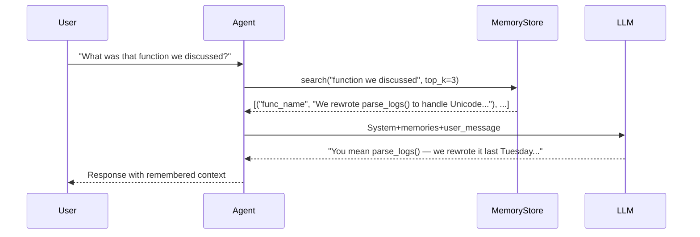
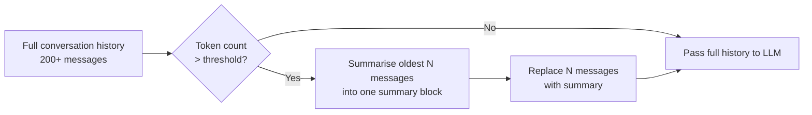

# Concepts: Agent Memory

## The Problem

Every conversation your agent has starts completely fresh. Ask it about your preferences today and it answers from scratch. Come back tomorrow and it has forgotten everything — your name, what you were working on, what it learned about your codebase. The agent is brilliant but amnesiac.

Real assistants remember. A good personal assistant recalls that you prefer concise answers, that you were debugging a race condition last week, and that you never want code examples in Java. Without memory, your agent cannot build any of that context.

---

## The Intuition

<div className="concept-intuition">

Human memory is not one thing — it is a collection of systems working together. Agents need the same layered approach.

Your **working memory** holds what you are thinking about right now — the seven or so items you can hold in mind simultaneously. Your **episodic memory** stores experiences ("I had a meeting with Alice last Tuesday"). Your **semantic memory** holds facts and knowledge ("Paris is the capital of France"). Your **procedural memory** stores skills ("how to ride a bike").

Each type has a direct analogue in agent design. Working memory maps to the conversation context window. Episodic memory maps to conversation logs. Semantic memory maps to a retrieval store of embedded facts. Procedural memory maps to the agent's available tools and system prompt instructions.

The key insight: not all memories need to be in the context window at once. A well-designed memory system retrieves only what is relevant for the current query — just like you do not consciously recall everything you know before answering a question.

</div>

---

## How It Works

### 1. In-Context Memory — The Messages Array

The simplest form of memory is the conversation history already in the `messages` list. Everything the user has said and everything the agent has replied is visible to the model.

**The catch:** context windows have limits. GPT-4o has a 128k token limit; Claude 3 Haiku has 200k. A long conversation will eventually exceed the limit, causing either an error or truncation of the oldest messages. In-context memory is also ephemeral — it vanishes when the process exits.

```python
messages = [
    {"role": "user", "content": "My name is Alice."},
    {"role": "assistant", "content": "Nice to meet you, Alice."},
    {"role": "user", "content": "What's my name?"},
    # The model can see the full history and answer "Alice"
]
```

**Suitable for:** single sessions, short conversations, when you do not need cross-session memory.

---

### 2. External Short-Term Memory — Redis / Dict

A key-value store that survives the current session but is not permanent. A Python dict in a shared process, Redis, or a session store.

```python
# Simple in-process key-value memory
session_memory = {}
session_memory["user_name"] = "Alice"
session_memory["preferred_language"] = "Python"

# Later in the same process
name = session_memory.get("user_name")  # "Alice"
```

**Suitable for:** multi-turn conversations within a session, storing user preferences per session.

---

### 3. External Long-Term Memory — Database / File

Facts that must survive restarts. A JSON file, SQLite database, or any persistent store. The agent writes memories explicitly and loads them on startup.

```python
import json

def save_memory(path: str, key: str, value: str):
    store = load_all(path)
    store[key] = value
    with open(path, "w") as f:
        json.dump(store, f)

def load_all(path: str) -> dict:
    try:
        with open(path) as f:
            return json.load(f)
    except FileNotFoundError:
        return {}
```

**Suitable for:** user preferences, learned facts about a project, anything that must persist across agent restarts.

---

### 4. Semantic Memory with RAG

A vector store of embedded memories. Instead of exact key lookups, the agent searches for the most relevant memories given the current query. This scales to thousands of memories without polluting the context window.



**Suitable for:** agents with many accumulated memories, long-running personal assistants, knowledge that grows over time.

---

### 5. Memory Consolidation — Avoiding Context Overflow

Long conversation histories grow without bound. Consolidation compresses old memories:

- **Summarisation:** replace a block of old messages with a summary
- **Pruning:** drop memories older than N days, or below a relevance threshold
- **Tiered storage:** keep recent memories in-context, archive older ones to the retrieval store



Without consolidation, every long-running agent eventually hits the context limit. Consolidation is the maintenance task that keeps your agent healthy.

---

## Key Terms

| Term | Definition |
|------|------------|
| **Short-term memory** | In-context or session-scoped memory that does not persist across process restarts |
| **Long-term memory** | Persistent storage (file, database) that survives restarts |
| **Semantic memory** | Facts and knowledge stored as embeddings, retrieved by similarity |
| **Episodic memory** | Logs of past conversations or events, retrieved by recency or relevance |
| **Memory retrieval** | The process of finding relevant memories for a given query |
| **Context window limit** | The maximum number of tokens a model can process in a single call |
| **Consolidation** | Summarising or pruning old memories to stay within context limits |

---

## The Interview Angle

<div className="interview-angle">

**"How would you give an agent persistent memory?"**

There are four layers to the answer:

1. **In-context:** put recent history directly in the messages array — simplest, but limited by context window size
2. **Key-value store:** save named facts (user preferences, project metadata) to a persistent dict or Redis — good for structured data
3. **Semantic retrieval:** embed all memories and retrieve the most relevant ones at query time using cosine similarity — scales to thousands of memories
4. **Consolidation:** periodically summarise old messages to prevent context overflow

The right choice depends on volume: a small personal assistant might only need a JSON file; a production assistant with years of history needs the full semantic memory stack with consolidation.

</div>

---

## Common Mistakes

<div className="antipattern">

**Injecting all memories into every prompt** — Loading 500 memories into the system prompt on every call is expensive, slow, and adds noise. Retrieve only the top-k relevant memories using semantic search.

**Never persisting anything** — In-context memory disappears when the process exits. Any fact that should survive a restart must be written to external storage explicitly.

**Growing memory without pruning** — A memory store with no deletion strategy becomes a liability. Old, outdated memories can mislead the agent. Build in a TTL or summarisation step from the start.

</div>
