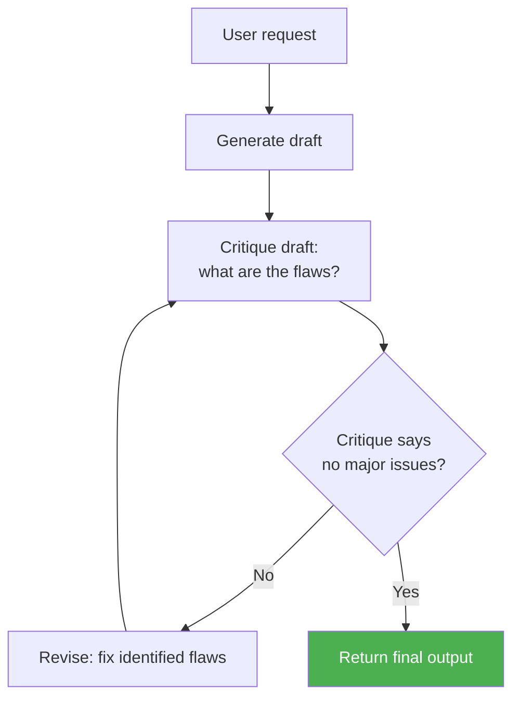

# Concepts: Reflection & Self-critique

## The Problem

A writing agent generates a summary and immediately returns it. The first draft is competent but not great — a few key points are buried, the tone is too formal, and one fact is overstated. A human writer would catch these issues by reading the draft critically before sending it. The agent skips that step.

First drafts are rarely best drafts. Reflection adds the critical reading pass that bridges the gap between "good enough" and "genuinely good."

---

## The Intuition

<div className="concept-intuition">

A skilled writer wears two hats: author and editor.

The author generates freely, without stopping to judge. The editor reads the draft with fresh eyes, asks "what is wrong with this?", identifies weak spots, and sends it back for revision. The same person plays both roles — but at different moments, with different mindsets.

An LLM can play both roles in sequence. In the generation pass it is the author. In the critique pass it is the editor — instructed to find flaws, not to be polite. In the revision pass it is the author again, armed with the editor's notes.

The key insight: the model is often better at finding problems than at not having them in the first place. Asking "what is wrong?" gets more useful output than asking "write something perfect."

</div>

---

## How It Works

### 1. Generate-Critique-Revise Loop

The core pattern: generate a draft, critique it (what is wrong?), revise it (fix the problems), repeat N times.



Each iteration targets specific weaknesses identified by the critique, making progress toward a higher-quality output. In practice, most of the gain comes from iterations 1-2; iteration 3+ has diminishing returns.

---

### 2. Constitutional AI Critique

Instead of asking "what is wrong?", evaluate the output against a list of explicit principles. Each principle is a yes/no question. The critique collects violations and explains them.

**Example principles:**
- Is the response accurate — does it avoid stating anything that is not true?
- Is the response helpful — does it address the user's actual question?
- Is the response concise — does it avoid unnecessary padding?
- Is the response safe — does it avoid harmful or misleading content?

Constitutional critique makes the evaluation criteria explicit and auditable. You can tune which principles apply to which use case.

---

### 3. Self-Consistency as Reflection

Generate N independent outputs for the same prompt, then reflect on which is best. The reflection pass compares the candidates and picks the strongest, combining the best elements if needed.

```
Generate: output_1, output_2, output_3

Reflect:
  - output_1 is accurate but verbose
  - output_2 is concise but misses a key point
  - output_3 is the best balance

Return: output_3 (or a synthesis)
```

This is most effective for tasks with a single correct or clearly best answer (math, code) and less effective for tasks where multiple outputs are equally valid.

---

### 4. When Reflection Helps vs. When It Does Not

| Use case | Reflection helps? | Why |
|----------|-------------------|-----|
| Long-form writing | Yes | Multiple quality dimensions to improve |
| Code generation | Yes | Bugs and edge cases are often caught in critique |
| Complex reasoning | Yes | First-pass reasoning errors surface in critique |
| Simple factual Q&A | No | Single correct answer — reflection adds latency only |
| Real-time responses | Usually not | Users notice the delay; quality gain may be marginal |
| Summarisation | Yes | Completeness and conciseness both improvable |

The rule of thumb: if a human expert would benefit from a second read-through before submitting, reflection is worth it.

---

## Key Terms

| Term | Definition |
|------|------------|
| **Reflection** | An agent evaluating and improving its own output before returning it |
| **Self-critique** | The critique pass in which the model identifies flaws in its own generation |
| **Generate-critique-revise** | A loop: generate a draft, critique it, revise it, repeat |
| **Constitutional AI** | Evaluating output against a fixed list of named principles |
| **Revision** | The pass in which identified flaws are addressed |
| **Diminishing returns** | The pattern where iteration 1 improves quality most; later iterations add little |

---

## The Interview Angle

<div className="interview-angle">

**"How would you improve the quality of an LLM's output beyond prompt engineering?"**

Reflection is the answer. The G-C-R loop adds a second LLM pass: the model reads its own draft and identifies weaknesses, then revises. In practice, one round of critique and revision catches most of the quality gap. Constitutional AI critique makes the evaluation criteria explicit — useful when you have specific quality requirements (accuracy, safety, tone) that need to be systematically checked.

The follow-up is usually about cost: each reflection iteration doubles (or more) the API cost. The answer is to apply reflection selectively — for high-stakes outputs or tasks where quality matters more than latency.

</div>

---

## Common Mistakes

<div className="antipattern">

**Too many iterations**

Running five or more critique-revise cycles almost never produces output five times better than two cycles. After the first two rounds, the critique tends to find minor stylistic issues. Set a maximum of 2-3 iterations.

**Critique prompts that are too vague**

```
# Bad — too vague to produce actionable feedback
"Is this output good? How could it be better?"

# Good — specific criteria produce specific, actionable critique
"Review this summary. Identify: (1) any factual inaccuracies,
(2) key points from the source that are missing,
(3) any sentences that are unnecessarily verbose."
```

**Applying reflection to every call**

A simple Q&A agent that reflects on every response will feel slow and add cost without improving answers. Reserve reflection for the calls that justify it.

</div>
