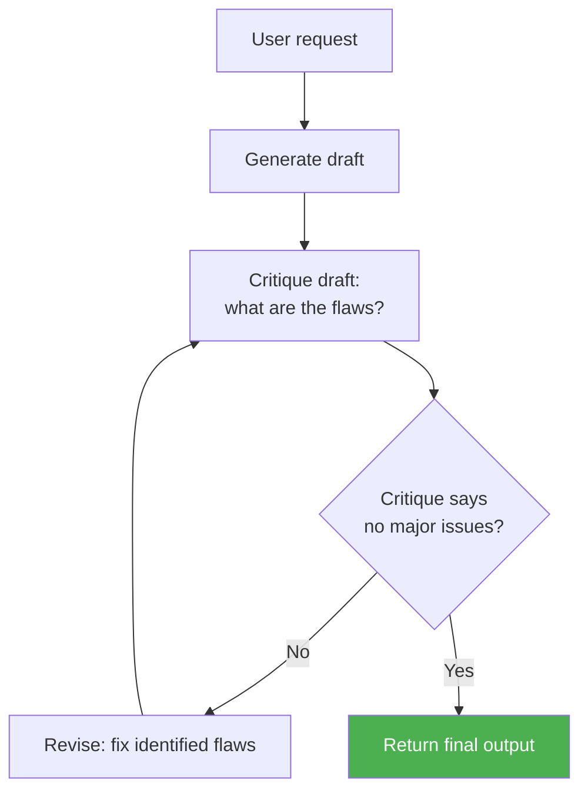

# Concepts: Reflection & Self-critique

## The Problem

A writing agent generates a summary and immediately returns it. The first draft is competent but not great — a few key points are buried, the tone is too formal, and one fact is overstated. A human writer would catch these issues by reading the draft critically before sending it. The agent skips that step.

First drafts are rarely best drafts. Reflection adds the critical reading pass that bridges the gap between "good enough" and "genuinely good."

---

## The Intuition

<div className="concept-intuition">

A skilled writer wears two hats: author and editor.

The author generates freely, without stopping to judge. The editor reads the draft with fresh eyes, asks "what is wrong with this?", identifies weak spots, and sends it back for revision. The same person plays both roles — but at different moments, with different mindsets.

An LLM can play both roles in sequence. In the generation pass it is the author. In the critique pass it is the editor — instructed to find flaws, not to be polite. In the revision pass it is the author again, armed with the editor's notes.

The key insight: the model is often better at finding problems than at not having them in the first place. Asking "what is wrong?" gets more useful output than asking "write something perfect."

</div>

---

## How It Works

### 1. Generate-Critique-Revise Loop

The core pattern: generate a draft, critique it (what is wrong?), revise it (fix the problems), repeat N times.



Each iteration targets specific weaknesses identified by the critique, making progress toward a higher-quality output. In practice, most of the gain comes from iterations 1-2; iteration 3+ has diminishing returns.

---

### 2. Constitutional AI Critique

Instead of asking "what is wrong?", evaluate the output against a list of explicit principles. Each principle is a yes/no question. The critique collects violations and explains them.

**Example principles:**
- Is the response accurate — does it avoid stating anything that is not true?
- Is the response helpful — does it address the user's actual question?
- Is the response concise — does it avoid unnecessary padding?
- Is the response safe — does it avoid harmful or misleading content?

Constitutional critique makes the evaluation criteria explicit and auditable. You can tune which principles apply to which use case.

---

### 3. Self-Consistency as Reflection

Generate N independent outputs for the same prompt, then reflect on which is best. The reflection pass compares the candidates and picks the strongest, combining the best elements if needed.

```
Generate: output_1, output_2, output_3

Reflect:
  - output_1 is accurate but verbose
  - output_2 is concise but misses a key point
  - output_3 is the best balance

Return: output_3 (or a synthesis)
```

This is most effective for tasks with a single correct or clearly best answer (math, code) and less effective for tasks where multiple outputs are equally valid.

---

### 4. When Reflection Helps vs. When It Does Not

| Use case | Reflection helps? | Why |
|----------|-------------------|-----|
| Long-form writing | Yes | Multiple quality dimensions to improve |
| Code generation | Yes | Bugs and edge cases are often caught in critique |
| Complex reasoning | Yes | First-pass reasoning errors surface in critique |
| Simple factual Q&A | No | Single correct answer — reflection adds latency only |
| Real-time responses | Usually not | Users notice the delay; quality gain may be marginal |
| Summarisation | Yes | Completeness and conciseness both improvable |

The rule of thumb: if a human expert would benefit from a second read-through before submitting, reflection is worth it.

---

## What Reflection Actually Does to Output Quality

The easiest way to see reflection's value is a before/after comparison on the same task. The task: review a Python function and provide feedback.

**The function under review:**

```python
def process(data):
    result = []
    for i in range(len(data)):
        if data[i] > 0:
            result.append(data[i] * 2)
    return result
```

---

**First pass — no reflection:**

> The function works and processes data correctly. You might want to add a docstring. Consider using more descriptive variable names. The logic is clear enough but could be slightly improved.

This is the kind of feedback a junior reviewer gives when they do not want to seem harsh. It is technically true, but it is not actionable. "More descriptive variable names" could mean anything.

---

**Second pass — after one self-critique round:**

The critic rated the first pass: accuracy 7, completeness 4, clarity 5, actionability 3. It identified that the feedback named no specific issues, gave no concrete rewrites, and missed two real problems.

The revised response:

> **Three specific issues:**
>
> 1. **Iterating with `range(len(data))` instead of directly over the iterable.** Replace `for i in range(len(data)): data[i]` with `for item in data: item`. The index is never used for anything other than access, so the index variable is noise.
>
> 2. **No type hints or docstring.** The function signature `process(data)` does not tell callers what `data` is expected to be or what the return type is. Add: `def process(data: list[float]) -> list[float]:` and a one-line docstring.
>
> 3. **The function name `process` is meaningless.** Rename to `double_positive_values` or `filter_and_double` — whatever accurately describes what the function does.
>
> **Suggested rewrite:**
> ```python
> def double_positive_values(numbers: list[float]) -> list[float]:
>     """Return a new list with each positive number doubled; negatives and zeros are excluded."""
>     return [n * 2 for n in numbers if n > 0]
> ```

The second pass is specific, names the exact lines that need changing, explains why each change matters, and provides a rewrite. The reflection round turned vague approval into actionable feedback.

---

## The Self-Critique Prompt

The critic role needs a precise system prompt. A vague "is this good?" prompt produces vague praise. The prompt below forces numeric scores on four dimensions and requires a specific improvement for any score below 8, so the revision pass has concrete targets.

```
You are a quality reviewer. The user will show you a draft response.
Rate it 1-10 on: accuracy, completeness, clarity, actionability.
For each score below 8, provide one specific improvement.
Output JSON: {"scores": {...}, "improvements": [...], "revised_response": "..."}
```

In practice, include the user's original request in the critic call so the critic can judge whether the draft actually answers the question:

```python
CRITIC_SYSTEM_PROMPT = """
You are a quality reviewer. The user will provide:
1. The original request
2. A draft response

Rate the draft 1-10 on four dimensions:
- accuracy     : does it avoid stating anything false?
- completeness : does it address all parts of the request?
- clarity      : is it easy to understand without re-reading?
- actionability: does it tell the reader exactly what to do next?

For every dimension scored below 8, provide one specific, concrete improvement.
Do not give general advice — name the specific sentence or section that needs fixing.

Output valid JSON only, with this exact structure:
{
  "scores": {
    "accuracy": <int>,
    "completeness": <int>,
    "clarity": <int>,
    "actionability": <int>
  },
  "improvements": [
    "<specific improvement for each dimension scored below 8>"
  ],
  "revised_response": "<the full revised response incorporating all improvements>"
}
"""

def critique(original_request: str, draft: str, llm_client) -> dict:
    import json
    user_message = f"ORIGINAL REQUEST:\n{original_request}\n\nDRAFT RESPONSE:\n{draft}"
    raw = llm_client.chat(system=CRITIC_SYSTEM_PROMPT, user=user_message)
    return json.loads(raw)
```

The `revised_response` field lets you use the critic's output directly in the next round without a separate revision call — the critic both scores and rewrites in a single pass.

---

## When Reflection Hurts

Reflection is not always beneficial. Applied carelessly, it degrades both quality and user experience.

| Failure mode | What happens | Fix |
|---|---|---|
| **Over-hedging** | Each revision adds more qualifiers ("it depends", "this may vary", "generally speaking") until the answer says nothing definitive. The response becomes longer but less useful. | Add an explicit instruction to the critic: "Do not add hedges or qualifiers. If the draft is too hedged, mark clarity as low and demand a more direct rewrite." |
| **Infinite loop** | Each revision generates new critique; the loop never converges because every revision introduces something new for the critic to flag. | Enforce a hard `max_rounds` cap. Also check improvement delta: if scores improve by &lt;1 point across all dimensions, stop. |
| **Latency tax** | Each reflection round adds 2-3 seconds of API latency. Three rounds adds 6-9 seconds. For a chat interface, users feel this as a broken experience. | Reserve reflection for async workflows or high-stakes outputs. For real-time chat, apply at most one critique round, or none. |
| **Sycophantic critique** | The critic rates everything 9-10 and provides no improvements, so the loop terminates after one round with a mediocre first draft approved unchanged. | Use an adversarial critic prompt: "Your job is to find flaws. Assume the draft has at least two problems. If you cannot find real problems, invent the most plausible ones. A score of 10 is only valid if you can argue the response is objectively perfect." |

---

## Stopping the Reflection Loop

A reflection loop needs an explicit exit condition. Without one, you either waste tokens on useless iterations or loop forever. Three conditions cover almost all cases:

1. **Score threshold** — all scores meet or exceed a minimum (e.g., all dimensions ≥ 8)
2. **Max rounds** — a hard cap regardless of scores (e.g., 3 rounds maximum)
3. **Improvement delta** — if scores improved by less than epsilon since the last round, the loop has converged and further iteration is wasteful

```python
import json

def reflection_loop(
    request: str,
    initial_draft: str,
    llm_client,
    score_threshold: int = 8,
    max_rounds: int = 3,
    min_delta: float = 0.5,
) -> str:
    """
    Run a generate-critique-revise loop with convergence detection.

    Stops when ALL scores >= score_threshold, OR after max_rounds,
    OR if the average score improvement across rounds is < min_delta.
    """
    current_draft = initial_draft
    previous_avg_score: float | None = None

    for round_num in range(1, max_rounds + 1):
        result = critique(request, current_draft, llm_client)
        scores: dict = result["scores"]
        avg_score = sum(scores.values()) / len(scores)

        print(f"[Round {round_num}] Scores: {scores} | Avg: {avg_score:.1f}")

        # Condition 1: all scores meet threshold
        if all(v >= score_threshold for v in scores.values()):
            print(f"[Round {round_num}] Threshold met — stopping.")
            return result.get("revised_response", current_draft)

        # Condition 3: improvement delta too small — loop has converged
        if previous_avg_score is not None:
            delta = avg_score - previous_avg_score
            if delta < min_delta:
                print(f"[Round {round_num}] Delta {delta:.2f} < {min_delta} — converged, stopping.")
                return result.get("revised_response", current_draft)

        previous_avg_score = avg_score
        current_draft = result.get("revised_response", current_draft)

    # Condition 2: max rounds reached
    print(f"[max_rounds={max_rounds}] Stopping after hard cap.")
    return current_draft
```

Example run showing all three exit paths:

```python
# Path 1 — threshold met at round 2
# Round 1: Scores: {'accuracy': 6, 'completeness': 5, 'clarity': 7, 'actionability': 4} | Avg: 5.5
# Round 2: Scores: {'accuracy': 9, 'completeness': 8, 'clarity': 9, 'actionability': 8} | Avg: 8.5
# [Round 2] Threshold met — stopping.

# Path 2 — converged (delta too small) at round 2
# Round 1: Scores: {'accuracy': 7, 'completeness': 7, 'clarity': 7, 'actionability': 7} | Avg: 7.0
# Round 2: Scores: {'accuracy': 7, 'completeness': 7, 'clarity': 8, 'actionability': 7} | Avg: 7.25
# [Round 2] Delta 0.25 < 0.5 — converged, stopping.

# Path 3 — max rounds hit
# Round 1..3: scores improve but never reach threshold
# [max_rounds=3] Stopping after hard cap.
```

---

## Key Terms

| Term | Definition |
|------|------------|
| **Reflection** | An agent evaluating and improving its own output before returning it |
| **Self-critique** | The critique pass in which the model identifies flaws in its own generation |
| **Generate-critique-revise** | A loop: generate a draft, critique it, revise it, repeat |
| **Constitutional AI** | Evaluating output against a fixed list of named principles |
| **Revision** | The pass in which identified flaws are addressed |
| **Diminishing returns** | The pattern where iteration 1 improves quality most; later iterations add little |
| **Convergence detection** | Stopping the loop when score improvement drops below a minimum threshold |
| **Sycophantic critique** | A critic that approves everything, defeating the purpose of the reflection loop |
| **Adversarial critic** | A critic prompt explicitly instructed to find flaws, countering sycophancy |

---

## The Interview Angle

<div className="interview-angle">

**"How would you improve the quality of an LLM's output beyond prompt engineering?"**

Reflection is the answer. The G-C-R loop adds a second LLM pass: the model reads its own draft and identifies weaknesses, then revises. In practice, one round of critique and revision catches most of the quality gap. Constitutional AI critique makes the evaluation criteria explicit — useful when you have specific quality requirements (accuracy, safety, tone) that need to be systematically checked.

The follow-up is usually about cost: each reflection iteration doubles (or more) the API cost. The answer is to apply reflection selectively — for high-stakes outputs or tasks where quality matters more than latency. Also: use convergence detection (score threshold + improvement delta) to avoid wasting rounds when the loop has already plateaued. And guard against sycophantic critics with an adversarial prompt.

</div>

---

## Common Mistakes

<div className="antipattern">

**Too many iterations**

Running five or more critique-revise cycles almost never produces output five times better than two cycles. After the first two rounds, the critique tends to find minor stylistic issues. Set a maximum of 2-3 iterations.

**Critique prompts that are too vague**

```
# Bad — too vague to produce actionable feedback
"Is this output good? How could it be better?"

# Good — specific criteria produce specific, actionable critique
"Review this summary. Identify: (1) any factual inaccuracies,
(2) key points from the source that are missing,
(3) any sentences that are unnecessarily verbose."
```

**Applying reflection to every call**

A simple Q&A agent that reflects on every response will feel slow and add cost without improving answers. Reserve reflection for the calls that justify it.

</div>
