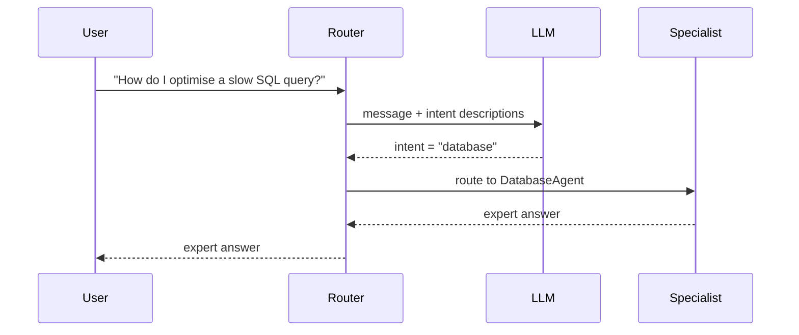

# Concepts: Agent Handoff

## The Problem

A general-purpose agent is a generalist. Ask it to debug a segfault in C++ and it will try. Ask it to interpret a tax treaty and it will try. In both cases, the answer will be competent but not expert. Specialized agents trained on specific domains — code debugging, legal interpretation, medical triage — outperform a generalist on their target tasks.

The problem: users do not route themselves. They send a single message to your agent and expect the right answer. You need something that reads the message, classifies the intent, and silently hands it to the correct specialist.

---

## The Intuition

<div className="concept-intuition">

Think of a hospital reception desk.

The receptionist does not treat patients. They ask "what is wrong?" and route: chest pain goes to the ER, a broken leg goes to orthopedics, a prescription question goes to the pharmacy. Each department is a specialist. The receptionist is the router.

The router does not need to know how to treat chest pain — it only needs to recognize that this is an ER case, not a pharmacy case. Once routed, the specialist handles everything.

A well-designed router has three responsibilities:
1. Classify the incoming request into one of N known intents
2. Hand off the request — with full context — to the right specialist
3. Fall back gracefully when no specialist matches

</div>

---

## How It Works

### 1. Router LLM — Classify Intent

The router calls an LLM with the user's message and a list of intent descriptions. The LLM returns the best-matching intent label.



The classification prompt lists each intent with a clear description. The LLM outputs the intent label — just the label, so it is easy to parse.

---

### 2. Handoff Protocol — Passing Context

When the router delegates to a specialist, it passes:
- The original user message
- The full conversation history (so the specialist has context)
- An optional task summary explaining why this specialist was chosen

Without context, a specialist sees only the immediate question and misses earlier turns. With context, it behaves as if it has been part of the conversation all along.

---

### 3. Graceful Fallback

No classification system is perfect. When the LLM returns an intent that does not match any known specialist, the router falls back to a general-purpose agent rather than failing or returning an error.

A fallback chain has multiple levels:
1. Primary specialist — the best match
2. Secondary specialist — a broader domain that might cover the request
3. General fallback — a capable generalist

The user never sees a routing failure — they see an answer.

---

### 4. Confidence Thresholds — Human Escalation

Some requests are high-stakes: medical advice, legal decisions, financial recommendations. For these, low router confidence should trigger escalation to a human rather than routing to an agent.

A simple approach: ask the LLM to return both the intent label and a confidence level (high/medium/low). If confidence is low, route to a human escalation handler instead.

---

## Key Terms

| Term | Definition |
|------|------------|
| **Router** | An agent that classifies incoming requests and delegates them to specialists |
| **Specialist agent** | An agent with domain-specific knowledge or system prompt optimised for a narrow task |
| **Handoff** | The act of passing a request and its context from the router to a specialist |
| **Intent classification** | Identifying the category or domain of a user's request |
| **Fallback** | A general-purpose handler that responds when no specialist matches |
| **Context passing** | Including prior conversation history in the handoff so the specialist has full context |
| **Confidence threshold** | A level below which the router escalates to a human rather than routing to an agent |

---

## The Interview Angle

<div className="interview-angle">

**"How would you build a system where different user requests go to different AI agents?"**

Three components: a router, a specialist registry, and a fallback.

The router calls an LLM with the user's message and a list of intent descriptions. It returns the best-matching intent label. The specialist registry maps intent labels to agent functions. The fallback handles anything that does not match.

The key design decision is context passing: when the router delegates, does it send just the latest message, or the full conversation history? For multi-turn conversations, you must pass history — otherwise the specialist answers in a vacuum.

For production, add a confidence threshold. Low confidence means the LLM is uncertain about the routing — that is when you escalate to a human rather than risk a wrong specialist.

</div>

---

## Common Mistakes

<div className="antipattern">

**Routing without fallback**

If every possible message must match a known intent and some do not, the system fails for any out-of-scope request. Always have a general fallback that handles the unclassified remainder gracefully.

**Losing context on handoff**

```python
# Bad — specialist only sees the current message
specialist(message=user_message)

# Good — specialist sees full conversation history
specialist(message=user_message, context=conversation_history)
```

**Infinite handoff loops**

If Specialist A hands off to Specialist B and B hands back to A, you have an infinite loop. Set a maximum handoff depth (typically 1 — the router delegates, the specialist answers) and enforce it.

</div>
