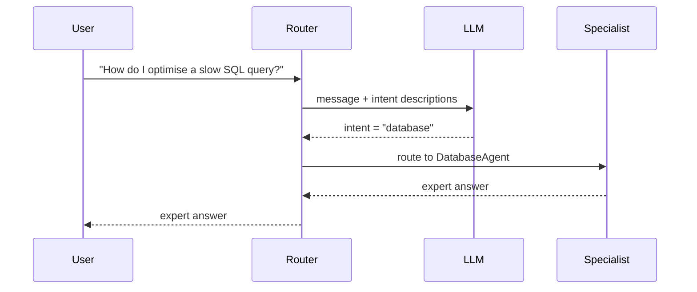
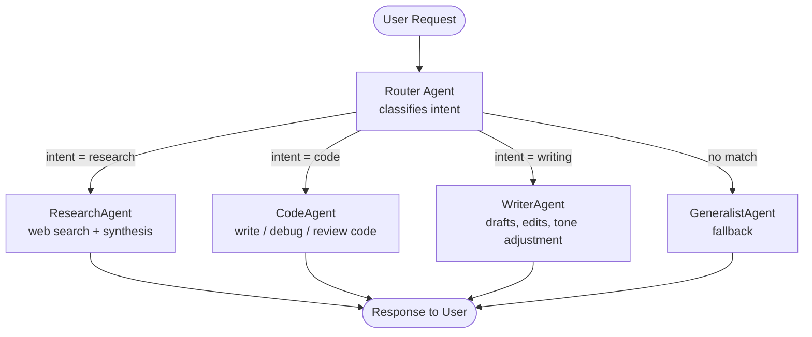

# Concepts: Agent Handoff

## The Problem

A general-purpose agent is a generalist. Ask it to debug a segfault in C++ and it will try. Ask it to interpret a tax treaty and it will try. In both cases, the answer will be competent but not expert. Specialized agents trained on specific domains — code debugging, legal interpretation, medical triage — outperform a generalist on their target tasks.

The problem: users do not route themselves. They send a single message to your agent and expect the right answer. You need something that reads the message, classifies the intent, and silently hands it to the correct specialist.

---

## The Intuition

<div className="concept-intuition">

Think of a hospital reception desk.

The receptionist does not treat patients. They ask "what is wrong?" and route: chest pain goes to the ER, a broken leg goes to orthopedics, a prescription question goes to the pharmacy. Each department is a specialist. The receptionist is the router.

The router does not need to know how to treat chest pain — it only needs to recognize that this is an ER case, not a pharmacy case. Once routed, the specialist handles everything.

A well-designed router has three responsibilities:
1. Classify the incoming request into one of N known intents
2. Hand off the request — with full context — to the right specialist
3. Fall back gracefully when no specialist matches

</div>

---

## How It Works

### 1. Router LLM — Classify Intent

The router calls an LLM with the user's message and a list of intent descriptions. The LLM returns the best-matching intent label.



The classification prompt lists each intent with a clear description. The LLM outputs the intent label — just the label, so it is easy to parse.

---

### 2. Handoff Protocol — Passing Context

When the router delegates to a specialist, it passes:
- The original user message
- The full conversation history (so the specialist has context)
- An optional task summary explaining why this specialist was chosen

Without context, a specialist sees only the immediate question and misses earlier turns. With context, it behaves as if it has been part of the conversation all along.

---

### 3. Graceful Fallback

No classification system is perfect. When the LLM returns an intent that does not match any known specialist, the router falls back to a general-purpose agent rather than failing or returning an error.

A fallback chain has multiple levels:
1. Primary specialist — the best match
2. Secondary specialist — a broader domain that might cover the request
3. General fallback — a capable generalist

The user never sees a routing failure — they see an answer.

---

### 4. Confidence Thresholds — Human Escalation

Some requests are high-stakes: medical advice, legal decisions, financial recommendations. For these, low router confidence should trigger escalation to a human rather than routing to an agent.

A simple approach: ask the LLM to return both the intent label and a confidence level (high/medium/low). If confidence is low, route to a human escalation handler instead.

---

## The Handoff Protocol

A handoff is not just a function call — it is a structured contract between agents. When Agent A determines it cannot handle a subtask optimally, it:

1. Decides to delegate based on task type, required expertise, or confidence level
2. Constructs a structured handoff message containing everything Agent B needs
3. Passes the message to Agent B and waits for (or discards, in fire-and-forget cases) the result

The handoff message is the unit of trust between agents. If it is incomplete, Agent B works in the dark. If it is well-formed, Agent B behaves as if it has been in the conversation from the start.

Here is the exact message structure as a Python TypedDict:

```python
from typing import TypedDict, Optional

class HandoffMessage(TypedDict):
    # What needs to be done — specific and scoped
    task_description: str

    # Why this task exists — the originating user intent
    originating_request: str

    # Prior conversation turns relevant to this subtask
    context_summary: str

    # Data, references, or intermediate outputs Agent A already has
    relevant_artifacts: list[str]

    # Hard boundaries the receiving agent must not cross
    constraints: list[str]

    # Which agent should receive this (registry key or class name)
    target_agent: str

    # How many times this task has already been handed off (loop guard)
    handoff_depth: int

    # Optional: what to do if target agent is unavailable
    fallback_agent: Optional[str]
```

A concrete example — Router handing off to CodeAgent:

```python
handoff: HandoffMessage = {
    "task_description": "Write a Python function that validates an email address using regex.",
    "originating_request": "User asked: 'help me validate user input on a signup form'",
    "context_summary": "User is building a Flask web app. They have already implemented the form HTML. They want backend validation before hitting the database.",
    "relevant_artifacts": [
        "form fields: email, password, username",
        "stack: Python 3.11, Flask 3.0, SQLAlchemy",
    ],
    "constraints": [
        "No external libraries — stdlib only",
        "Must return (bool, str) where str is the error message or empty string",
    ],
    "target_agent": "CodeAgent",
    "handoff_depth": 1,
    "fallback_agent": "GeneralistAgent",
}
```

---

## Router + Specialist Pattern

The most common multi-agent topology is a single Router agent that classifies intent and dispatches to one of several specialist agents. The Router never answers the user directly — it only routes.



The Router's classification logic uses few-shot prompting so the LLM learns from labelled examples rather than relying on a vague description alone:

```python
ROUTER_SYSTEM_PROMPT = """
You are a request classifier. Given a user message, output exactly one intent label.

Intent labels and descriptions:
- research  : questions requiring fact-finding, web search, or summarising sources
- code      : tasks involving writing, debugging, reviewing, or explaining code
- writing   : drafting documents, emails, blog posts, or editing existing text
- unknown   : anything that does not fit the above

Few-shot examples:
User: "What were the main causes of the 2008 financial crisis?"
Intent: research

User: "My Python function raises a KeyError on line 12, can you fix it?"
Intent: code

User: "Write a professional email declining a job offer politely."
Intent: writing

User: "What is the meaning of life?"
Intent: unknown

Now classify the following message. Output only the intent label, nothing else.
"""

def classify_intent(user_message: str, llm_client) -> str:
    response = llm_client.chat(
        system=ROUTER_SYSTEM_PROMPT,
        user=user_message,
    )
    label = response.strip().lower()
    allowed = {"research", "code", "writing", "unknown"}
    return label if label in allowed else "unknown"
```

The Router then dispatches:

```python
SPECIALIST_REGISTRY = {
    "research": ResearchAgent,
    "code":     CodeAgent,
    "writing":  WriterAgent,
    "unknown":  GeneralistAgent,   # fallback
}

def route(user_message: str, conversation_history: list, llm_client) -> str:
    intent = classify_intent(user_message, llm_client)
    agent_class = SPECIALIST_REGISTRY.get(intent, GeneralistAgent)
    agent = agent_class()
    return agent.run(
        message=user_message,
        context=conversation_history,
    )
```

---

## Context Preservation During Handoff

The single most common handoff failure is lost context. Agent B receives a task but not the reasoning, constraints, or prior work that makes the task meaningful. The result is a technically correct answer to the wrong problem.

Use a structured payload dataclass to enforce completeness:

```python
from dataclasses import dataclass, field

@dataclass
class HandoffPayload:
    # The specific task Agent B must perform
    task: str

    # A compressed summary of the full conversation history.
    # Summarise with an LLM rather than truncating — truncation loses the middle.
    context_summary: str

    # Discrete facts extracted from the conversation that are directly relevant.
    # Keep each item to one sentence.
    relevant_facts: list[str]

    # Hard constraints Agent B must not violate.
    constraints: list[str]

    # Registry key of the receiving agent.
    target_agent: str

    # Auto-set — do not pass manually.
    handoff_depth: int = field(default=0)
```

Generating the context summary with an LLM rather than truncating:

```python
def build_handoff_payload(
    task: str,
    full_history: list[dict],
    constraints: list[str],
    target_agent: str,
    llm_client,
) -> HandoffPayload:
    # Summarise long history rather than passing raw tokens
    history_text = "\n".join(
        f"{m['role'].upper()}: {m['content']}" for m in full_history
    )
    summary_prompt = (
        "Summarise the following conversation in 3-5 sentences. "
        "Focus on: the user's goal, decisions already made, and any constraints mentioned.\n\n"
        + history_text
    )
    context_summary = llm_client.chat(user=summary_prompt)

    # Extract discrete facts for quick lookup
    facts_prompt = (
        "From this conversation, list up to 5 specific facts "
        "that a downstream agent must know to complete the task. "
        "One fact per line, no bullet points.\n\n" + history_text
    )
    facts_raw = llm_client.chat(user=facts_prompt)
    relevant_facts = [f.strip() for f in facts_raw.splitlines() if f.strip()]

    return HandoffPayload(
        task=task,
        context_summary=context_summary,
        relevant_facts=relevant_facts,
        constraints=constraints,
        target_agent=target_agent,
    )
```

---

## Failure Modes in Handoff

Handoff systems fail in predictable ways. The table below lists each failure mode, its symptom, and the standard fix.

| Failure mode | Symptom | Fix |
|---|---|---|
| **Target agent unavailable** | Handoff times out or raises a connection error; user gets no response | Register a fallback agent for every specialist. Before dispatching, check agent health. On failure, route to the fallback and log the incident. |
| **Context lost in transit** | Specialist answers the literal question but misses the user's actual goal; user has to repeat themselves | Always pass a `HandoffPayload` with `context_summary` and `relevant_facts`. Never pass only the latest message. |
| **Infinite handoff loop** | Agents pass the task back and forth; response never arrives; token cost spirals | Include `handoff_depth` in every payload. Increment on each handoff. Enforce a hard maximum (typically 2). If depth is exceeded, route to a generalist and stop. |
| **Intent misclassification** | Wrong specialist receives the task and gives an off-topic answer | Add few-shot examples to the classification prompt. Log misroutes and add the misclassified messages as new examples over time. |
| **Overly broad handoff** | Specialist receives a vague task and has to ask clarifying questions, adding latency | The handing-off agent must scope the task before delegating. The `task` field in `HandoffPayload` should be specific enough that no clarification is needed. |

Enforcing the depth limit:

```python
MAX_HANDOFF_DEPTH = 2

def dispatch(payload: HandoffPayload, agent_registry: dict, llm_client) -> str:
    if payload.handoff_depth > MAX_HANDOFF_DEPTH:
        # Hard stop — route to generalist and log
        print(f"[WARN] Handoff depth exceeded for task: {payload.task}")
        fallback = GeneralistAgent()
        return fallback.run(message=payload.task, context=payload.context_summary)

    agent_class = agent_registry.get(payload.target_agent)
    if agent_class is None:
        # Target unavailable — try fallback
        fallback_key = getattr(payload, "fallback_agent", None)
        agent_class = agent_registry.get(fallback_key, GeneralistAgent)

    agent = agent_class()
    return agent.run(message=payload.task, context=payload.context_summary)
```

---

## Key Terms

| Term | Definition |
|------|------------|
| **Router** | An agent that classifies incoming requests and delegates them to specialists |
| **Specialist agent** | An agent with domain-specific knowledge or system prompt optimised for a narrow task |
| **Handoff** | The act of passing a request and its context from the router to a specialist |
| **Intent classification** | Identifying the category or domain of a user's request |
| **Fallback** | A general-purpose handler that responds when no specialist matches |
| **Context passing** | Including prior conversation history in the handoff so the specialist has full context |
| **Confidence threshold** | A level below which the router escalates to a human rather than routing to an agent |
| **HandoffPayload** | A structured dataclass that packages task, context, facts, and constraints for agent-to-agent transfer |
| **Handoff depth** | A counter tracking how many times a task has been re-delegated; used to break loops |

---

## The Interview Angle

<div className="interview-angle">

**"How would you build a system where different user requests go to different AI agents?"**

Three components: a router, a specialist registry, and a fallback.

The router calls an LLM with the user's message and a list of intent descriptions. It returns the best-matching intent label. The specialist registry maps intent labels to agent functions. The fallback handles anything that does not match.

The key design decision is context passing: when the router delegates, does it send just the latest message, or the full conversation history? For multi-turn conversations, you must pass history — otherwise the specialist answers in a vacuum. In practice, summarise long histories with an LLM rather than truncating; truncation loses the middle of the conversation.

For production, add a confidence threshold. Low confidence means the LLM is uncertain about the routing — that is when you escalate to a human rather than risk a wrong specialist. Also enforce a handoff depth limit to prevent agents from bouncing work back and forth indefinitely.

</div>

---

## Common Mistakes

<div className="antipattern">

**Routing without fallback**

If every possible message must match a known intent and some do not, the system fails for any out-of-scope request. Always have a general fallback that handles the unclassified remainder gracefully.

**Losing context on handoff**

```python
# Bad — specialist only sees the current message
specialist(message=user_message)

# Good — specialist sees full conversation history
specialist(message=user_message, context=conversation_history)
```

**Infinite handoff loops**

If Specialist A hands off to Specialist B and B hands back to A, you have an infinite loop. Set a maximum handoff depth (typically 1 — the router delegates, the specialist answers) and enforce it.

</div>
