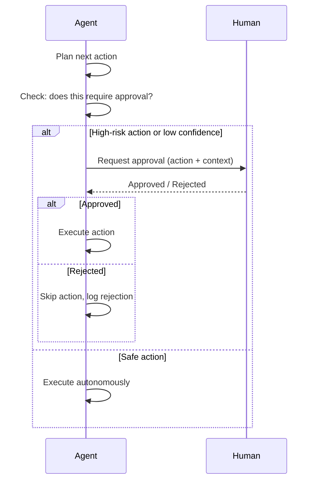

# Concepts: Human-in-the-Loop (HITL)

## The Problem

An autonomous agent that sends emails, deletes files, or makes purchases without checking can cause real damage. Consider:

> An agent tasked with "clean up old customer records" interprets this as "delete all records older than 1 year" — and does it, irreversibly, across your production database.

No tool error. No exception. Just a well-intentioned agent following ambiguous instructions. Without checkpoints, you have no way to stop it.

---

## The Intuition: The Junior Employee Rule

Think of a junior employee joining your company. You don't let them:

- Delete files without approval
- Send client-facing emails independently
- Process payments over a certain amount

But you also don't micromanage every task. They can:

- Read documents
- Write drafts
- Run reports
- Format data

The rule: **routine tasks are autonomous; high-stakes decisions require manager approval**. Your agent should work the same way.

---

## When HITL is Required vs. Optional

Not every agent action needs a human gate. The cost of unnecessary HITL is real: it slows workflows, creates reviewer fatigue, and erodes trust in the system. Use this table to calibrate when HITL genuinely adds value versus when it just adds friction.

| Scenario | HITL Requirement | Why |
|----------|-----------------|-----|
| Medical diagnosis or treatment recommendation | **Required** | Liability, patient safety, regulatory mandate |
| Financial transactions &gt; $10k | **Required** | Compliance (SOX, AML), reversibility window is short |
| Autonomous email sending to external parties | **Required** | Irreversible action; reputational risk if wrong |
| Code deployed directly to production | **Required** | Hard to roll back; blast radius is high |
| Content generation queued for editorial review | **Optional** | Quality gate; human catches errors before publication |
| Internal draft documents or summaries | **Optional** | Low stakes; easy to revise if wrong |
| Read-only search or lookup queries | **Not needed** | No side effects; worst case is a bad answer |
| Data formatting or transformation (reversible) | **Not needed** | Easy to re-run; no external consequences |

**Design principle:** HITL should be proportional to **irreversibility × blast radius**. A read query has neither. Sending 50,000 customer emails has both.

---

## How It Works

### 1. Escalation Criteria

Before executing any action, the agent evaluates whether it needs approval. Three main escalation triggers:

| Trigger | Example |
|---------|---------|
| **Action type** | `delete_file`, `send_email`, `make_payment` always require approval |
| **Confidence score** | If confidence &lt; 0.7, the agent isn't sure — ask |
| **Ambiguous instructions** | "remove the old stuff" — unclear scope, needs clarification |

A simple allowlist of high-risk actions plus a confidence threshold covers most real-world cases.

### 2. Approval Workflow

When escalation is triggered:

1. Agent pauses before executing
2. Sends an approval request (via `input()`, a queue, a webhook, or a UI notification)
3. Waits for human response: **approve** or **reject**
4. If approved: executes the action
5. If rejected: skips the action and logs the decision

### 3. Async HITL

For long-running or batch workflows, synchronous blocking isn't practical. The pattern:

1. Agent reaches a checkpoint requiring approval
2. Agent **saves its state** (action, context, current plan position)
3. Sends a notification (email, Slack, webhook)
4. Human approves or rejects — possibly hours later
5. Agent **resumes** from saved state

This requires durable workflow infrastructure (e.g., Temporal, AWS Step Functions, or a simple database queue). The key insight: the agent doesn't need to stay running while waiting. It can be reconstructed from persisted state.

### 4. Confidence-Based Escalation

LLMs can provide self-assessed confidence scores. If you ask the model to rate its confidence in an action from 0.0 to 1.0, you can use that as an escalation trigger:

```
confidence = 0.55  → escalate (below threshold of 0.7)
confidence = 0.92  → proceed autonomously
```

This is particularly useful when the agent is processing ambiguous or unusual inputs where hard-coded rules wouldn't catch the uncertainty.

---

## Diagrams

### HITL Approval Flow



### Async HITL Flow


---

## Implementing an Approval Gate

This pattern shows a complete approval gate: the agent proposes an action, the action enters a queue with a timeout, a human reviews it, and the agent receives the decision and continues.

```python
import time
import uuid
from datetime import datetime, timezone
from dataclasses import dataclass, field
from enum import Enum
from typing import Any


class DecisionStatus(Enum):
    PENDING = "pending"
    APPROVED = "approved"
    REJECTED = "rejected"
    MODIFIED = "modified"
    TIMED_OUT = "timed_out"


@dataclass
class PendingAction:
    """Represents an agent action waiting for human review."""
    action_id: str
    action_type: str
    action_payload: dict
    context: str
    proposed_at: datetime
    status: DecisionStatus = DecisionStatus.PENDING
    reviewed_by: str | None = None
    reviewed_at: datetime | None = None
    final_payload: dict | None = None  # human may modify the action
    rejection_reason: str | None = None


class ApprovalQueue:
    """
    In-memory approval queue. In production, replace with a database table
    or a message queue (SQS, Redis, Postgres) so state survives restarts.
    """

    def __init__(self):
        self._queue: dict[str, PendingAction] = {}

    def submit(self, action_type: str, payload: dict, context: str) -> PendingAction:
        """Submit an action for human review. Returns the pending action."""
        action = PendingAction(
            action_id=str(uuid.uuid4()),
            action_type=action_type,
            action_payload=payload,
            context=context,
            proposed_at=datetime.now(timezone.utc),
        )
        self._queue[action.action_id] = action
        print(f"\n[APPROVAL QUEUE] New action pending review:")
        print(f"  ID:      {action.action_id}")
        print(f"  Type:    {action.action_type}")
        print(f"  Payload: {action.action_payload}")
        print(f"  Context: {action.context}\n")
        return action

    def wait_for_decision(
        self,
        action_id: str,
        timeout_seconds: int = 300,
        poll_interval: float = 1.0,
    ) -> PendingAction:
        """
        Block until a human makes a decision or the timeout expires.
        In async systems, replace this with an event/callback pattern.
        """
        deadline = time.time() + timeout_seconds
        while time.time() < deadline:
            action = self._queue[action_id]
            if action.status != DecisionStatus.PENDING:
                return action
            time.sleep(poll_interval)

        # Timeout reached — mark as timed out (treat as rejection for safety)
        self._queue[action_id].status = DecisionStatus.TIMED_OUT
        return self._queue[action_id]

    def approve(self, action_id: str, reviewer: str, modified_payload: dict | None = None):
        """Human approves the action, optionally modifying the payload."""
        action = self._queue[action_id]
        action.status = DecisionStatus.APPROVED if modified_payload is None else DecisionStatus.MODIFIED
        action.reviewed_by = reviewer
        action.reviewed_at = datetime.now(timezone.utc)
        action.final_payload = modified_payload or action.action_payload

    def reject(self, action_id: str, reviewer: str, reason: str = ""):
        """Human rejects the action."""
        action = self._queue[action_id]
        action.status = DecisionStatus.REJECTED
        action.reviewed_by = reviewer
        action.reviewed_at = datetime.now(timezone.utc)
        action.rejection_reason = reason


# --- Agent integration ---

approval_queue = ApprovalQueue()

HIGH_RISK_ACTIONS = {"send_email", "delete_record", "make_payment", "deploy_code"}


def execute_action(action_type: str, payload: dict, context: str) -> dict:
    """
    Execute an action. If the action is high-risk, gate it behind
    the approval queue before executing.
    """
    if action_type in HIGH_RISK_ACTIONS:
        # Submit to queue
        pending = approval_queue.submit(action_type, payload, context)

        # Wait for human decision (synchronous for demo; see async section below)
        decision = approval_queue.wait_for_decision(pending.action_id, timeout_seconds=60)

        if decision.status == DecisionStatus.APPROVED:
            print(f"[AGENT] Action approved by {decision.reviewed_by}. Executing.")
            return _do_execute(action_type, decision.final_payload)

        elif decision.status == DecisionStatus.MODIFIED:
            print(f"[AGENT] Action modified by {decision.reviewed_by}. Executing with new payload.")
            return _do_execute(action_type, decision.final_payload)

        elif decision.status == DecisionStatus.REJECTED:
            print(f"[AGENT] Action rejected: {decision.rejection_reason}. Skipping.")
            return {"status": "rejected", "reason": decision.rejection_reason}

        else:  # TIMED_OUT
            print("[AGENT] Approval timed out. Skipping action for safety.")
            return {"status": "timed_out"}

    # Low-risk action — execute directly
    return _do_execute(action_type, payload)


def _do_execute(action_type: str, payload: dict) -> dict:
    """Stub for actual execution logic."""
    print(f"[EXECUTOR] Executing {action_type} with payload: {payload}")
    return {"status": "success", "action": action_type, "payload": payload}


# --- Demo ---
if __name__ == "__main__":
    import threading

    # Simulate human reviewer approving after 2 seconds
    def simulate_human_review(action_id: str):
        time.sleep(2)
        approval_queue.approve(
            action_id=action_id,
            reviewer="alice@company.com",
            modified_payload=None,  # approve as-is
        )
        print(f"[HUMAN] Approved action {action_id}")

    # Agent proposes a high-risk action
    pending = approval_queue.submit(
        action_type="send_email",
        payload={"to": "customer@example.com", "subject": "Your order is ready"},
        context="Step 3 of order fulfillment workflow — notify customer",
    )

    # Start simulated reviewer in background
    reviewer_thread = threading.Thread(
        target=simulate_human_review, args=(pending.action_id,)
    )
    reviewer_thread.start()

    # Agent waits for decision
    decision = approval_queue.wait_for_decision(pending.action_id, timeout_seconds=10)
    print(f"\n[AGENT] Decision received: {decision.status.value}")
    reviewer_thread.join()
```

---

## Async HITL — Don't Block the Loop

### The Problem with Synchronous HITL

When HITL is synchronous, the agent process blocks — holding memory, database connections, and compute — while waiting for a human who may not respond for hours. At scale:

- 100 agents waiting on approvals = 100 blocked processes
- If a reviewer is offline, the entire pipeline stalls
- Cloud functions time out (typically 15 minutes max on Lambda/Cloud Run)

### The Async Pattern

Instead of blocking, the agent **saves state and exits**. When the human responds, the agent is **reconstructed from saved state** and continues from exactly where it left off.

```
[Agent] → propose action → save state → emit "pending" → terminate
                                              ↓
                                    [Queue / DB stores state]
                                              ↓
                               [Human reviews — could be hours later]
                                              ↓
                              [Webhook / callback triggers resume]
                                              ↓
                           [Agent reconstructed from saved state] → continues
```

```python
import json
import uuid
from datetime import datetime, timezone
from dataclasses import dataclass, asdict
from enum import Enum


class WorkflowStatus(Enum):
    RUNNING = "running"
    PENDING_APPROVAL = "pending_approval"
    APPROVED = "approved"
    REJECTED = "rejected"
    COMPLETED = "completed"


@dataclass
class WorkflowState:
    """
    Complete agent state. Everything needed to resume the workflow
    from the exact point it was paused.
    """
    workflow_id: str
    status: WorkflowStatus
    current_step: int
    completed_steps: list
    pending_action: dict | None
    context: dict
    created_at: str
    updated_at: str


class WorkflowStateStore:
    """
    In-memory state store. In production: use Postgres, DynamoDB, or Redis
    with a TTL. State must survive process restarts.
    """

    def __init__(self):
        self._store: dict[str, dict] = {}

    def save(self, state: WorkflowState):
        self._store[state.workflow_id] = asdict(state)
        self._store[state.workflow_id]["status"] = state.status.value
        print(f"[STATE STORE] Saved workflow {state.workflow_id} — status: {state.status.value}")

    def load(self, workflow_id: str) -> WorkflowState | None:
        data = self._store.get(workflow_id)
        if not data:
            return None
        data["status"] = WorkflowStatus(data["status"])
        return WorkflowState(**data)


store = WorkflowStateStore()


def start_workflow(initial_context: dict) -> str:
    """
    Start a new workflow. Returns the workflow_id.
    The workflow runs until it hits an action requiring approval,
    then saves state and returns "pending_approval".
    """
    workflow_id = str(uuid.uuid4())
    now = datetime.now(timezone.utc).isoformat()

    state = WorkflowState(
        workflow_id=workflow_id,
        status=WorkflowStatus.RUNNING,
        current_step=0,
        completed_steps=[],
        pending_action=None,
        context=initial_context,
        created_at=now,
        updated_at=now,
    )

    # Simulate workflow steps
    state.completed_steps.append("fetch_customer_data")
    state.current_step = 1
    state.completed_steps.append("generate_email_content")
    state.current_step = 2

    # Hit a high-risk action — pause here
    state.pending_action = {
        "type": "send_email",
        "payload": {
            "to": initial_context.get("customer_email"),
            "subject": "Your refund has been processed",
            "body": "Dear customer, your refund of $250 will arrive in 3–5 business days.",
        },
    }
    state.status = WorkflowStatus.PENDING_APPROVAL
    state.updated_at = datetime.now(timezone.utc).isoformat()
    store.save(state)

    print(f"[WORKFLOW] Paused at step {state.current_step}. Waiting for approval.")
    print(f"[WORKFLOW] Workflow ID: {workflow_id} — notify reviewer.")
    return workflow_id


def resume_workflow(workflow_id: str, approved: bool, reviewer: str) -> str:
    """
    Called by the webhook/callback when the human makes a decision.
    Reconstructs state and continues the workflow.
    """
    state = store.load(workflow_id)
    if not state:
        raise ValueError(f"No workflow found: {workflow_id}")

    if state.status != WorkflowStatus.PENDING_APPROVAL:
        raise ValueError(f"Workflow {workflow_id} is not pending approval (status: {state.status})")

    print(f"\n[WORKFLOW] Resuming workflow {workflow_id} — decision: {'approved' by reviewer if approved else 'rejected'}")

    if approved:
        # Execute the pending action
        action = state.pending_action
        print(f"[WORKFLOW] Executing approved action: {action['type']}")
        print(f"[WORKFLOW]   Payload: {action['payload']}")
        state.completed_steps.append(f"send_email (approved by {reviewer})")
        state.current_step += 1
        state.pending_action = None
        state.status = WorkflowStatus.COMPLETED
    else:
        print("[WORKFLOW] Action rejected. Workflow aborted.")
        state.pending_action = None
        state.status = WorkflowStatus.REJECTED

    state.updated_at = datetime.now(timezone.utc).isoformat()
    store.save(state)
    return state.status.value


# --- Demo ---
if __name__ == "__main__":
    # Step 1: Agent starts workflow, hits approval gate, returns "pending"
    wf_id = start_workflow({"customer_email": "jane@example.com", "order_id": "ORD-9981"})
    print(f"\n[MAIN] Workflow paused. ID: {wf_id}")
    print("[MAIN] (In production: send email/Slack to reviewer with approve link)")

    # Step 2: Hours later, reviewer clicks approve link → webhook calls resume_workflow
    print("\n[MAIN] Simulating human approval...")
    final_status = resume_workflow(wf_id, approved=True, reviewer="bob@company.com")
    print(f"\n[MAIN] Final workflow status: {final_status}")
```

**Key rule:** The agent should treat `PENDING_APPROVAL` as a terminal state for the current execution. The next execution starts fresh from the saved state when the decision arrives. Never use `time.sleep()` in production agents waiting on humans.

---

## HITL Audit Trail

### Why Audit Trails Are Non-Negotiable

In regulated environments (finance, healthcare, legal), you must be able to answer:

- Who approved this action?
- When did they approve it?
- What was the original proposed action?
- Was the action modified before execution?
- How long did the approval take?

Beyond compliance, audit trails are essential for debugging. When an agent does something unexpected, the audit log tells you whether it was an approval error (human approved the wrong thing) or an execution error (the agent didn't follow the approved action).

### Implementation

```python
import json
import uuid
from datetime import datetime, timezone
from dataclasses import dataclass, asdict


@dataclass
class HITLAuditRecord:
    """
    One record per HITL decision. Append-only — never update existing records.
    Store in a database with an index on workflow_id and action_id.
    """
    audit_id: str
    workflow_id: str
    action_id: str
    # What the agent originally proposed
    original_action_type: str
    original_action_payload: dict
    # Why it was escalated
    escalation_reason: str  # e.g. "action_type_allowlist", "low_confidence", "ambiguous_input"
    escalation_confidence: float | None
    # Timing
    proposed_at: str
    reviewed_at: str | None
    decision_latency_seconds: float | None
    # Human decision
    reviewer_id: str | None
    reviewer_email: str | None
    decision: str  # "approved", "rejected", "modified", "timed_out"
    rejection_reason: str | None
    # Final action (may differ from original if human modified it)
    final_action_type: str | None
    final_action_payload: dict | None
    was_modified: bool


class HITLAuditLogger:
    """
    Audit logger for all HITL decisions.
    In production: write to Postgres/DynamoDB/BigQuery with write-once semantics.
    Export to SIEM for compliance monitoring.
    """

    def __init__(self):
        self._records: list[dict] = []  # replace with DB writes in production

    def log_proposed(
        self,
        workflow_id: str,
        action_id: str,
        action_type: str,
        action_payload: dict,
        escalation_reason: str,
        confidence: float | None = None,
    ) -> HITLAuditRecord:
        """Call this when the agent proposes an action for review."""
        record = HITLAuditRecord(
            audit_id=str(uuid.uuid4()),
            workflow_id=workflow_id,
            action_id=action_id,
            original_action_type=action_type,
            original_action_payload=action_payload,
            escalation_reason=escalation_reason,
            escalation_confidence=confidence,
            proposed_at=datetime.now(timezone.utc).isoformat(),
            reviewed_at=None,
            decision_latency_seconds=None,
            reviewer_id=None,
            reviewer_email=None,
            decision="pending",
            rejection_reason=None,
            final_action_type=None,
            final_action_payload=None,
            was_modified=False,
        )
        self._records.append(asdict(record))
        print(f"[AUDIT] Logged proposal: action_id={action_id}, type={action_type}")
        return record

    def log_decision(
        self,
        action_id: str,
        decision: str,
        reviewer_id: str,
        reviewer_email: str,
        proposed_at: str,
        rejection_reason: str | None = None,
        final_payload: dict | None = None,
        original_payload: dict | None = None,
    ):
        """Call this when the human makes their decision."""
        now = datetime.now(timezone.utc)
        proposed_dt = datetime.fromisoformat(proposed_at)
        latency = (now - proposed_dt).total_seconds()

        was_modified = (
            final_payload is not None
            and original_payload is not None
            and final_payload != original_payload
        )

        # Find and update the matching record
        for record in self._records:
            if record["action_id"] == action_id:
                record["reviewed_at"] = now.isoformat()
                record["decision_latency_seconds"] = latency
                record["reviewer_id"] = reviewer_id
                record["reviewer_email"] = reviewer_email
                record["decision"] = decision
                record["rejection_reason"] = rejection_reason
                record["final_action_type"] = record["original_action_type"]
                record["final_action_payload"] = final_payload or record["original_action_payload"]
                record["was_modified"] = was_modified
                break

        print(
            f"[AUDIT] Logged decision: action_id={action_id}, "
            f"decision={decision}, reviewer={reviewer_email}, "
            f"latency={latency:.1f}s, modified={was_modified}"
        )

    def get_audit_trail(self, workflow_id: str) -> list[dict]:
        """Return all audit records for a workflow, sorted by proposed_at."""
        records = [r for r in self._records if r["workflow_id"] == workflow_id]
        return sorted(records, key=lambda r: r["proposed_at"])

    def export_for_compliance(self, workflow_id: str) -> str:
        """Export audit trail as JSON for compliance reporting."""
        trail = self.get_audit_trail(workflow_id)
        return json.dumps(trail, indent=2)


# --- Demo ---
if __name__ == "__main__":
    logger = HITLAuditLogger()
    workflow_id = "wf-" + str(uuid.uuid4())[:8]
    action_id = "act-" + str(uuid.uuid4())[:8]

    # Agent proposes an action
    record = logger.log_proposed(
        workflow_id=workflow_id,
        action_id=action_id,
        action_type="send_email",
        action_payload={
            "to": "customer@example.com",
            "subject": "Refund processed",
            "amount": 250.00,
        },
        escalation_reason="action_type_allowlist",
        confidence=None,
    )

    # Simulate delay (human reviews)
    import time
    time.sleep(0.1)  # represents human review time

    # Human approves with a modification (changed the subject line)
    logger.log_decision(
        action_id=action_id,
        decision="modified",
        reviewer_id="usr_alice_123",
        reviewer_email="alice@company.com",
        proposed_at=record.proposed_at,
        final_payload={
            "to": "customer@example.com",
            "subject": "Your refund of $250 has been processed",  # modified
            "amount": 250.00,
        },
        original_payload=record.original_action_payload,
    )

    # Export for compliance
    print("\n--- Compliance Export ---")
    print(logger.export_for_compliance(workflow_id))
```

### What to Store and Where

| Field | Why it matters |
|-------|---------------|
| `original_action_payload` | Prove what the agent actually intended |
| `final_action_payload` | Prove what was actually executed |
| `was_modified` | Flag for compliance review — human changed the action |
| `decision_latency_seconds` | SLA monitoring — are reviewers responding in time? |
| `reviewer_email` | Non-repudiation — who is accountable? |
| `escalation_reason` | Debugging — why did the agent escalate this particular action? |

Store audit records in an **append-only** table. Never update or delete audit records, even if the workflow is deleted. Retain according to your compliance requirements (typically 7 years for financial records).

---

## Key Terms

| Term | Definition |
|------|-----------|
| **HITL** | Human-in-the-Loop — a design pattern where humans are included in agent decision workflows |
| **Escalation** | The act of pausing and routing a decision to a human rather than proceeding autonomously |
| **Approval workflow** | The mechanism for requesting, receiving, and acting on human approval |
| **Confidence threshold** | A numeric cutoff below which the agent automatically escalates |
| **Durable workflow** | A workflow that can be paused and resumed, with state persisted between executions |
| **State persistence** | Saving enough agent context to resume from an exact point after an interruption |
| **Action allowlist** | A defined set of actions that always require human approval regardless of confidence |
| **Audit trail** | An append-only log of every HITL decision: who, when, what was proposed, what was executed |
| **Decision latency** | Time between the agent proposing an action and the human making a decision |

---

## Interview Angle

**"How would you prevent an autonomous agent from taking irreversible actions?"**

Three layers of protection:

1. **Allowlist escalation**: define which actions are always gated by human approval, regardless of context
2. **Confidence threshold**: if the model rates its own certainty below a cutoff, force escalation
3. **Dry-run mode**: before deployment, run the agent in a mode where all "write" actions are logged but not executed — verify the planned actions are correct, then enable

Production agents often combine all three. The key engineering decision is what threshold to set for confidence, and how broad to make the allowlist — too broad and you break automation, too narrow and you miss dangerous edge cases.

---

## Common Mistakes

| Mistake | What Goes Wrong | Fix |
|---------|----------------|-----|
| Asking for approval on everything | Defeats the purpose of automation; human fatigue | Only escalate genuinely high-risk or uncertain actions |
| Never asking for approval | Irreversible damage from edge cases | Define explicit allowlist + confidence threshold from day one |
| Ignoring human rejections | Agent proceeds anyway or loops | Log rejections, abort the action, adjust future behavior |
| No async HITL for long workflows | Agent blocks for hours waiting on input | Use state persistence + notification pattern for multi-hour tasks |
| No audit trail | Can't prove what was approved in a compliance audit | Log every HITL decision with who, when, original vs. final action |
| Synchronous polling in production | Process holds resources while waiting for a human | Use event-driven resume (webhook/callback) not polling loops |

---

Next: [Patterns — Human-in-the-Loop](./patterns.mdx)
