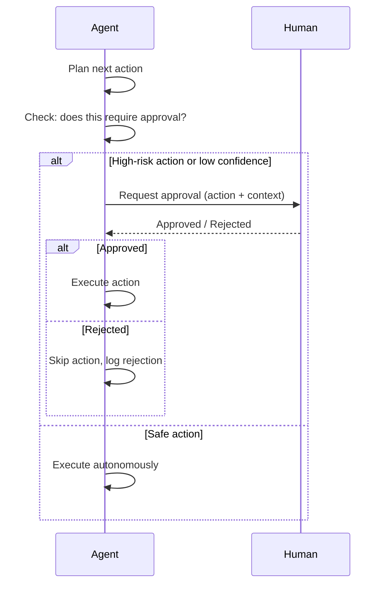
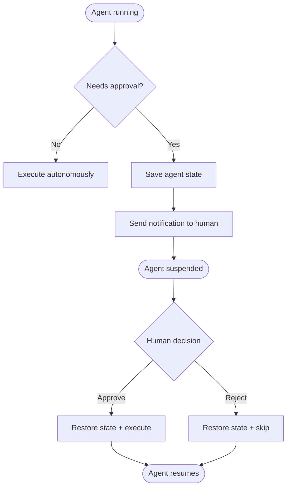

# Concepts: Human-in-the-Loop (HITL)

## The Problem

An autonomous agent that sends emails, deletes files, or makes purchases without checking can cause real damage. Consider:

> An agent tasked with "clean up old customer records" interprets this as "delete all records older than 1 year" — and does it, irreversibly, across your production database.

No tool error. No exception. Just a well-intentioned agent following ambiguous instructions. Without checkpoints, you have no way to stop it.

---

## The Intuition: The Junior Employee Rule

Think of a junior employee joining your company. You don't let them:

- Delete files without approval
- Send client-facing emails independently
- Process payments over a certain amount

But you also don't micromanage every task. They can:

- Read documents
- Write drafts
- Run reports
- Format data

The rule: **routine tasks are autonomous; high-stakes decisions require manager approval**. Your agent should work the same way.

---

## How It Works

### 1. Escalation Criteria

Before executing any action, the agent evaluates whether it needs approval. Three main escalation triggers:

| Trigger | Example |
|---------|---------|
| **Action type** | `delete_file`, `send_email`, `make_payment` always require approval |
| **Confidence score** | If confidence < 0.7, the agent isn't sure — ask |
| **Ambiguous instructions** | "remove the old stuff" — unclear scope, needs clarification |

A simple allowlist of high-risk actions plus a confidence threshold covers most real-world cases.

### 2. Approval Workflow

When escalation is triggered:

1. Agent pauses before executing
2. Sends an approval request (via `input()`, a queue, a webhook, or a UI notification)
3. Waits for human response: **approve** or **reject**
4. If approved: executes the action
5. If rejected: skips the action and logs the decision

### 3. Async HITL

For long-running or batch workflows, synchronous blocking isn't practical. The pattern:

1. Agent reaches a checkpoint requiring approval
2. Agent **saves its state** (action, context, current plan position)
3. Sends a notification (email, Slack, webhook)
4. Human approves or rejects — possibly hours later
5. Agent **resumes** from saved state

This requires durable workflow infrastructure (e.g., Temporal, AWS Step Functions, or a simple database queue). The key insight: the agent doesn't need to stay running while waiting. It can be reconstructed from persisted state.

### 4. Confidence-Based Escalation

LLMs can provide self-assessed confidence scores. If you ask the model to rate its confidence in an action from 0.0 to 1.0, you can use that as an escalation trigger:

```
confidence = 0.55  → escalate (below threshold of 0.7)
confidence = 0.92  → proceed autonomously
```

This is particularly useful when the agent is processing ambiguous or unusual inputs where hard-coded rules wouldn't catch the uncertainty.

---

## Diagrams

### HITL Approval Flow



### Async HITL Flow



---

## Key Terms

| Term | Definition |
|------|-----------|
| **HITL** | Human-in-the-Loop — a design pattern where humans are included in agent decision workflows |
| **Escalation** | The act of pausing and routing a decision to a human rather than proceeding autonomously |
| **Approval workflow** | The mechanism for requesting, receiving, and acting on human approval |
| **Confidence threshold** | A numeric cutoff below which the agent automatically escalates |
| **Durable workflow** | A workflow that can be paused and resumed, with state persisted between executions |
| **State persistence** | Saving enough agent context to resume from an exact point after an interruption |
| **Action allowlist** | A defined set of actions that always require human approval regardless of confidence |

---

## Interview Angle

**"How would you prevent an autonomous agent from taking irreversible actions?"**

Three layers of protection:

1. **Allowlist escalation**: define which actions are always gated by human approval, regardless of context
2. **Confidence threshold**: if the model rates its own certainty below a cutoff, force escalation
3. **Dry-run mode**: before deployment, run the agent in a mode where all "write" actions are logged but not executed — verify the planned actions are correct, then enable

Production agents often combine all three. The key engineering decision is what threshold to set for confidence, and how broad to make the allowlist — too broad and you break automation, too narrow and you miss dangerous edge cases.

---

## Common Mistakes

| Mistake | What Goes Wrong | Fix |
|---------|----------------|-----|
| Asking for approval on everything | Defeats the purpose of automation; human fatigue | Only escalate genuinely high-risk or uncertain actions |
| Never asking for approval | Irreversible damage from edge cases | Define explicit allowlist + confidence threshold from day one |
| Ignoring human rejections | Agent proceeds anyway or loops | Log rejections, abort the action, adjust future behavior |
| No async HITL for long workflows | Agent blocks for hours waiting on input | Use state persistence + notification pattern for multi-hour tasks |

---

Next: [Patterns — Human-in-the-Loop](./patterns.mdx)
