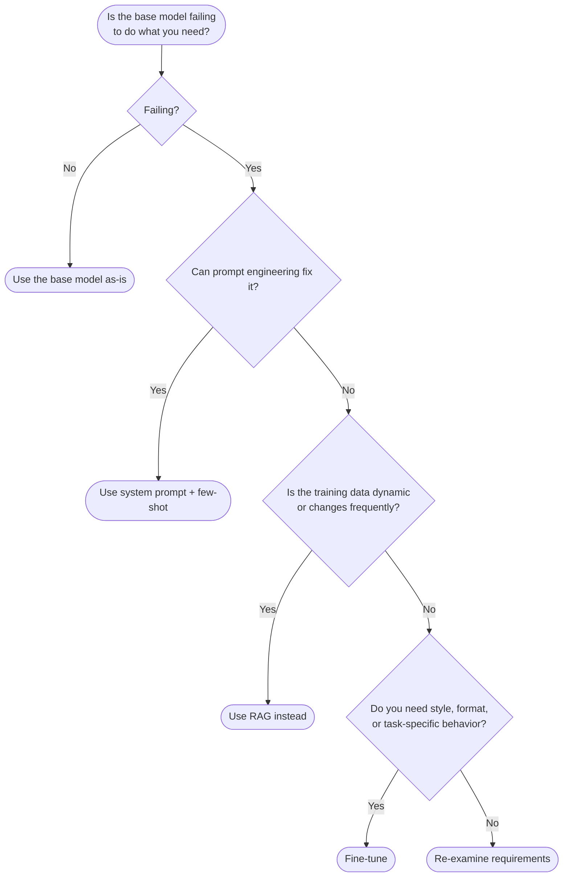
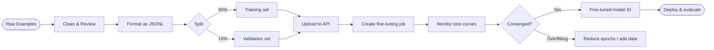
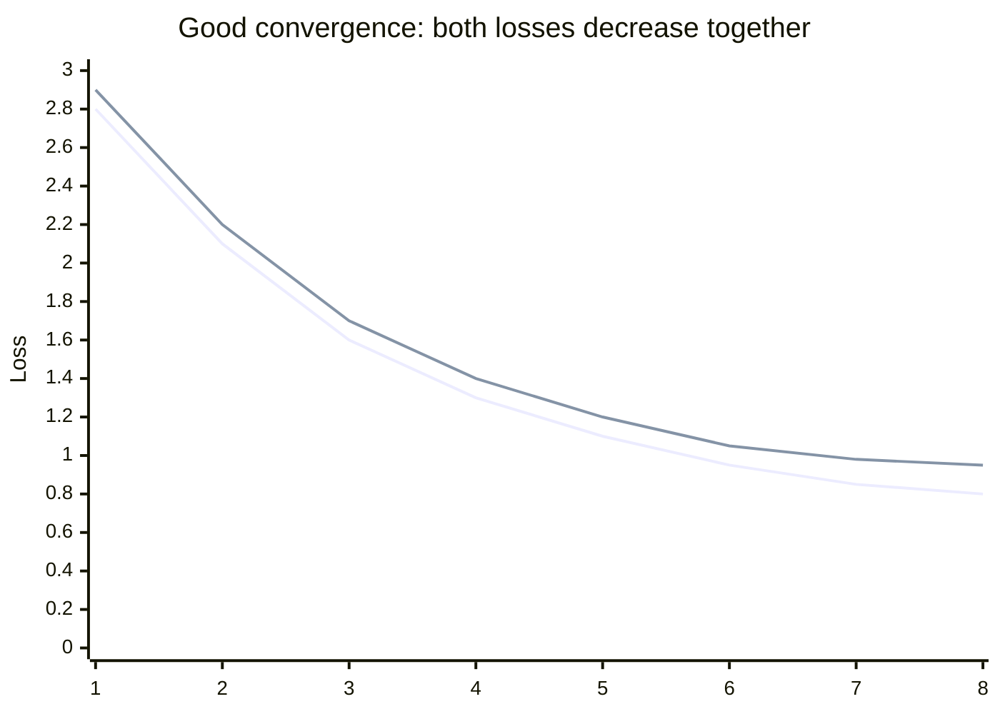

# Concepts: Fine-tuning Basics

## The Problem

Your customer service bot needs to:

1. Always respond in Portuguese
2. Follow a specific brand voice — formal, empathetic, never uses contractions
3. Know your product catalogue, which changes every quarter

Prompt engineering can get you partway there. But with 2,000 hand-curated examples of the exact responses you want, you can fine-tune the model so these properties become its default behaviour — no elaborate system prompt required.

---

## The Intuition: Intensive On-the-Job Training

Fine-tuning is like intensive on-the-job training. A base LLM is like a smart generalist who joined yesterday — they understand everything, but they don't know your specific processes, terminology, or expectations yet.

Fine-tuning is handing them a training manual with 2,000 examples of "here's the situation, here's how we respond." After training, they've internalized the patterns. You still give them instructions (the system prompt), but the baseline behaviour is already aligned to your needs.

---

## How It Works

### 1. Data Preparation

Fine-tuning requires (input, output) example pairs in a specific format. The standard format for chat models is JSONL — one JSON object per line:

```jsonl
{"messages": [{"role": "user", "content": "What is your return policy?"}, {"role": "assistant", "content": "Olá! Nossa política de devolução permite retornos em até 30 dias após a compra, com produto em perfeito estado."}]}
{"messages": [{"role": "user", "content": "Do you ship internationally?"}, {"role": "assistant", "content": "Olá! Sim, realizamos envios internacionais para mais de 50 países. Os prazos de entrega variam de 7 a 21 dias úteis."}]}
```

Each line is a complete conversation example. The model learns to produce the `assistant` content given the `user` content.

### 2. How Much Data Do You Need?

| Task type | Minimum | Recommended |
|-----------|---------|-------------|
| Style / tone / format | 100 | 500–1000 |
| Domain-specific facts | 500 | 1000–5000 |
| Complex reasoning patterns | 1000 | 5000+ |

Quality matters more than quantity. 200 carefully reviewed, accurate examples outperform 2,000 noisy ones. The single most common fine-tuning mistake is training on unreviewed, LLM-generated data.

### 3. Train/Validation Split

Split your dataset before training — typically 90% train, 10% validation.

- **Training set**: the model sees these examples and updates its weights
- **Validation set**: the model never trains on these; they're used to measure generalisation

Watch for **overfitting**: training loss keeps decreasing but validation loss plateaus or increases. The model has memorised the training examples and isn't generalising.

### 4. When to Fine-tune

Fine-tuning is appropriate when you need:

| Use case | Prompt engineering sufficient? | Fine-tune instead? |
|----------|-------------------------------|-------------------|
| Consistent response format (JSON schema) | Sometimes | Yes, if reliability matters |
| Specific language / brand voice | Partially | Yes, if it must be consistent |
| Domain-specific knowledge | Only with RAG | Yes, if data doesn't change |
| Reasoning capability | Not reliably | Rarely — base models reason better |
| Following instructions | Yes | Not needed |

If prompt engineering works reliably, don't fine-tune. Fine-tuning is expensive (money, time, iteration cycles) and adds operational complexity (model versioning, retraining cadence).

### 5. The Fine-tuning Process (OpenAI as example)

```
Step 1: Upload JSONL file  →  files.create(file=..., purpose="fine-tune")
Step 2: Create job         →  fine_tuning.jobs.create(training_file=file_id, model="gpt-4o-mini")
Step 3: Monitor            →  fine_tuning.jobs.retrieve(job_id)  →  status: "running" | "succeeded" | "failed"
Step 4: Get model ID       →  job.fine_tuned_model  →  "ft:gpt-4o-mini-2024-07-18:org::abc123"
Step 5: Deploy             →  Use fine_tuned_model ID in chat.completions.create(model=...)
```

---

## The Fine-tuning Decision Tree

Before spending time and money on fine-tuning, run through this flowchart. Most problems have a cheaper solution.



**Quick heuristic:** if you can describe the behaviour you want in a paragraph and show three examples, try a system prompt first. Only escalate to fine-tuning when the system prompt consistently fails in production.

---

## What Fine-tuning Actually Changes

Understanding what happens under the hood prevents expensive mistakes.

### Full Fine-tuning

Full fine-tuning updates **every weight** in the model. For a 7B-parameter model that is roughly 14 GB of numbers — all of them are candidates for change. This is:

- **Expensive**: requires significant GPU memory and compute time
- **Risky**: susceptible to catastrophic forgetting (see below)
- **Powerful**: can reshape the model's behaviour substantially

### LoRA (Low-Rank Adaptation)

LoRA, covered in depth in Chapter 30, inserts small **adapter matrices** alongside the original weight matrices. Only the adapter weights are updated during training — the original model weights are frozen.

The result: 10–100× fewer trainable parameters compared to full fine-tuning. A model with 7 billion parameters might only update 10–50 million with LoRA. This makes training feasible on a single consumer GPU and reduces the risk of forgetting.

### Catastrophic Forgetting

When you fine-tune on a narrow dataset, the model gets better at your specific task but can lose capability on unrelated tasks. Examples:

- Fine-tune on medical Q&A → the model may start formatting all answers in clinical style, even when asked to write a poem
- Fine-tune heavily on Portuguese → English responses may degrade

**Mitigation strategies:**

- Use LoRA instead of full fine-tuning (frozen base weights cannot forget)
- Mix in general-purpose examples alongside your task-specific ones
- Use the smallest number of epochs that achieves your target validation loss

### Why You Always Fine-tune from a Base Model

Never fine-tune on top of a model that has already been fine-tuned (unless you have a specific, well-understood reason). Each successive fine-tuning pass:

1. Compounds the risk of catastrophic forgetting
2. Makes it harder to reproduce results (two layers of custom training)
3. Can amplify biases from both training runs

Always start from the official base or instruction-tuned checkpoint published by the model provider.

---

## Data Quality vs. Quantity

**100 perfect examples beat 10,000 mediocre ones.** This is the most consistently validated principle in applied fine-tuning, and the one most often ignored.

### What a Good Training Example Looks Like

```jsonl
{
  "messages": [
    {
      "role": "user",
      "content": "My order #48291 hasn't arrived after 14 days. What should I do?"
    },
    {
      "role": "assistant",
      "content": "We sincerely apologise for the delay with your order #48291. Please allow us to investigate immediately. Could you confirm the delivery address on the order? We will contact the courier within 24 hours and provide you with a resolution — either a replacement shipment or a full refund, whichever you prefer."
    }
  ]
}
```

Why this is good:
- **Specific input**: includes an order number, a concrete timeframe, a clear question
- **Consistent output**: formal tone, empathetic opening, clear action, no contractions, defined resolution path
- **No ambiguity**: any reviewer would agree this is the correct response style

### What a Bad Training Example Looks Like

```jsonl
{
  "messages": [
    {
      "role": "user",
      "content": "Where's my stuff?"
    },
    {
      "role": "assistant",
      "content": "Hey! Sorry about that, let me check. It might be delayed, you know how shipping is sometimes. Try checking the tracking link we sent you or contact us if you need more help!"
    }
  ]
}
```

Why this is bad:
- **Vague input**: "Where's my stuff?" could mean anything — no order number, no timeframe
- **Inconsistent style**: uses contractions ("let me", "you know"), casual tone ("Hey!"), contradicts brand voice
- **Weak resolution**: "contact us if you need help" — the user *is* contacting you
- **LLM-generated feel**: reads like a generic chatbot response, not a trained brand voice

If your dataset is full of examples like this second one, fine-tuning will make your model consistently mediocre.

### Minimum Example Counts by Task

| Task type | Minimum viable | Recommended | Notes |
|-----------|---------------|-------------|-------|
| Style / tone / format | 50 | 200–500 | Humans must review every example |
| Complex reasoning tasks | 200+ | 500–1000 | Include diverse edge cases |
| Domain knowledge | 1000+ | 2000–5000 | Pair with RAG for dynamic facts |

Below these minimums, the model will partially learn your pattern but revert to base behaviour on inputs that differ even slightly from your training examples.

---

## Cost and Time Estimates

These are rough estimates as of early 2025. Prices change — always check the provider's current pricing page before budgeting a project.

| Model | Training cost (100 examples) | Training time | Inference cost vs base |
|-------|------------------------------|---------------|------------------------|
| GPT-3.5-turbo | ~$0.50 | ~5 min | Same |
| GPT-4o mini | ~$2.00 | ~10 min | Same |
| Llama 3 8B (LoRA, A100) | ~$1–5 | ~30 min | Self-hosted |

**Notes on the table:**

- OpenAI costs scale roughly linearly with the number of tokens in your training file, not just the number of examples. Longer conversations cost more.
- "Inference cost vs base" being "Same" for OpenAI models means your fine-tuned model is priced at the same per-token rate as the base model — there is no fine-tuned model surcharge on inference.
- Self-hosted Llama costs depend entirely on your GPU hourly rate. An A100 on a cloud provider runs ~$2–4/hour; 30 minutes of training costs ~$1–2 in compute, plus any storage or orchestration overhead.
- For production use, budget for **multiple training runs** — the first run is rarely the one you deploy.

---

## Diagrams

### Fine-tuning Pipeline



### Training vs Validation Loss



---

## Key Terms

| Term | Definition |
|------|-----------|
| **Fine-tuning** | Continuing training on a pre-trained model with a smaller, task-specific dataset |
| **JSONL** | JSON Lines format — one JSON object per line, used for fine-tuning datasets |
| **Training loss** | How well the model predicts the training examples; decreases as training progresses |
| **Validation loss** | Loss on held-out data the model never trained on; measures generalisation |
| **Overfitting** | Training loss decreasing while validation loss stagnates or increases |
| **Catastrophic forgetting** | Fine-tuning on narrow data can degrade the model's general capabilities |
| **Epochs** | Number of times the model iterates over the full training dataset |
| **LoRA** | Low-Rank Adaptation — adds small trainable adapter matrices, freezes base weights |
| **Full fine-tuning** | Updates every weight in the model; powerful but expensive and prone to forgetting |

---

## Interview Angle

**"How many examples do you need to fine-tune effectively?"**

Quality over quantity — always. The minimum is roughly 50–100 examples for style/format tasks, 200+ for complex reasoning, 1000+ for domain knowledge. But 200 high-quality, human-reviewed examples will outperform 2,000 LLM-generated ones.

The more important question is: "Do you need to fine-tune at all?" If the task can be solved with a clear system prompt and few-shot examples in context, that's faster, cheaper, and easier to iterate. Reserve fine-tuning for cases where consistency, latency, or cost at scale justify the investment.

---

## Common Mistakes

| Mistake | What Goes Wrong | Fix |
|---------|----------------|-----|
| Training on LLM-generated data without human review | Model learns to imitate the original model's hallucinations | Always have humans review training examples |
| No train/val split | Can't detect overfitting until you deploy | Always hold out 10% as validation before uploading |
| Fine-tuning when prompting works | Unnecessary complexity, harder to update | Try prompt engineering first; fine-tune only when it reliably fails |
| Too many epochs | Overfitting — model memorises training data | Monitor validation loss; stop when it stops improving |
| Biased training data | Model learns to reflect biases in examples | Audit dataset for representation and accuracy |
| Fine-tuning on top of a fine-tuned model | Compounded forgetting, hard to reproduce | Always start from the official base checkpoint |
| Skipping the decision tree | Time and money spent on fine-tuning a problem that RAG or prompting could solve | Run through the decision flowchart before starting |

---

Next: [Patterns — Fine-tuning Basics](./patterns.mdx)
