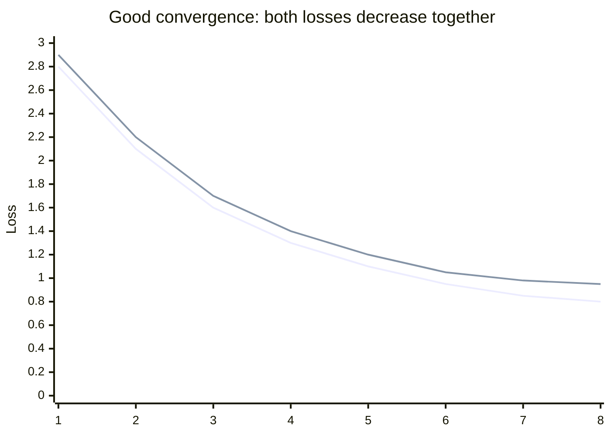

# Concepts: Fine-tuning Basics

## The Problem

Your customer service bot needs to:

1. Always respond in Portuguese
2. Follow a specific brand voice — formal, empathetic, never uses contractions
3. Know your product catalogue, which changes every quarter

Prompt engineering can get you partway there. But with 2,000 hand-curated examples of the exact responses you want, you can fine-tune the model so these properties become its default behaviour — no elaborate system prompt required.

---

## The Intuition: Intensive On-the-Job Training

Fine-tuning is like intensive on-the-job training. A base LLM is like a smart generalist who joined yesterday — they understand everything, but they don't know your specific processes, terminology, or expectations yet.

Fine-tuning is handing them a training manual with 2,000 examples of "here's the situation, here's how we respond." After training, they've internalized the patterns. You still give them instructions (the system prompt), but the baseline behaviour is already aligned to your needs.

---

## How It Works

### 1. Data Preparation

Fine-tuning requires (input, output) example pairs in a specific format. The standard format for chat models is JSONL — one JSON object per line:

```jsonl
{"messages": [{"role": "user", "content": "What is your return policy?"}, {"role": "assistant", "content": "Olá! Nossa política de devolução permite retornos em até 30 dias após a compra, com produto em perfeito estado."}]}
{"messages": [{"role": "user", "content": "Do you ship internationally?"}, {"role": "assistant", "content": "Olá! Sim, realizamos envios internacionais para mais de 50 países. Os prazos de entrega variam de 7 a 21 dias úteis."}]}
```

Each line is a complete conversation example. The model learns to produce the `assistant` content given the `user` content.

### 2. How Much Data Do You Need?

| Task type | Minimum | Recommended |
|-----------|---------|-------------|
| Style / tone / format | 100 | 500–1000 |
| Domain-specific facts | 500 | 1000–5000 |
| Complex reasoning patterns | 1000 | 5000+ |

Quality matters more than quantity. 200 carefully reviewed, accurate examples outperform 2,000 noisy ones. The single most common fine-tuning mistake is training on unreviewed, LLM-generated data.

### 3. Train/Validation Split

Split your dataset before training — typically 90% train, 10% validation.

- **Training set**: the model sees these examples and updates its weights
- **Validation set**: the model never trains on these; they're used to measure generalisation

Watch for **overfitting**: training loss keeps decreasing but validation loss plateaus or increases. The model has memorised the training examples and isn't generalising.

### 4. When to Fine-tune

Fine-tuning is appropriate when you need:

| Use case | Prompt engineering sufficient? | Fine-tune instead? |
|----------|-------------------------------|-------------------|
| Consistent response format (JSON schema) | Sometimes | Yes, if reliability matters |
| Specific language / brand voice | Partially | Yes, if it must be consistent |
| Domain-specific knowledge | Only with RAG | Yes, if data doesn't change |
| Reasoning capability | Not reliably | Rarely — base models reason better |
| Following instructions | Yes | Not needed |

If prompt engineering works reliably, don't fine-tune. Fine-tuning is expensive (money, time, iteration cycles) and adds operational complexity (model versioning, retraining cadence).

### 5. The Fine-tuning Process (OpenAI as example)

```
Step 1: Upload JSONL file  →  files.create(file=..., purpose="fine-tune")
Step 2: Create job         →  fine_tuning.jobs.create(training_file=file_id, model="gpt-4o-mini")
Step 3: Monitor            →  fine_tuning.jobs.retrieve(job_id)  →  status: "running" | "succeeded" | "failed"
Step 4: Get model ID       →  job.fine_tuned_model  →  "ft:gpt-4o-mini-2024-07-18:org::abc123"
Step 5: Deploy             →  Use fine_tuned_model ID in chat.completions.create(model=...)
```

---

## Diagrams

### Fine-tuning Pipeline


### Training vs Validation Loss



---

## Key Terms

| Term | Definition |
|------|-----------|
| **Fine-tuning** | Continuing training on a pre-trained model with a smaller, task-specific dataset |
| **JSONL** | JSON Lines format — one JSON object per line, used for fine-tuning datasets |
| **Training loss** | How well the model predicts the training examples; decreases as training progresses |
| **Validation loss** | Loss on held-out data the model never trained on; measures generalisation |
| **Overfitting** | Training loss decreasing while validation loss stagnates or increases |
| **Catastrophic forgetting** | Fine-tuning on narrow data can degrade the model's general capabilities |
| **Epochs** | Number of times the model iterates over the full training dataset |

---

## Interview Angle

**"How many examples do you need to fine-tune effectively?"**

Quality over quantity — always. The minimum is roughly 100 examples for style/format tasks, 500–1000 for consistent domain-specific behaviour. But 200 high-quality, human-reviewed examples will outperform 2,000 LLM-generated ones.

The more important question is: "Do you need to fine-tune at all?" If the task can be solved with a clear system prompt and few-shot examples in context, that's faster, cheaper, and easier to iterate. Reserve fine-tuning for cases where consistency, latency, or cost at scale justify the investment.

---

## Common Mistakes

| Mistake | What Goes Wrong | Fix |
|---------|----------------|-----|
| Training on LLM-generated data without human review | Model learns to imitate the original model's hallucinations | Always have humans review training examples |
| No train/val split | Can't detect overfitting until you deploy | Always hold out 10% as validation before uploading |
| Fine-tuning when prompting works | Unnecessary complexity, harder to update | Try prompt engineering first; fine-tune only when it reliably fails |
| Too many epochs | Overfitting — model memorises training data | Monitor validation loss; stop when it stops improving |
| Biased training data | Model learns to reflect biases in examples | Audit dataset for representation and accuracy |

---

Next: [Patterns — Fine-tuning Basics](./patterns.mdx)
