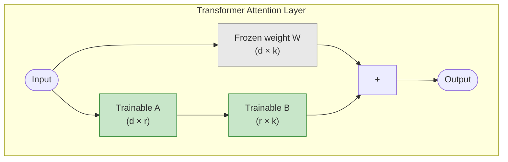

# Concepts: LoRA / QLoRA

## The Problem

Full fine-tuning updates every parameter in the model. For a 7B parameter model stored in 16-bit (float16), that's:

```
7,000,000,000 parameters × 2 bytes = 14 GB just to store the model
+ optimizer states (Adam stores 2 copies per parameter) = +28 GB
+ activations during forward pass = +8 GB
Total: ~50 GB for training
```

A single A100 80GB GPU can handle this. A consumer RTX 4090 (24GB) cannot. Most cloud GPUs top out at 40–80GB. For teams without dedicated ML infrastructure, full fine-tuning is out of reach.

---

## The Intuition: Adapter Matrices

Instead of updating all 7 billion weights, LoRA asks:

> "What if we could represent the *change* to the weights as a much smaller matrix?"

It turns out that weight updates during fine-tuning tend to have **low intrinsic rank** — most of the useful change can be captured in a matrix with far fewer dimensions than the original.

LoRA's solution: **freeze all original weights and add two small trainable matrices (adapters) to key layers**. Only these adapters are trained. 99% of parameters stay fixed.

Think of it as: instead of rewriting a textbook, you write margin notes. The textbook stays unchanged; the notes are small and specific.

---

## How It Works

### 1. LoRA Math

For a weight matrix **W** of shape (d × k), LoRA introduces two matrices:

- **A**: shape (d × r) — randomly initialised
- **B**: shape (r × k) — initialised to zero (so the adapter starts as a no-op)

The effective weight at inference is:

```
W_effective = W + (α / r) × A × B
```

Where **r** is the rank (a small integer like 4, 8, 16) and **α** is a scaling factor.

**Parameter count comparison** (attention layer, d=4096):

| Method | Trainable params |
|--------|-----------------|
| Full fine-tuning | 4096 × 4096 = 16.7M |
| LoRA r=8 | 4096×8 + 8×4096 = 65K |
| LoRA r=16 | 4096×16 + 16×4096 = 131K |

LoRA r=8 trains **256× fewer parameters** than full fine-tuning for this layer.

### 2. Rank (r)

The rank controls the capacity of the adapters:

| Rank | Trainable params | Use case |
|------|-----------------|----------|
| r=4 | Very few | Simple style/format tasks |
| r=8 | Few | Most fine-tuning tasks |
| r=16 | Moderate | Complex domain adaptation |
| r=64 | More | Approaching full fine-tuning capacity |

Lower rank = less capacity = less RAM needed. Start with r=8; increase if the model can't learn the task.

### 3. Alpha (α)

The scaling factor controls how much the adapter output is scaled before being added to the frozen weights. Common convention: set α = r (so scaling = 1.0) or α = 2r.

### 4. QLoRA: Quantization + LoRA

QLoRA pushes memory savings further by quantizing the frozen base model to 4-bit precision:

| Method | 7B model RAM |
|--------|-------------|
| Full fine-tuning (fp16) | ~28 GB |
| LoRA only (fp16 base) | ~14 GB |
| QLoRA (4-bit base + fp16 adapters) | ~5 GB |

The trick: the base model's weights are stored in 4-bit (NF4 format via BitsAndBytes). The LoRA adapter matrices remain in 16-bit for training accuracy. During the forward pass, weights are dequantized on-the-fly.

This makes 7B model fine-tuning possible on a consumer RTX 3090/4090.

### 5. PEFT Library (HuggingFace)

The standard Python interface for LoRA in the HuggingFace ecosystem:

```python
from peft import LoraConfig, get_peft_model, TaskType

config = LoraConfig(
    r=8,
    lora_alpha=16,
    target_modules=["q_proj", "v_proj"],  # which attention layers to adapt
    lora_dropout=0.1,
    bias="none",
    task_type=TaskType.CAUSAL_LM,
)

model = get_peft_model(base_model, config)
model.print_trainable_parameters()
# trainable params: 4,194,304 || all params: 6,738,415,616 || trainable%: 0.0623
```

### 6. After Training: Merge or Keep Separate

Two deployment options:

| Option | Pros | Cons |
|--------|------|------|
| **Keep separate** (adapter + base) | Hot-swappable, small adapter file | Slight inference overhead |
| **Merge into base** | No inference overhead, single model file | Loses hot-swap capability |

```python
# Merge adapters into the base model before deployment
merged_model = model.merge_and_unload()
merged_model.save_pretrained("merged-model/")
```

---

## Diagrams

### LoRA Adapter Placement



### Memory Comparison

```mermaid
bar
    title GPU RAM Required (7B Model)
    x-axis [Full FT, LoRA, QLoRA]
    y-axis "GPU RAM (GB)"
    bar [50, 14, 5]
```

---

## Key Terms

| Term | Definition |
|------|-----------|
| **LoRA** | Low-Rank Adaptation — adds small trainable adapter matrices to frozen model layers |
| **Rank (r)** | The inner dimension of LoRA matrices; controls adapter capacity |
| **Alpha (α)** | Scaling factor for LoRA output; usually set to r or 2r |
| **Adapter** | The small trainable matrices A and B added to a frozen layer |
| **QLoRA** | Quantized LoRA — base model stored in 4-bit, adapters in 16-bit |
| **Quantization** | Reducing numeric precision (fp32 → fp16 → int8 → 4-bit) to save memory |
| **PEFT** | Parameter-Efficient Fine-Tuning — HuggingFace library implementing LoRA and variants |
| **4-bit NF4** | NormalFloat 4-bit quantization format used by BitsAndBytes for QLoRA |
| **BitsAndBytes** | Library that implements 4-bit and 8-bit quantization for transformers |
| **Frozen weights** | Base model parameters that are not updated during LoRA fine-tuning |

---

## Interview Angle

**"How would you fine-tune Llama 3 8B on a single consumer GPU?"**

1. Use **QLoRA**: quantize the base model to 4-bit with BitsAndBytes (`load_in_4bit=True`)
2. Apply **LoRA** adapters via PEFT (`LoraConfig(r=8, target_modules=["q_proj", "v_proj", ...])`)
3. Enable **gradient checkpointing** to trade compute for memory (`model.gradient_checkpointing_enable()`)
4. Train with **SFTTrainer** from TRL or HuggingFace Trainer with a small batch size and gradient accumulation
5. After training: optionally **merge adapters** (`model.merge_and_unload()`) before deployment

This gets a 8B model training on a 24GB RTX 4090 that would normally require 80GB+ for full fine-tuning.

---

## Common Mistakes

| Mistake | What Goes Wrong | Fix |
|---------|----------------|-----|
| Rank too low for complex tasks | Model can't capture required behaviour changes | Start with r=8; increase to r=16 or r=32 if loss stagnates |
| Not merging adapters before deployment | Extra latency and memory from separate adapter computation | Run `merge_and_unload()` before serving if you don't need hot-swap |
| Missing BitsAndBytes setup for QLoRA | Import errors or running in fp16 unexpectedly | Install `bitsandbytes>=0.41` and verify CUDA version |
| Wrong target modules | LoRA applied to wrong layers, misses key attention weights | Check the model architecture; typically `q_proj, v_proj, k_proj, o_proj` |

---

Next: [Patterns — LoRA / QLoRA](./patterns.mdx)
