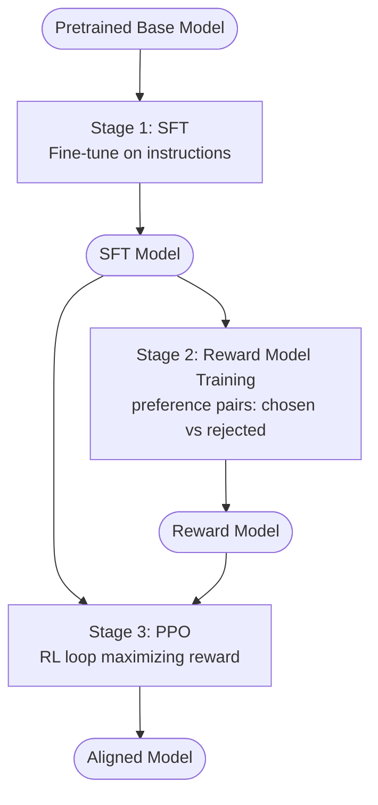
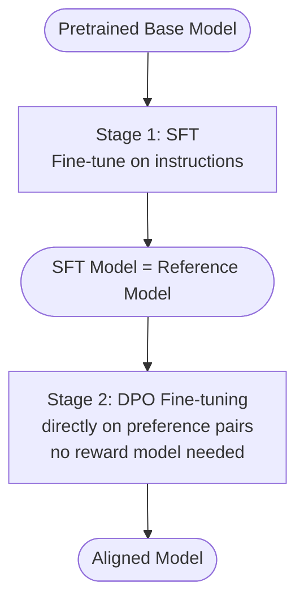

# Concepts: RLHF & DPO

## The Problem

A fine-tuned model follows instructions. But fine-tuning on instruction data does not guarantee the model is:

- **Helpful** — it might give technically correct but useless answers
- **Harmless** — it might comply with dangerous requests
- **Honest** — it might hallucinate confidently

The training objective for fine-tuning is to predict the next token in a training corpus. That objective doesn't care about whether the output is good for the human. You need a different training signal — one that directly incorporates human judgments of quality.

---

## The Intuition

**RLHF = teaching via feedback, not just examples.**

Think of training a dog. You can show a dog examples of sitting by pushing its haunches down (supervised learning). Or you can reward it with a treat every time it sits on command (reinforcement learning from feedback). The second approach produces more generalized, reliable behavior because the signal is "did the behavior please the trainer", not "did the behavior match a demonstration."

**DPO = same goal, simpler math.**

RLHF requires training a separate reward model and running a complex RL loop (PPO). DPO (Direct Preference Optimization) achieves the same alignment effect by reformulating the problem as a classification task — no reward model, no RL training loop. It is faster, more stable, and easier to implement, which is why it has largely replaced RLHF in practice for smaller teams.

---

## How It Works

### 1. The RLHF Pipeline

RLHF has three stages:

**Stage 1 — Supervised Fine-Tuning (SFT)**

Start with a pretrained base model. Fine-tune it on a high-quality instruction dataset (e.g., human-written question-answer pairs). This gives you a model that can follow instructions. The result is the SFT model.

**Stage 2 — Reward Model Training**

Collect preference pairs: for the same prompt, show humans two responses and ask which they prefer. The result is a dataset of `(prompt, chosen_response, rejected_response)` triples.

Train a second model — the **reward model** — to predict which response a human would prefer. Concretely: given a prompt and a response, the reward model outputs a scalar score. It is trained so that `score(chosen) > score(rejected)` for each preference pair.

**Stage 3 — PPO (Reinforcement Learning)**

Use the reward model as the reward signal. Run PPO (Proximal Policy Optimization), an RL algorithm, to update the SFT model. In each PPO step:

- Sample a prompt
- Generate a response with the current model (the "policy")
- Score the response with the reward model
- Update the model weights to increase the probability of high-scoring responses
- Add a KL-divergence penalty to prevent the model from drifting too far from the SFT baseline

This loop continues until the model reliably generates responses the reward model scores highly.

### 2. Reward Model Detail

The reward model is typically initialized from the SFT model (same architecture) with a linear head added to output a scalar. It is trained with a ranking loss:

```
loss = -log(sigmoid(score(chosen) - score(rejected)))
```

This loss is minimized when `score(chosen)` is consistently higher than `score(rejected)`.

### 3. DPO (Direct Preference Optimization)

DPO makes the insight that the RL step in RLHF has a closed-form solution. Instead of training a reward model and then running PPO, DPO directly fine-tunes the policy on the preference pairs.

The DPO objective adjusts the model weights so that:
- The probability of generating `chosen` increases relative to the reference (SFT) model
- The probability of generating `rejected` decreases relative to the reference model

In practice: you fine-tune the model directly on preference pairs using a special loss function. No reward model, no RL loop.

**DPO dataset format:**

```python
{
    "prompt": "Explain what a transformer is.",
    "chosen": "A transformer is a neural network architecture...",
    "rejected": "It's a thing that does stuff with attention."
}
```

### 4. RLHF vs DPO Comparison

| Aspect | RLHF | DPO |
|--------|------|-----|
| Reward model | Required | Not needed |
| Training stability | Can be unstable (PPO is sensitive) | More stable |
| Implementation complexity | High | Moderate |
| Data requirement | Preference pairs | Same: preference pairs |
| Quality ceiling | Slightly higher (more expressive) | Competitive for most use cases |
| Industry adoption | OpenAI InstructGPT, early Claude | Most modern alignment fine-tunes |

---

## Diagrams

### RLHF Pipeline



### DPO Pipeline



---

## Key Terms

| Term | Definition |
|------|-----------|
| **RLHF** | Reinforcement Learning from Human Feedback — the three-stage pipeline to align LLMs with human preferences |
| **SFT** | Supervised Fine-Tuning — Stage 1 of RLHF; fine-tuning on instruction-response examples |
| **Reward model** | A model trained to predict which of two responses a human would prefer; outputs a scalar score |
| **PPO** | Proximal Policy Optimization — the RL algorithm used in Stage 3 of RLHF to update the policy |
| **DPO** | Direct Preference Optimization — directly fine-tunes on preference pairs without a reward model |
| **Preference pair** | A `(prompt, chosen, rejected)` triple where `chosen` is the human-preferred response |
| **chosen / rejected** | The preferred and dispreferred responses in a DPO/RLHF training pair |
| **Constitutional AI** | Anthropic's variant of RLHF that uses a written constitution to generate AI feedback instead of human feedback |

---

## Interview Angle

**"What problem does RLHF solve that fine-tuning doesn't?"**

Fine-tuning optimizes for token prediction — matching the distribution of the training data. If the training data contains helpful responses, the model learns to be helpful; but this is incidental. RLHF directly optimizes for a human preference signal. The reward model encodes "what humans consider good" and PPO steers the model toward outputs that maximize this. The result is more robust alignment, particularly for safety-critical behaviors that are hard to capture in an instruction dataset.

**"Why has DPO largely replaced RLHF in practice?"**

PPO is notoriously difficult to tune. The reward model can be gamed (reward hacking), the KL penalty coefficient requires careful tuning, and training instability is common. DPO sidesteps all of this by reformulating alignment as a supervised classification problem. It uses the same preference data, produces comparable results, and is far easier to implement and reproduce.

---

## Common Mistakes

| Mistake | What Goes Wrong | Fix |
|---------|----------------|-----|
| `chosen == rejected` in training data | The model gets a zero-gradient signal and doesn't learn | Always validate that chosen and rejected differ |
| Vague preference signal | Annotators disagree on which response is better; model gets noisy signal | Write clear annotation guidelines with examples |
| LLM-generated rejections without review | Synthetic bad responses can be subtly wrong rather than clearly bad | Human-review all rejection responses, or use rule-based degradation |
| Not normalizing response length | Longer responses often score higher regardless of quality (verbosity bias) | Control for length in annotation guidelines |

---

Next: [Patterns — RLHF & DPO](./patterns.mdx)
