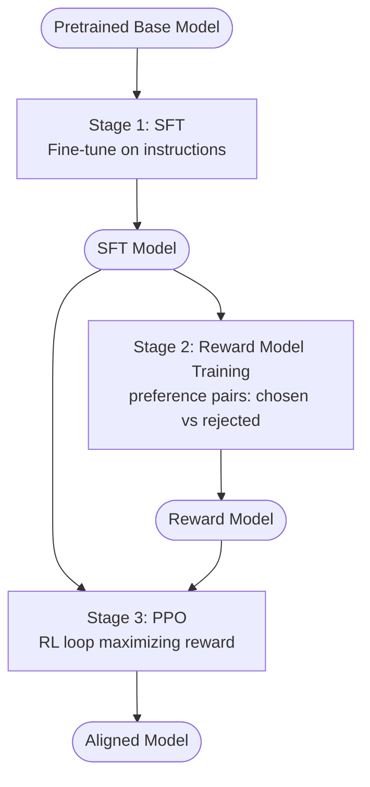
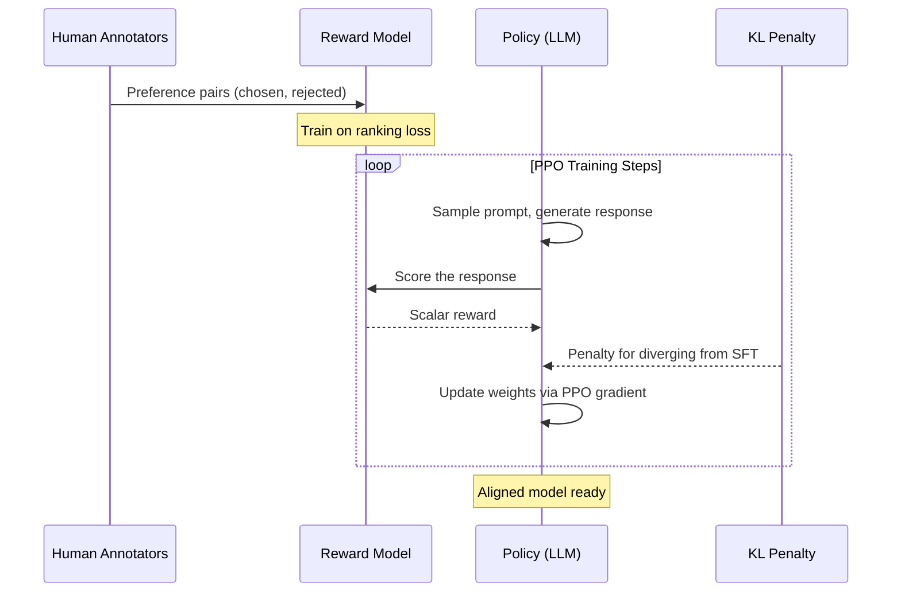
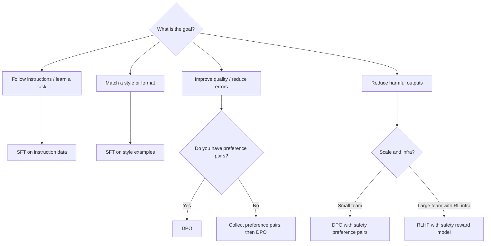

# Concepts: RLHF & DPO

## The Problem

A fine-tuned model follows instructions. But fine-tuning on instruction data does not guarantee the model is:

- **Helpful** — it might give technically correct but useless answers
- **Harmless** — it might comply with dangerous requests
- **Honest** — it might hallucinate confidently

The training objective for fine-tuning is to predict the next token in a training corpus. That objective doesn't care about whether the output is good for the human. You need a different training signal — one that directly incorporates human judgments of quality.

---

## The Intuition

**RLHF = teaching via feedback, not just examples.**

Think of training a dog. You can show a dog examples of sitting by pushing its haunches down (supervised learning). Or you can reward it with a treat every time it sits on command (reinforcement learning from feedback). The second approach produces more generalized, reliable behavior because the signal is "did the behavior please the trainer", not "did the behavior match a demonstration."

**DPO = same goal, simpler math.**

RLHF requires training a separate reward model and running a complex RL loop (PPO). DPO (Direct Preference Optimization) achieves the same alignment effect by reformulating the problem as a classification task — no reward model, no RL training loop. It is faster, more stable, and easier to implement, which is why it has largely replaced RLHF in practice for smaller teams.

---

## How It Works

### 1. The RLHF Pipeline

RLHF has three stages:

**Stage 1 — Supervised Fine-Tuning (SFT)**

Start with a pretrained base model. Fine-tune it on a high-quality instruction dataset (e.g., human-written question-answer pairs). This gives you a model that can follow instructions. The result is the SFT model.

**Stage 2 — Reward Model Training**

Collect preference pairs: for the same prompt, show humans two responses and ask which they prefer. The result is a dataset of `(prompt, chosen_response, rejected_response)` triples.

Train a second model — the **reward model** — to predict which response a human would prefer. Concretely: given a prompt and a response, the reward model outputs a scalar score. It is trained so that `score(chosen) > score(rejected)` for each preference pair.

**Stage 3 — PPO (Reinforcement Learning)**

Use the reward model as the reward signal. Run PPO (Proximal Policy Optimization), an RL algorithm, to update the SFT model. In each PPO step:

- Sample a prompt
- Generate a response with the current model (the "policy")
- Score the response with the reward model
- Update the model weights to increase the probability of high-scoring responses
- Add a KL-divergence penalty to prevent the model from drifting too far from the SFT baseline

This loop continues until the model reliably generates responses the reward model scores highly.

### 2. Reward Model Detail

The reward model is typically initialized from the SFT model (same architecture) with a linear head added to output a scalar. It is trained with a ranking loss:

```
loss = -log(sigmoid(score(chosen) - score(rejected)))
```

This loss is minimized when `score(chosen)` is consistently higher than `score(rejected)`.

### 3. DPO (Direct Preference Optimization)

DPO makes the insight that the RL step in RLHF has a closed-form solution. Instead of training a reward model and then running PPO, DPO directly fine-tunes the policy on the preference pairs.

The DPO objective adjusts the model weights so that:
- The probability of generating `chosen` increases relative to the reference (SFT) model
- The probability of generating `rejected` decreases relative to the reference model

In practice: you fine-tune the model directly on preference pairs using a special loss function. No reward model, no RL loop.

**DPO dataset format:**

```python
{
    "prompt": "Explain what a transformer is.",
    "chosen": "A transformer is a neural network architecture...",
    "rejected": "It's a thing that does stuff with attention."
}
```

### 4. RLHF vs DPO Comparison

| Aspect | RLHF | DPO |
|--------|------|-----|
| Reward model | Required | Not needed |
| Training stability | Can be unstable (PPO is sensitive) | More stable |
| Implementation complexity | High | Moderate |
| Data requirement | Preference pairs | Same: preference pairs |
| Quality ceiling | Slightly higher (more expressive) | Competitive for most use cases |
| Industry adoption | OpenAI InstructGPT, early Claude | Most modern alignment fine-tunes |

---

## Diagrams

### RLHF Pipeline



### DPO Pipeline


---

## RLHF Step-by-Step — What Actually Happens

Here is a concrete walkthrough of each stage, including the role of KL divergence.

### Step 1: Collect preference data

Human annotators are shown a prompt alongside two model-generated completions — call them A and B. They choose which one is better according to a rubric (helpfulness, accuracy, harmlessness). The output is a labelled triple:

```
{ "prompt": "...", "chosen": "...", "rejected": "..." }
```

This is the most expensive and slowest part of the pipeline. High-quality annotation guidelines are critical: annotators must agree on what "better" means or the signal becomes noisy.

### Step 2: Train a reward model

The reward model (RM) is a standard language model with a scalar output head. It takes a prompt and a completion as input and outputs a single number: the estimated human preference score.

Training objective: maximize `score(chosen) - score(rejected)` across all preference pairs. The RM learns to encode the annotators' judgments in its weights.

### Step 3: PPO to optimize the policy

PPO (Proximal Policy Optimization) treats the LLM as the "policy" in an RL framework:

- **State:** the prompt (and generation so far)
- **Action:** the next token to generate
- **Reward:** the RM's score of the completed response

PPO updates the model to increase the probability of token sequences that lead to high RM scores. The "proximal" constraint means each update step is limited in size — this prevents catastrophic forgetting and training instability.

### Step 4: KL divergence penalty

Without constraint, PPO will exploit the reward model — discovering generations that get high scores but look nothing like natural language (reward hacking). The KL divergence penalty counteracts this:

```
total_reward = RM_score - β × KL(policy || SFT_model)
```

`β` (beta) is a hyperparameter controlling how far the model is allowed to drift. Low β → model chases the reward model aggressively (risk of reward hacking). High β → model stays close to SFT behavior (safer but less aligned improvement).

### Full RLHF flow



---

## DPO vs RLHF — The Simpler Alternative

### Why DPO skips the reward model

RLHF trains a reward model and then uses PPO to optimize the policy against it. DPO observes that this two-stage process is mathematically equivalent to directly optimizing a single loss over the preference pairs — no reward model, no PPO loop required.

**The key insight:** the optimal policy under RLHF can be expressed analytically in terms of the reference (SFT) model and the reward function. DPO substitutes that expression back into the preference loss, giving a loss that depends only on the policy and the reference model — both of which you already have.

In practical terms, the DPO loss directly maximizes the log-ratio of the policy's probability of generating `chosen` over `rejected`, relative to the reference model:

```
DPO_loss = -log(sigmoid(
    β × (log P_policy(chosen|prompt) - log P_ref(chosen|prompt))
  - β × (log P_policy(rejected|prompt) - log P_ref(rejected|prompt))
))
```

This is a standard binary cross-entropy loss. It runs in a single supervised fine-tuning loop with no RL machinery.

### DPO vs RLHF at a glance

| Property | RLHF | DPO |
|----------|------|-----|
| Requires a trained reward model | Yes | No |
| Requires a PPO training loop | Yes | No |
| Training stability | Often unstable | Stable (standard SFT loop) |
| Hyperparameter sensitivity | High (β, learning rate, clip ratio) | Low (β, learning rate) |
| Implementation lines of code | Hundreds (RL infra needed) | Tens (standard fine-tuning + custom loss) |
| Result quality | Slightly higher ceiling | Competitive for most tasks |
| Industry adoption | Legacy (InstructGPT era) | Dominant for teams without RL infra |

### What DPO needs

DPO needs exactly the same input data as RLHF stage 2: preference pairs in `(prompt, chosen, rejected)` format. The data collection step is identical. DPO simply removes everything that happens after data collection — no reward model training, no PPO loop.

---

## What DPO Training Data Looks Like

### JSONL format

DPO datasets are typically stored as JSONL (one JSON object per line):

```json
{"prompt": "Explain photosynthesis", "chosen": "Photosynthesis is the process by which plants convert sunlight, water, and carbon dioxide into glucose and oxygen using chlorophyll in their leaves.", "rejected": "It's when plants use the sun to make food or something like that."}
{"prompt": "Write a Python function to sort a list", "chosen": "def sort_list(lst):\n    return sorted(lst)", "rejected": "you can use sort()"}
{"prompt": "What is the capital of France?", "chosen": "The capital of France is Paris.", "rejected": "I think it might be Paris or Lyon, I'm not entirely sure."}
```

### The quality bar

The single most important property of DPO data is that **`chosen` must be clearly better than `rejected`**. If the difference is subtle — for example, both responses are accurate but one is slightly more concise — the gradient signal is too small for the model to learn from. The model needs clear contrast to update its weights in the right direction.

**Good contrast (strong signal):**
- `chosen`: complete, accurate, well-structured answer
- `rejected`: vague, wrong, or harmful answer

**Weak contrast (noisy signal, avoid):**
- `chosen`: 200-word accurate answer
- `rejected`: 180-word accurate answer that is slightly less detailed

**Rules of thumb for DPO data quality:**

| Criterion | Why it matters |
|-----------|---------------|
| Chosen and rejected must differ meaningfully | Subtle differences produce near-zero gradient |
| Chosen must be unambiguously better | Annotator disagreement introduces label noise |
| Avoid length as the only differentiator | Models have a verbosity bias; longer ≠ better |
| Both responses should be plausible | Trivially bad rejections (gibberish) teach the model nothing useful |
| Validate with a second annotator | Single-annotator data has high noise; inter-annotator agreement &gt; 80% is a minimum bar |

### Generating DPO data programmatically

For domain-specific applications, you can generate synthetic preference pairs:

```python
import anthropic
import json

client = anthropic.Anthropic()

def generate_preference_pair(prompt: str) -> dict:
    # Generate a high-quality response
    chosen_response = client.messages.create(
        model="claude-3-opus-20240229",
        max_tokens=512,
        system="You are a helpful, accurate, and thorough assistant.",
        messages=[{"role": "user", "content": prompt}]
    ).content[0].text

    # Generate a lower-quality response (e.g., with a weaker model or degraded prompt)
    rejected_response = client.messages.create(
        model="claude-3-haiku-20240307",
        max_tokens=128,
        system="Give a very brief answer.",
        messages=[{"role": "user", "content": prompt}]
    ).content[0].text

    return {
        "prompt": prompt,
        "chosen": chosen_response,
        "rejected": rejected_response
    }
```

Always human-review synthetic rejections. LLM-generated rejections can be subtly wrong rather than clearly bad, which creates noisy training signal.

---

## When to Use RLHF/DPO vs. Other Alignment Methods

Not every alignment problem requires preference data. The right method depends on what you are trying to achieve.

### Decision table

| Goal | Best approach |
|------|--------------|
| Follow instructions better | SFT on instruction-following data |
| Match a specific style or tone | SFT on examples written in that style |
| Reduce harmful outputs | RLHF with a safety-focused reward model |
| Improve response quality (helpfulness, completeness) | DPO with quality preference pairs |
| Reduce refusals on benign queries | DPO with preference pairs showing appropriate responses |
| Improve factual accuracy | SFT on verified fact-response pairs + RAG for retrieval |
| Teach a new domain (medical, legal) | SFT on domain-specific Q&amp;A data |
| Fix a specific failure mode at scale | DPO targeting that failure mode in preference pairs |

### How to read the table

**SFT** (Supervised Fine-Tuning) is the baseline. It is the right starting point when you have examples of the behavior you want. It does not require preference pairs.

**DPO** is best when you already have an SFT model that works reasonably well and you want to push quality higher or correct systematic errors. It requires preference pairs but no RL infrastructure.

**RLHF** is warranted when DPO quality is insufficient, when you need a generalizable reward signal for a continuously updated system, or when you have the infrastructure to run PPO. In practice, most teams start with DPO and only move to RLHF if they hit a quality ceiling.

**Prompt engineering** (not listed above, but always relevant) should be tried first before any fine-tuning. Many alignment issues can be resolved with a better system prompt.

### Flowchart for method selection



---

## Key Terms

| Term | Definition |
|------|-----------|
| **RLHF** | Reinforcement Learning from Human Feedback — the three-stage pipeline to align LLMs with human preferences |
| **SFT** | Supervised Fine-Tuning — Stage 1 of RLHF; fine-tuning on instruction-response examples |
| **Reward model** | A model trained to predict which of two responses a human would prefer; outputs a scalar score |
| **PPO** | Proximal Policy Optimization — the RL algorithm used in Stage 3 of RLHF to update the policy |
| **DPO** | Direct Preference Optimization — directly fine-tunes on preference pairs without a reward model |
| **Preference pair** | A `(prompt, chosen, rejected)` triple where `chosen` is the human-preferred response |
| **chosen / rejected** | The preferred and dispreferred responses in a DPO/RLHF training pair |
| **KL divergence** | A measure of how different two probability distributions are; used as a penalty to prevent the policy from drifting too far from the SFT model |
| **Constitutional AI** | Anthropic's variant of RLHF that uses a written constitution to generate AI feedback instead of human feedback |

---

## Interview Angle

**"What problem does RLHF solve that fine-tuning doesn't?"**

Fine-tuning optimizes for token prediction — matching the distribution of the training data. If the training data contains helpful responses, the model learns to be helpful; but this is incidental. RLHF directly optimizes for a human preference signal. The reward model encodes "what humans consider good" and PPO steers the model toward outputs that maximize this. The result is more robust alignment, particularly for safety-critical behaviors that are hard to capture in an instruction dataset.

**"Why has DPO largely replaced RLHF in practice?"**

PPO is notoriously difficult to tune. The reward model can be gamed (reward hacking), the KL penalty coefficient requires careful tuning, and training instability is common. DPO sidesteps all of this by reformulating alignment as a supervised classification problem. It uses the same preference data, produces comparable results, and is far easier to implement and reproduce.

---

## Common Mistakes

| Mistake | What Goes Wrong | Fix |
|---------|----------------|-----|
| `chosen == rejected` in training data | The model gets a zero-gradient signal and doesn't learn | Always validate that chosen and rejected differ |
| Vague preference signal | Annotators disagree on which response is better; model gets noisy signal | Write clear annotation guidelines with examples |
| LLM-generated rejections without review | Synthetic bad responses can be subtly wrong rather than clearly bad | Human-review all rejection responses, or use rule-based degradation |
| Not normalizing response length | Longer responses often score higher regardless of quality (verbosity bias) | Control for length in annotation guidelines |
| Using DPO when SFT would suffice | Added complexity without clear benefit | Try SFT first; use DPO only when you need to correct quality issues in an existing SFT model |
| Skipping inter-annotator agreement check | High annotator disagreement means your `chosen`/`rejected` labels are unreliable | Measure agreement; aim for &gt;80% before training |

---

Next: [Patterns — RLHF & DPO](./patterns.mdx)
