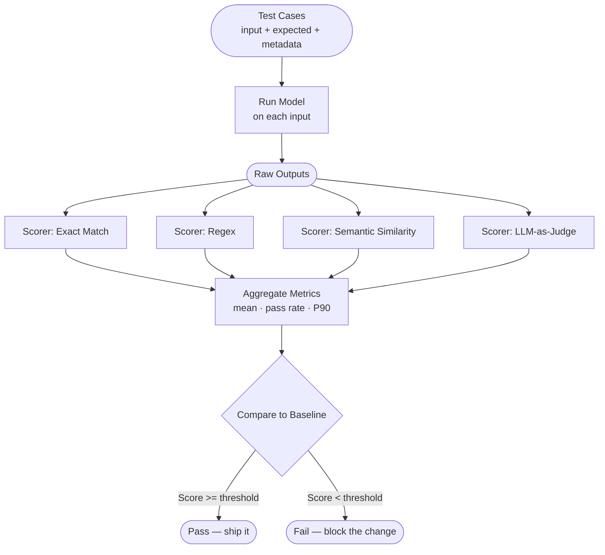
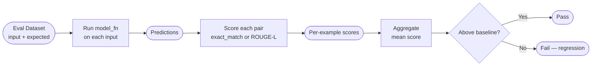

# Concepts: Evals / LLM Evaluation

## The Problem

You built a RAG pipeline. It "seems to work" in your demos. Then you:

- Change the chunk size from 512 to 256 tokens
- Swap the embedding model
- Update the system prompt
- Upgrade to a newer LLM

Each change might help or hurt quality. Without a systematic way to measure quality, you are flying blind. You might ship a regression (a change that makes things worse) without knowing it until users complain.

**Evals are the answer.** They give you a number — or a set of numbers — that you can compare before and after a change.

---

## The Intuition: AI Systems Need Tests Too

Software engineers run unit tests and integration tests to catch regressions. AI systems need the same discipline.

| Software | AI System |
|----------|-----------|
| `assert result == expected` | `exact_match_score(prediction, reference)` |
| Passing test suite | Eval score at or above baseline |
| CI fails on regression | Eval pipeline fails when score drops |
| Test coverage | Eval dataset coverage across input types |

The analogy is imperfect — AI outputs are probabilistic and rarely exactly equal to the expected output — but the engineering discipline is the same: measure systematically, track over time, block changes that degrade quality.

---

## How It Works

### 1. Reference-Based Evaluation

You have a dataset of `(input, expected_output)` pairs. You run each input through the model and compare the actual output to the expected output using a metric.

**Exact Match:** `prediction.strip().lower() == reference.strip().lower()`

Useful for classification tasks, structured outputs, or QA where one correct answer exists.

**ROUGE-L (Recall-Oriented Understudy for Gisting Evaluation — Longest Common Subsequence):**

Measures the overlap between the prediction and reference by finding their longest common subsequence (LCS). Useful for summarization and open-ended QA where the phrasing can vary.

```
ROUGE-L = F1 of LCS-based precision and recall
precision = len(LCS) / len(prediction_tokens)
recall    = len(LCS) / len(reference_tokens)
F1        = 2 * precision * recall / (precision + recall)
```

**F1 Token Overlap:** token-level F1 between prediction and reference. Common for extractive QA tasks.

### 2. Reference-Free Evaluation

No ground truth required. Evaluate properties of the output directly:

- **Fluency**: does the text read naturally?
- **Coherence**: is the response logically consistent?
- **Factuality**: are factual claims plausible (without ground truth verification)?

Reference-free metrics are useful when collecting ground truth is expensive, but they are harder to operationalize reliably.

### 3. Model-Based Evaluation (LLM-as-Judge)

Use a second LLM to score the output according to a rubric. The judge model reads the prompt and response and assigns scores on dimensions like helpfulness, accuracy, and clarity.

Advantages: flexible, can handle open-ended outputs, correlates well with human judgment.
Disadvantages: expensive, introduces its own biases (see Chapter 33).

### 4. Eval Dataset Construction

An eval dataset is a collection of `{"input": ..., "expected_output": ...}` pairs. Best practices:

- **Sample from real production data** — synthetic inputs miss the long tail of user behavior
- **Cover failure modes** — include examples of known difficult cases
- **Human-label expected outputs** — especially for open-ended tasks
- **Keep it versioned** — treat the eval dataset as code; track changes in git

A good eval dataset has 50–500 examples for most applications. Smaller is fine if examples are diverse and representative.

### 5. The Eval Pipeline

```
Eval dataset
    → run each input through the model
    → score each (prediction, reference) pair
    → aggregate scores (mean, pass rate, P90)
    → compare to baseline
    → report regression / improvement
```

The baseline is the score from the last known-good version (e.g., the current production model). If the new score is below the baseline by more than a threshold (e.g., 2 percentage points), the eval fails.

---

## The Eval Pipeline

Evals are not a one-time manual check. They are an automated pipeline that runs every time you change anything — the prompt, the model, the retrieval logic. Here is the full shape of that pipeline:



Key points this diagram makes concrete:

- **Multiple scorers run in parallel** against the same outputs. You rarely rely on a single metric.
- **Aggregation happens after scoring** — you compute pass rate, mean, or P90 across all test cases, not per-example.
- **Comparison to baseline is the gate** — the pipeline produces a binary pass/fail, not just a number.

---

## Types of Scorers

Different tasks need different scorers. Picking the right scorer is as important as writing good test cases.

| Scorer type | How it works | When to use | Cost |
|-------------|-------------|-------------|------|
| Exact match | `output == expected` | Classification, structured output, entity extraction | Free |
| Regex | `re.search(pattern, output)` | Checking format (e.g. JSON shape), presence of required keywords | Free |
| Semantic similarity | `cosine_sim(embed(output), embed(expected)) > threshold` | Paraphrase answers, summaries where wording varies | Embedding cost |
| LLM-as-Judge | Ask another LLM to score on a rubric | Open-ended quality — helpfulness, tone, reasoning correctness | LLM cost |
| Human | Human rates output on a rubric | Gold standard; use to calibrate automated scorers | Expensive |

**Practical rule:** start with free scorers (exact match, regex) for any structured part of your output. Add semantic similarity or LLM-as-Judge only for the parts where exact match fails to capture real quality differences.

---

## Writing Good Test Cases

A test case is more than just an input/output pair. A well-formed test case has three parts:

1. **Input** — the prompt or query the model will receive.
2. **Expected output (or rubric)** — either the exact expected answer, or a rubric that a scorer can use to judge correctness.
3. **Metadata** — tags that let you slice results. Useful tags: `"edge_case"`, `"adversarial"`, `"core_behavior"`, `"language:es"`, `"topic:billing"`.

### Minimal test case structure

```json
{
  "id": "tc-001",
  "input": "What is the refund policy for digital products?",
  "expected_output": "Digital products are non-refundable unless they are defective.",
  "rubric": "Response must mention non-refundable and include the defect exception.",
  "tags": ["core_behavior", "topic:refunds"]
}
```

The `rubric` field is used when the expected output is too rigid — an LLM-as-Judge scorer reads both the `expected_output` and the `rubric` to decide if the actual output passes.

### Coverage requirements

Evals only catch what they cover. A useful rule of thumb:

- **At least 5 examples per behavior you care about.** If you care about refund questions, have at least 5 different refund-related inputs. One example can be fooled by luck; five expose a real pattern.
- **At least 3 adversarial examples per behavior.** Adversarial examples test the boundary: negations ("I do NOT want a refund, I want an exchange"), unusual phrasing, multi-part questions, or inputs that should trigger a refusal. Tag these `"adversarial"` so you can track them separately.

| Behavior | Min examples | Min adversarial |
|----------|-------------|-----------------|
| Billing questions | 5 | 3 |
| Refusal (policy violations) | 5 | 3 |
| Structured output format | 5 | 3 |
| Multilingual inputs | 5 per language | 3 per language |

---

## Connecting Evals to CI

An eval that only runs manually will drift out of use. The right home for evals is your CI pipeline. Every pull request that touches the prompt, model config, or retrieval logic should trigger the eval suite and block merging if the pass rate drops below the threshold.

### Minimal GitHub Actions step

```yaml
- name: Run evals
  run: python evals/run_evals.py --threshold 0.80
  env:
    ANTHROPIC_API_KEY: ${{ secrets.ANTHROPIC_API_KEY }}
```

`run_evals.py` should exit with code `0` when pass rate is at or above the threshold, and exit `1` (or any non-zero code) when it falls below. GitHub Actions treats a non-zero exit code as a failed step and blocks the merge.

### What `run_evals.py` needs to do

1. Load the eval dataset from a versioned file (e.g., `evals/dataset.jsonl`).
2. Run each input through the model (using the same config as production).
3. Score each output with the configured scorers.
4. Compute pass rate = `(number of passing examples) / (total examples)`.
5. Print a summary table per tag so failures are easy to diagnose.
6. Exit `1` if pass rate &lt; threshold, `0` otherwise.

A minimal exit-code pattern in Python:

```python
import sys

pass_rate = compute_pass_rate(results)
print(f"Pass rate: {pass_rate:.2%}")
if pass_rate < args.threshold:
    print(f"FAIL: pass rate {pass_rate:.2%} is below threshold {args.threshold:.2%}")
    sys.exit(1)
```

---

## Diagram



---

## Key Terms

| Term | Definition |
|------|-----------|
| **Eval** | A systematic measurement of model output quality on a defined dataset |
| **Benchmark** | A public eval dataset with a leaderboard; used to compare models at scale |
| **ROUGE** | A family of metrics measuring text overlap; ROUGE-L uses the longest common subsequence |
| **Exact match** | Score of 1 if prediction matches reference exactly (normalized), 0 otherwise |
| **Faithfulness** | Whether a RAG response is grounded in the retrieved context (no hallucination) |
| **Groundedness** | Synonym for faithfulness in RAG evaluation |
| **Regression** | A change that causes eval scores to decrease |
| **Baseline** | The reference score to compare against; usually the current production model's score |

---

## Interview Angle

**"How do you know if a prompt change improved your RAG system?"**

The answer is: you run an eval. Before the change, you run your eval pipeline and record the baseline score (e.g., ROUGE-L = 0.61). After the change, you run it again. If the new score is 0.65, the change is an improvement. If it is 0.58, it is a regression. Without this, you are guessing.

The important follow-up: you need an eval dataset that covers the kinds of questions you care about. An eval on 10 easy examples tells you nothing about hard cases.

---

## Common Mistakes

| Mistake | What Goes Wrong | Fix |
|---------|----------------|-----|
| Manual spot-checking only | You bias toward examples that look good; miss systematic failures | Build an eval dataset and run it every time you ship |
| Evaluating on training data | Scores look great but reflect memorization, not generalization | Always hold out eval data; never use it for training |
| Single metric | ROUGE can be high even for unhelpful responses; exact match misses paraphrases | Use at least two metrics; add an LLM judge for quality |
| Not tracking baselines | You don't know if you regressed | Store eval results in a file or database; compare each run to the last |
| No adversarial test cases | System looks robust on easy examples but fails at edges | Add at least 3 adversarial examples per behavior; tag them separately |
| Evals not in CI | Evals drift out of use when run manually | Wire evals into GitHub Actions; block merges on regression |

---

Next: [Patterns — Evals / LLM Evaluation](./patterns.mdx)
