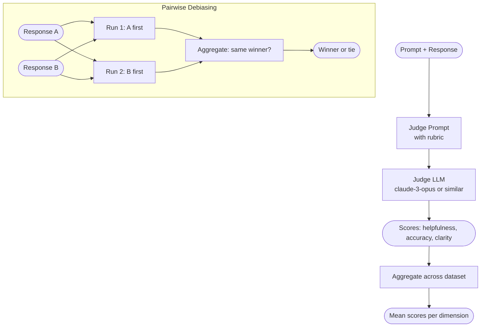

# Concepts: LLM-as-Judge

## The Problem

ROUGE and exact match can measure text overlap. They cannot measure:

- **Helpfulness**: did the response actually address what the user needed?
- **Coherence**: is the reasoning logical and well-organized?
- **Safety**: does the response contain harmful content?
- **Factual accuracy**: are the claims correct, in context?

These are the dimensions that matter most in a production AI system. You can score 0.85 on ROUGE-L and still produce responses that are confusing, off-topic, or misleading.

Human evaluation is the gold standard for these dimensions, but it is slow and expensive. LLM-as-Judge scales human-quality evaluation to thousands of examples per hour.

---

## The Intuition

Imagine you hire a senior editor to review all customer support responses. They read each response, compare it to the original question, and give it a score from 1 to 5 on helpfulness, accuracy, and clarity. They write a brief comment explaining the score.

**LLM-as-Judge automates this process.** You replace the human editor with a capable LLM. You give it:

1. The original prompt (the user's question)
2. The response to evaluate
3. A rubric defining each scoring dimension

The LLM reads all three and returns scores. For hundreds or thousands of responses, this takes seconds instead of weeks.

---

## How It Works

### 1. Single-Answer Judge

The simplest form: given a prompt and a response, score the response on a rubric.

```
System: You are an expert evaluator. Score the response on each dimension.
        Return a JSON object: {"helpfulness": int, "accuracy": int, "clarity": int}
        Each score is 1-5.

User: Prompt: {prompt}
      Response: {response}
      Rubric:
        helpfulness: How well did the response address the user's need? (1=not at all, 5=perfectly)
        accuracy: How factually correct is the response? (1=many errors, 5=fully accurate)
        clarity: How clear and well-organized is the response? (1=confusing, 5=very clear)
```

The judge returns structured scores that you can aggregate across your eval dataset.

### 2. Pairwise Judge

Instead of scoring a single response, compare two responses (A and B) for the same prompt.

```
User: Prompt: {prompt}
      Response A: {response_a}
      Response B: {response_b}
      Which response is better overall? Return "A", "B", or "tie".
```

Pairwise evaluation is useful for A/B testing model versions, comparing prompts, or ranking candidate responses in a retrieval pipeline.

### 3. Biases to Watch

LLM judges are not neutral. They have systematic biases:

**Position bias (order bias):** The judge tends to prefer whichever response appears first (or second) in the prompt, regardless of quality. Studies show judges prefer the first response ~60% of the time even when the responses are swapped and equivalent.

**Verbosity bias:** Longer responses are often scored higher, even when the additional length is redundant or repetitive. Models associate length with thoroughness.

**Self-enhancement bias:** A model judging its own outputs scores them higher than outputs from other models. Using Claude as the judge to evaluate Claude responses inflates scores.

**Sycophancy:** Some models are inclined to give positive scores to responses that include polite language or acknowledgment of the question, regardless of correctness.

### 4. Mitigating Position Bias

The standard mitigation is **response swapping**: run the pairwise judge twice, swapping A and B in the second call. Aggregate the two judgments:

- If both calls prefer the same response: that response wins
- If the calls disagree (A wins first call, B wins second): call it a tie (the preference was driven by position, not quality)

This halves the effect of position bias at the cost of 2x API calls.

### 5. Calibration Against Human Labels

Before trusting a judge at scale, calibrate it against a held-out set of human-labeled examples. Compute:

- **Agreement rate**: percentage of examples where judge and human agree
- **Correlation**: Spearman or Pearson correlation between judge scores and human scores
- **Bias direction**: does the judge systematically over- or under-score on certain dimensions?

A well-calibrated judge should agree with human labels 70–85% of the time on well-defined rubrics. Below 60% suggests the rubric or model needs improvement.

---

## Diagram



---

## Key Terms

| Term | Definition |
|------|-----------|
| **LLM-as-judge** | Using a capable LLM to evaluate another LLM's outputs according to a rubric |
| **Rubric** | A set of evaluation dimensions with scoring scales and descriptions |
| **Pairwise comparison** | Judging which of two responses is better, rather than scoring a single response |
| **Position bias** | The tendency of a judge to prefer the response that appears first in the prompt |
| **Verbosity bias** | The tendency to score longer responses higher, independent of quality |
| **Self-enhancement bias** | A model scoring its own outputs higher than outputs from other models |
| **Calibration** | Comparing judge scores to human labels to measure how trustworthy the judge is |
| **Inter-rater agreement** | The degree to which different evaluators (human or LLM) agree on the same examples |

---

## Interview Angle

**"What is position bias in LLM-as-judge and how do you fix it?"**

Position bias is the tendency of a judge LLM to systematically prefer whichever response appears first (or second) in a pairwise comparison prompt, regardless of actual quality. Studies have shown this is a consistent, measurable effect.

The standard fix: run the pairwise judge twice, swapping the order of responses between runs. If both runs agree on a winner, that winner is chosen. If the runs disagree (each run preferred the first-presented response), the result is called a tie. This eliminates first-position advantage at the cost of 2x API calls.

---

## Common Mistakes

| Mistake | What Goes Wrong | Fix |
|---------|----------------|-----|
| **Same model as generator and judge** | Self-enhancement bias inflates scores; the judge rates its own style favorably | Use a different, ideally stronger, model as judge |
| **No position debiasing for pairwise** | ~60% of preferences reflect presentation order, not quality | Always run pairwise twice with swapped order |
| **Judge without rubric** | Scores are inconsistent across runs and across dimensions | Write an explicit rubric with score anchors (what does a 3 mean?) |
| **Not calibrating against human labels** | Judge may be systematically biased; you won't know until users complain | Build a calibration set of 50–100 human-labeled examples and measure agreement |

---

Next: [Patterns — LLM-as-Judge](./patterns.mdx)
