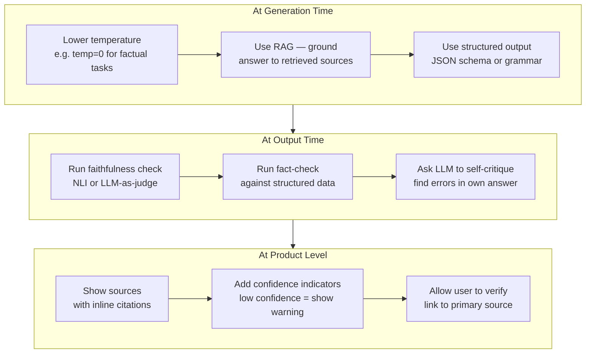
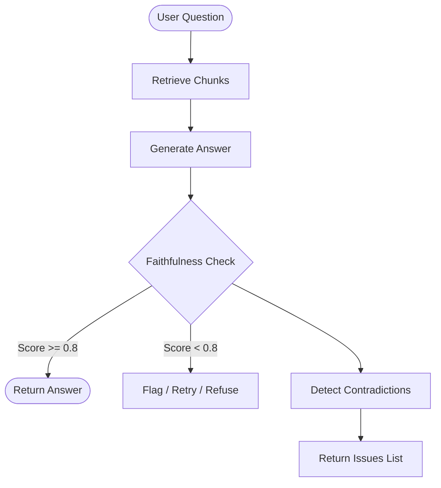

# Concepts: Hallucination Detection

## The Problem

Consider a RAG system answering a question about a product's refund policy. The retrieved context says:

> "Refunds are accepted within 30 days of purchase with a valid receipt."

The generated answer says:

> "You can get a refund within 60 days — no receipt needed."

No tool error. No exception. The answer is fluent, helpful-sounding, and completely wrong. This is a **faithfulness failure**: the answer contradicts the source document the system retrieved to answer the question.

---

## Why LLMs Hallucinate — The Root Cause

Hallucinations are not bugs. They are an emergent property of how LLMs are trained and how they generate text.

### Token prediction, not fact retrieval

An LLM does not look up facts in a database. It predicts the most **statistically likely next token** given everything that came before. When you ask "Who wrote *Crime and Punishment*?", the model does not query an encyclopedia — it predicts that "Dostoevsky" is the most probable continuation of that sentence, because that pattern was common in training data.

This works reliably when a fact appeared many times in training data. It breaks down when the fact was rare, absent, or contradicted by other patterns.

### Training data quality and interpolation

Models learn by compressing patterns from billions of documents. When they encounter a query about something they have only weak signal on, they **interpolate from adjacent patterns** — filling in plausible-sounding details that fit the style of the surrounding text but are not grounded in any specific source.

Think of it like autocomplete for knowledge: the model knows that a company founding story usually includes a year, a city, and a person's name, so it generates all three — even if the specific values are wrong.

### Confidence without calibration

A well-calibrated system knows when it does not know something. LLMs have no internal "I don't know" state. The model generates fluent, confident-sounding text regardless of whether it has relevant knowledge. A hallucinated sentence looks identical to a factually correct sentence in terms of token probabilities.

This is the core danger: **the signal that usually indicates quality (fluency) is decoupled from the signal that actually matters (accuracy)**.

### Where hallucinations cluster

Hallucinations are not uniformly distributed. They are most likely when:

- **Obscure facts** — low frequency in training data means weak signal
- **Recent events** — anything after the model's training cutoff is unknown territory
- **Numerical specifics** — exact figures, dates, percentages, and statistics are rarely memorized precisely
- **Citations and URLs** — the model knows what a citation looks like and will generate one; the specific paper may not exist

---

## Hallucination Types — A Taxonomy

| Type | Description | Example | Detection approach |
|------|-------------|---------|-------------------|
| Factual error | States a wrong fact confidently | "Einstein won the Nobel Prize for relativity" (he won it for the photoelectric effect) | Fact-check against a knowledge base |
| Fabricated citation | Invents a plausible-sounding source | "According to Smith et al. 2019 in *Nature*..." (paper does not exist) | Verify citations exist via API or search |
| Numeric hallucination | Gets numbers, dates, or percentages wrong | "The company was founded in 1987" (actually 1994) | Cross-reference structured data |
| Instruction drift | Fails to follow a constraint mid-generation | "Write in JSON" → outputs half JSON then switches to prose | Output schema validation |
| Context unfaithfulness | Contradicts the provided context | RAG answer says opposite of what the retrieved document states | NLI entailment check against source |

---

## How It Works

### 1. NLI-Based Detection

**Natural Language Inference (NLI)** is a classification task with three labels:
- **Entailment**: the context supports the claim
- **Contradiction**: the context contradicts the claim
- **Neutral**: the context neither supports nor contradicts (the claim is not grounded)

NLI models (e.g., DeBERTa fine-tuned on NLI datasets) take a (context, claim) pair and return one of these labels. Fast, cheap, and doesn't require an API call. The downside: NLI models struggle with long contexts and multi-sentence reasoning.

### 2. LLM-Based Faithfulness Check

Ask an LLM directly: "Does the answer contradict the context? Return a score from 0 (fully contradicts) to 1 (fully supported)."

This is the **LLM-as-judge** pattern applied to faithfulness. The LLM can handle complex reasoning, multi-sentence context, and nuanced claims that NLI models miss. The trade-off: higher latency and cost.

Prompt structure:
```
Given a context and an answer, rate how faithful the answer is to the context.
Return JSON: {"score": float 0-1, "reason": "explanation"}

Context: {context}
Answer: {answer}
```

### 3. Self-Consistency Check

Generate the same answer **N times** with temperature > 0. If the answers are consistent with each other, the model has high confidence. If they contradict each other, the model is uncertain — a signal that the answer may be hallucinated.

This is model-intrinsic: you don't need a separate judge. But it multiplies your API costs by N.

### 4. Source Attribution Check

For each sentence in the answer, find the most similar sentence in the retrieved context (using cosine similarity or exact substring match). Sentences with no close match in the context are likely hallucinated or out-of-scope additions.

---

## Detection Methods — Code Examples

### Regex-based numerical fact extraction and comparison

Extract numbers from a claim and a source, then flag mismatches.

```python
import re

def extract_numbers(text: str) -> list[float]:
    """Extract all numbers (including decimals) from a text string."""
    pattern = r"\b\d+(?:\.\d+)?\b"
    return [float(m) for m in re.findall(pattern, text)]

def numeric_mismatch(claim: str, source: str) -> dict:
    """
    Compare numbers in a claim against numbers in the source.
    Returns a dict with any values in the claim not found in the source.
    """
    claim_numbers = set(extract_numbers(claim))
    source_numbers = set(extract_numbers(source))
    unsupported = claim_numbers - source_numbers
    return {
        "claim_numbers": sorted(claim_numbers),
        "source_numbers": sorted(source_numbers),
        "unsupported": sorted(unsupported),
        "has_mismatch": len(unsupported) > 0,
    }

# Example
source = "Refunds are accepted within 30 days of purchase."
claim  = "You can get a refund within 60 days."

result = numeric_mismatch(claim, source)
print(result)
# {
#   'claim_numbers': [60.0],
#   'source_numbers': [30.0],
#   'unsupported': [60.0],
#   'has_mismatch': True
# }
```

### NLI-based faithfulness check using sentence embeddings

A lightweight proxy for faithfulness: embed the claim and the source, then use cosine similarity as a rough entailment signal. For a production system use a dedicated NLI model (e.g., `cross-encoder/nli-deberta-v3-small`), but cosine similarity is a fast first pass.

```python
from sentence_transformers import SentenceTransformer, util

model = SentenceTransformer("all-MiniLM-L6-v2")

def faithfulness_score(claim: str, source: str) -> float:
    """
    Returns cosine similarity between claim and source embeddings.
    Score close to 1.0 = semantically similar (likely faithful).
    Score close to 0.0 = semantically distant (possible hallucination).
    """
    embeddings = model.encode([claim, source], convert_to_tensor=True)
    score = util.cos_sim(embeddings[0], embeddings[1])
    return float(score)

def check_faithfulness(answer: str, context: str, threshold: float = 0.75) -> dict:
    """Split answer into sentences and score each one against the context."""
    sentences = [s.strip() for s in answer.split(".") if s.strip()]
    results = []
    for sentence in sentences:
        score = faithfulness_score(sentence, context)
        results.append({
            "sentence": sentence,
            "score": round(score, 3),
            "faithful": score >= threshold,
        })
    overall = sum(r["score"] for r in results) / len(results) if results else 0.0
    return {"sentences": results, "overall_score": round(overall, 3)}

# Example
context = "Refunds are accepted within 30 days of purchase with a valid receipt."
answer  = "You can get a refund within 60 days — no receipt needed."

report = check_faithfulness(answer, context)
for r in report["sentences"]:
    status = "OK" if r["faithful"] else "FLAG"
    print(f"[{status}] ({r['score']}) {r['sentence']}")
# [FLAG] (0.512) You can get a refund within 60 days — no receipt needed
```

### LLM-as-judge prompt template

Use this prompt to ask a capable LLM to evaluate whether a generated answer is faithful to the provided context. Structured output makes the result easy to parse.

```python
HALLUCINATION_JUDGE_PROMPT = """You are a strict fact-checker evaluating whether an AI-generated answer is faithful to a source context.

## Source Context
{context}

## Generated Answer
{answer}

## Task
1. Identify every factual claim in the Generated Answer.
2. For each claim, check whether the Source Context supports it, contradicts it, or neither (neutral/ungrounded).
3. Return your evaluation as JSON with this exact schema:

{{
  "faithfulness_score": <float 0.0 to 1.0>,
  "verdict": "<faithful | unfaithful | uncertain>",
  "claims": [
    {{
      "claim": "<exact quote from answer>",
      "label": "<supported | contradicted | neutral>",
      "reason": "<one sentence explanation>"
    }}
  ],
  "summary": "<one sentence overall assessment>"
}}

Rules:
- faithfulness_score of 1.0 means every claim is supported by the context.
- A single contradicted claim should push the score below 0.5.
- Neutral/ungrounded claims should lower the score proportionally.
- Be strict. A claim is only "supported" if the context explicitly states it.
"""

def build_judge_prompt(context: str, answer: str) -> str:
    return HALLUCINATION_JUDGE_PROMPT.format(context=context, answer=answer)

# Usage with any OpenAI-compatible client
# response = client.chat.completions.create(
#     model="gpt-4o",
#     messages=[{"role": "user", "content": build_judge_prompt(context, answer)}],
#     response_format={"type": "json_object"},
# )
# result = json.loads(response.choices[0].message.content)
# if result["faithfulness_score"] < 0.8:
#     raise ValueError(f"Hallucination detected: {result['summary']}")
```

---

## Mitigation Strategies

Prevention is cheaper than detection. Apply mitigations at three levels: generation, output, and product.



**At generation time** — reduce the opportunity for hallucination before it happens:
- Lower temperature forces the model toward high-probability (usually more factual) completions.
- RAG gives the model specific source material to draw from instead of relying on memorized patterns.
- Structured output (JSON schema, grammar-constrained decoding) prevents instruction drift.

**At output time** — catch hallucinations before they reach the user:
- Faithfulness check (NLI or LLM-as-judge) scores the answer against the source context.
- Fact-check cross-references specific claims against a trusted structured data source.
- Self-critique prompts the model to re-read its own answer and flag uncertain claims.

**At product level** — build trust and recoverability into the UI:
- Inline citations let users trace every claim back to its source.
- Confidence indicators (e.g., "low confidence — verify this") set appropriate expectations.
- Links to primary sources give users a path to verify independently.

---

## Diagram: RAG Faithfulness Pipeline



---

## Key Terms

| Term | Definition |
|------|-----------|
| **Hallucination** | When an LLM generates content that is factually incorrect or unsupported by the provided context |
| **Faithfulness** | The degree to which an answer is supported by and consistent with the source context |
| **Groundedness** | Similar to faithfulness; the answer is "grounded" in the retrieved documents |
| **NLI** | Natural Language Inference — a classification task (entailment/contradiction/neutral) for (premise, hypothesis) pairs |
| **Entailment** | The premise (context) logically supports the hypothesis (claim) |
| **Self-consistency** | A technique where multiple independent generations are compared; high variance signals uncertainty |
| **LLM-as-judge** | Using a capable LLM to evaluate the output of another LLM for quality, faithfulness, or correctness |
| **Instruction drift** | When a model stops following a formatting or structural constraint part-way through a long generation |
| **Numeric hallucination** | Generating plausible-looking but incorrect numbers, dates, or statistics |

---

## Interview Angle

**"How would you detect if your RAG system is hallucinating?"**

Three-layer answer:

1. **Faithfulness scorer**: use an LLM judge to score each answer 0–1 against the retrieved context. Flag any answer below your threshold (e.g., 0.8) for review or refusal.
2. **Sentence-level contradiction detection**: decompose the answer into sentences and check each one against the context. This gives you granular signal — you can identify *which part* of the answer is fabricated.
3. **Self-consistency**: generate the answer 3–5 times at temperature 0.7. If answers contradict each other, the model is uncertain — don't surface any of them without review.

In production, combine (1) and (2): use (1) for go/no-go decisions and (2) for debugging and improving your retrieval.

---

## Common Mistakes

| Mistake | What Goes Wrong | Fix |
|---------|----------------|-----|
| Checking faithfulness after the fact, not in the pipeline | Hallucinated answers reach users | Run faithfulness check in the pipeline before returning the answer |
| Using one global score without sentence breakdown | You know the answer is bad but not which part | Add sentence-level detection alongside the global score |
| Setting the threshold too low | Hallucinated answers pass | Calibrate threshold on a labeled dataset; start at 0.8 |
| Treating "neutral" as "faithful" | Ungrounded claims pass as faithful | A score of 1.0 means every claim is supported; neutral claims should lower the score |
| Skipping faithfulness checks on short answers | Short answers hallucinate too | Apply the check regardless of answer length |

---

Next: [Patterns — Hallucination Detection](./patterns.mdx)
