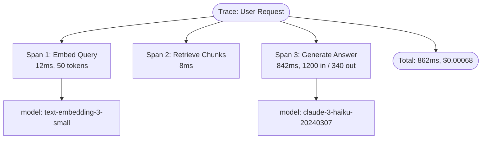

# Concepts: Tracing & Observability

## The Problem

An agent processes 1,000 support tickets overnight. In the morning you discover that 80 of them were handled incorrectly. You look at the code — it looks fine. You look at the logs — you see "Request completed." That's it.

Questions you cannot answer:
- Which step failed? Was it retrieval, generation, or post-processing?
- Was it slow? Did timeouts cause retries that cascaded into errors?
- Was it expensive? Did some requests use 10x the expected tokens?
- What was the exact prompt for the failing cases?

Without tracing, you are debugging in the dark.

---

## The Intuition: Distributed Tracing for LLM Calls

If you have worked with microservices, you know distributed tracing: every request gets a trace ID, every service call becomes a span, and a trace visualiser shows you the full execution tree with timing.

Apply the same idea to LLM pipelines:
- Each **LLM call** is a **span** — the atomic unit of observable work
- A **trace** is the sequence of spans for one user request
- Spans record: model name, input tokens, output tokens, latency, cost, errors

The key insight: you don't need a fancy platform to start. You can capture these metrics manually with a simple decorator or context manager and log them to a file or database.

---

## How It Works

### 1. Span — One LLM Call

A span captures everything about a single LLM call:

| Field | Type | Example |
|-------|------|---------|
| `name` | str | "retrieval_reranker" |
| `model` | str | "claude-3-haiku-20240307" |
| `input_tokens` | int | 1200 |
| `output_tokens` | int | 340 |
| `latency_ms` | float | 842.3 |
| `error` | str \| None | None |

### 2. Trace — One User Request

A trace is a list of spans for a single end-to-end request. From a trace you can compute:
- **Total tokens** = sum of all input + output tokens across all spans
- **Total latency** = sum of all span latencies (for sequential pipelines)
- **Total cost** = sum of (input_tokens × input_price + output_tokens × output_price) for each span

### 3. Key Metrics

| Metric | Why It Matters |
|--------|---------------|
| **Latency per span** | Identifies bottleneck steps |
| **Total tokens per trace** | Predicts cost per request |
| **Cost per trace** | Enables billing and budget alerts |
| **Error rate** | Measures reliability per step |
| **p95 latency** | SLA monitoring |

### 4. Observability Tools

| Tool | What It Does |
|------|-------------|
| **LangSmith** | LangChain's built-in tracing — captures prompts, responses, latencies, token counts |
| **LangFuse** | Open-source LLM observability platform — traces, evaluations, cost dashboards |
| **Weights & Biases** | ML experiment tracking extended to LLM pipelines |
| **OpenTelemetry** | Vendor-neutral standard for traces, metrics, logs — integrates with Datadog, Jaeger etc. |

### 5. Manual Tracing: Decorator + Context Manager Pattern

For pipelines where you own the code, a simple decorator is often sufficient:

```python
import time
import functools

def trace_span(name: str):
    def decorator(fn):
        @functools.wraps(fn)
        def wrapper(*args, **kwargs):
            start = time.time()
            try:
                result = fn(*args, **kwargs)
                latency_ms = (time.time() - start) * 1000
                print(f"[TRACE] {name} completed in {latency_ms:.1f}ms")
                return result
            except Exception as e:
                latency_ms = (time.time() - start) * 1000
                print(f"[TRACE] {name} FAILED in {latency_ms:.1f}ms: {e}")
                raise
        return wrapper
    return decorator
```

---

## Diagram: Trace Structure for a RAG Pipeline



---

## Key Terms

| Term | Definition |
|------|-----------|
| **Trace** | The complete record of all operations for a single user request |
| **Span** | A single unit of work within a trace — one LLM call, one tool call, one retrieval |
| **Latency** | Time taken for a span or trace to complete, measured in milliseconds |
| **Tokens** | Input and output token counts — the primary driver of LLM API cost |
| **Cost** | USD cost calculated from token counts and per-model pricing |
| **Observability** | The ability to understand a system's internal state from its external outputs |
| **LangFuse** | An open-source LLM observability platform that captures traces, scores, and dashboards |
| **Instrumentation** | Adding tracing/logging code to capture runtime behaviour |

---

## Interview Angle

**"How would you debug a production AI pipeline where some requests are slow or expensive?"**

Four steps:
1. **Add tracing**: wrap every LLM call with a span that records model, tokens, and latency
2. **Aggregate by trace**: for each user request, sum tokens and latency across all spans to get a request-level view
3. **Identify outliers**: sort traces by total cost or latency — the worst 5% usually reveal the pattern
4. **Drill into spans**: for expensive/slow traces, look at which span is the culprit — is it retrieval, generation, or a downstream tool call?

In production, use LangFuse or LangSmith to get this automatically. For internal tools, a simple span decorator writing to Postgres or S3 is often enough.

---

## Common Mistakes

| Mistake | What Goes Wrong | Fix |
|---------|----------------|-----|
| Logging only errors | You know it failed but not why or how long it took | Log every call: latency, tokens, model, status |
| Not capturing input/output tokens | Cannot calculate cost or diagnose runaway token usage | Always record `usage.input_tokens` and `usage.output_tokens` from the API response |
| Flat logging (no trace grouping) | Individual log lines but no way to correlate them to a single request | Group spans under a trace ID (UUID per request) |
| Capturing in production but not staging | Surprises in production that staging would have caught | Instrument all environments — latency and cost surprises are common in dev too |

---

Next: [Patterns — Tracing & Observability](./patterns.mdx)
