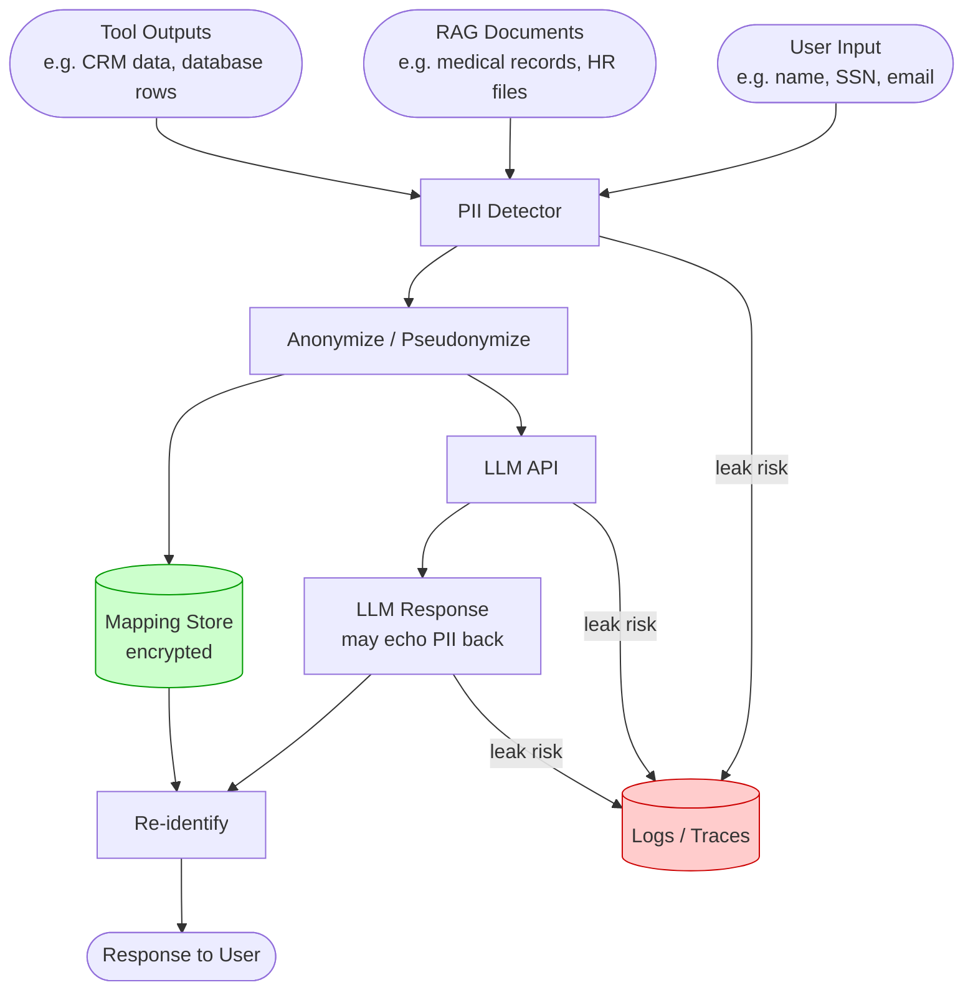
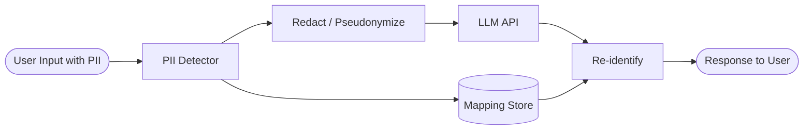

# Concepts: PII Handling

## The Problem

A user submits this message to your AI support assistant:

> "Hi, my name is John Smith, my SSN is 123-45-6789, and I need help with my account. My email is john.smith@example.com and my credit card 4111-1111-1111-1111 was charged incorrectly."

You call the LLM API with this message verbatim. You just sent a real person's name, SSN, email, and credit card number to a third-party API. Even if you trust that API, you may have violated GDPR, HIPAA, or your own data processing agreement.

---

## The Intuition: Anonymise Before Sending

The fix is to process the text *before* it reaches the LLM:

1. **Detect** what types of PII are present
2. **Redact** (replace with `[EMAIL_REDACTED]`) or **pseudonymize** (replace with a consistent fake)
3. **Send the cleaned text** to the LLM
4. **Re-identify** if needed: swap pseudonyms back for the user's response

The user sees a complete response. The LLM never saw real PII.

---

## PII in the LLM Pipeline — Where It Leaks

PII does not only enter through the user's chat message. It can appear at every stage of an LLM pipeline. Each node below is a potential leak point.



**Key leak points:**

| Location | How PII Enters | Risk |
|----------|---------------|------|
| User input | Direct user message | Always present |
| RAG documents | Retrieved chunks from HR, medical, legal files | High if corpus is not scrubbed |
| Tool outputs | CRM lookups, database queries return full records | Easily overlooked |
| LLM responses | Model echoes back PII from context | Common with verbose prompts |
| Logs and traces | Raw prompt logging captures everything | Persistent, hard to purge |
| Fine-tuning datasets | Exported conversation data used for training | Catastrophic if not cleaned |

---

## How It Works

### 1. PII Types

| Type | Example | Detection Method |
|------|---------|-----------------|
| **Email** | john@example.com | Regex |
| **Phone** | +1 (555) 123-4567 | Regex |
| **SSN** | 123-45-6789 | Regex |
| **Credit Card** | 4111-1111-1111-1111 | Regex (Luhn check optional) |
| **Name** | John Smith | NER model (not covered here) |
| **IP Address** | 192.168.1.1 | Regex |

For structured PII (emails, phone numbers, SSNs, credit cards), regex is fast and accurate. For unstructured PII (names, organisations, addresses), you need a Named Entity Recognition (NER) model.

### 2. Detection

```python
PII_PATTERNS = {
    "email": r"\b[A-Za-z0-9._%+-]+@[A-Za-z0-9.-]+\.[A-Z|a-z]{2,}\b",
    "ssn":   r"\b\d{3}-\d{2}-\d{4}\b",
}
```

Run each pattern against the input text. Return a dict of `{pii_type: [matched_values]}`.

### 3. Redaction

Replace each PII match with a type label: `[EMAIL_REDACTED]`, `[SSN_REDACTED]`, `[PHONE_REDACTED]`.

```
Input:  "My email is john@example.com and my SSN is 123-45-6789."
Output: "My email is [EMAIL_REDACTED] and my SSN is [SSN_REDACTED]."
```

Redaction is one-way: you cannot get the original values back from the redacted text. Use this when the LLM doesn't need the actual values.

### 4. Pseudonymization

Replace each unique PII value with a consistent placeholder (e.g., `email_1`, `phone_1`). The same value always maps to the same placeholder within a processing context. This allows the LLM to reason about relationships ("email_1 sent a message to email_2") without seeing real values.

```python
mapping = {}
counter = {}

def pseudonymize_value(value: str, pii_type: str) -> str:
    if value not in mapping:
        count = counter.get(pii_type, 0) + 1
        counter[pii_type] = count
        mapping[value] = f"{pii_type}_{count}"
    return mapping[value]
```

The `mapping` dictionary lets you re-identify after the LLM call.

### 5. Re-identification

After the LLM produces a response (using pseudonyms), swap the pseudonyms back for the original values:

```
LLM Response: "The account for email_1 has been updated."
After re-id:  "The account for john@example.com has been updated."
```

---

## Detection: Regex + NER + LLM

No single detection method catches all PII. A production system layers all three.

### Approach 1: Regex (fast, high-precision for structured PII)

```python
import re
from typing import Dict, List

PII_PATTERNS: Dict[str, str] = {
    "email":       r"\b[A-Za-z0-9._%+\-]+@[A-Za-z0-9.\-]+\.[A-Za-z]{2,}\b",
    "phone":       r"\b(?:\+1[\s\-.]?)?\(?\d{3}\)?[\s\-.]?\d{3}[\s\-.]?\d{4}\b",
    "ssn":         r"\b\d{3}-\d{2}-\d{4}\b",
    "credit_card": r"\b(?:\d{4}[\s\-]){3}\d{4}\b",
    "ip_address":  r"\b(?:\d{1,3}\.){3}\d{1,3}\b",
}

def detect_pii_regex(text: str) -> Dict[str, List[str]]:
    """Return all PII matches grouped by type."""
    findings: Dict[str, List[str]] = {}
    for pii_type, pattern in PII_PATTERNS.items():
        matches = re.findall(pattern, text)
        if matches:
            findings[pii_type] = matches
    return findings

# Example usage
text = "Call me at 555-867-5309 or email jane@example.com. SSN: 987-65-4321."
print(detect_pii_regex(text))
# {'phone': ['555-867-5309'], 'email': ['jane@example.com'], 'ssn': ['987-65-4321']}
```

**When to use:** Always as the first pass. Fast (&lt;1ms), zero dependencies, catches structured PII reliably.

### Approach 2: spaCy NER (for names, organisations, locations)

```python
import spacy

# python -m spacy download en_core_web_sm
nlp = spacy.load("en_core_web_sm")

ENTITY_TYPES_TO_FLAG = {"PERSON", "ORG", "GPE", "LOC", "FAC"}

def detect_pii_ner(text: str) -> Dict[str, List[str]]:
    """Use spaCy NER to find unstructured PII: names, orgs, locations."""
    doc = nlp(text)
    findings: Dict[str, List[str]] = {}
    for ent in doc.ents:
        if ent.label_ in ENTITY_TYPES_TO_FLAG:
            key = ent.label_.lower()
            findings.setdefault(key, []).append(ent.text)
    return findings

# Example usage
text = "John Smith works at Acme Corp in New York and filed a complaint."
print(detect_pii_ner(text))
# {'person': ['John Smith'], 'org': ['Acme Corp'], 'gpe': ['New York']}
```

**When to use:** After regex. Catches names, company names, and cities that regex cannot pattern-match reliably.

### Approach 3: LLM-based detection (for contextual/nuanced PII)

Some PII is only recognisable in context. "My employee ID is 12345" — `12345` is not inherently PII, but the sentence makes it one. An LLM can reason about this.

```python
import anthropic
import json

client = anthropic.Anthropic()

def detect_pii_llm(text: str) -> Dict[str, List[str]]:
    """
    Use an LLM to detect contextual PII that regex and NER miss.
    Returns a dict of {pii_type: [values]}.
    """
    prompt = f"""Analyze the following text and identify any Personally Identifiable Information (PII).

Include obvious PII (names, emails, phone numbers) AND contextual PII such as:
- Employee IDs, badge numbers, patient IDs
- Account numbers or order numbers tied to a person
- Descriptions that uniquely identify a person ("the only left-handed engineer on team X")
- Combinations that together identify someone even if each piece is harmless alone

Text:
{text}

Respond with valid JSON only. Format:
{{
  "pii_found": [
    {{"type": "pii_type", "value": "exact_value_from_text", "reason": "why this is PII"}}
  ]
}}

If no PII is found, return: {{"pii_found": []}}"""

    response = client.messages.create(
        model="claude-haiku-4-5",
        max_tokens=512,
        messages=[{"role": "user", "content": prompt}]
    )

    raw = response.content[0].text.strip()
    parsed = json.loads(raw)

    # Group by type for consistent interface
    findings: Dict[str, List[str]] = {}
    for item in parsed.get("pii_found", []):
        pii_type = item["type"].lower()
        findings.setdefault(pii_type, []).append(item["value"])
    return findings

# Example usage
text = "Hi, my employee ID is EMP-00472 and my manager's badge number is 9931."
print(detect_pii_llm(text))
# {'employee_id': ['EMP-00472'], 'badge_number': ['9931']}
```

**When to use:** For high-sensitivity pipelines where you cannot afford false negatives. Adds ~200–500ms latency per call. Use on a sample or for async audit, not inline on every message.

### Combining all three

```python
def detect_pii_all(text: str) -> Dict[str, List[str]]:
    """Layer all three detection methods; merge results."""
    findings: Dict[str, List[str]] = {}

    for source in [detect_pii_regex(text), detect_pii_ner(text)]:
        for pii_type, values in source.items():
            findings.setdefault(pii_type, []).extend(values)

    # Deduplicate
    return {k: list(set(v)) for k, v in findings.items()}
```

---

## Anonymization Strategies

Four strategies, each with different trade-offs:

| Strategy | How It Works | Reversible? | LLM Usefulness | Best For |
|----------|-------------|-------------|----------------|----------|
| **Redaction** | Replace with `[REDACTED]` | No | Low — loses context | Compliance logs, audit trails |
| **Tokenization** | Replace with reversible opaque token (UUID) | Yes, via lookup | Medium — token has no meaning | Payment processing, secure pipelines |
| **Pseudonymization** | Replace with consistent fake (`email_1`) | Yes, via mapping | High — preserves structure | LLM reasoning across a session |
| **Generalization** | Replace with a range or category (`age 32` → `age 30–35`) | No | High — preserves utility | Analytics, aggregate reporting |

### Code: Redaction

```python
import re
from typing import Dict

def redact(text: str, patterns: Dict[str, str]) -> str:
    """Replace all PII with type labels."""
    result = text
    for pii_type, pattern in patterns.items():
        label = f"[{pii_type.upper()}_REDACTED]"
        result = re.sub(pattern, label, result, flags=re.IGNORECASE)
    return result

text = "Email jane@example.com or call 555-123-4567."
print(redact(text, PII_PATTERNS))
# "Email [EMAIL_REDACTED] or call [PHONE_REDACTED]."
```

### Code: Tokenization (reversible via UUID)

```python
import uuid
from typing import Dict, Tuple

def tokenize(text: str, patterns: Dict[str, str]) -> Tuple[str, Dict[str, str]]:
    """
    Replace each unique PII value with a UUID token.
    Returns (anonymized_text, token_to_value_map).
    """
    token_map: Dict[str, str] = {}   # token -> original value
    value_map: Dict[str, str] = {}   # original value -> token (dedup)
    result = text

    for pii_type, pattern in patterns.items():
        for match in re.finditer(pattern, result, flags=re.IGNORECASE):
            original = match.group(0)
            if original not in value_map:
                token = f"TOKEN_{uuid.uuid4().hex[:8].upper()}"
                value_map[original] = token
                token_map[token] = original
            result = result.replace(original, value_map[original], 1)

    return result, token_map

text = "Call jane@example.com. Also email jane@example.com again."
anon, mapping = tokenize(text, PII_PATTERNS)
print(anon)
# "Call TOKEN_A1B2C3D4. Also email TOKEN_A1B2C3D4 again."
print(mapping)
# {'TOKEN_A1B2C3D4': 'jane@example.com'}

# De-tokenize after LLM call
def detokenize(text: str, token_map: Dict[str, str]) -> str:
    result = text
    for token, original in token_map.items():
        result = result.replace(token, original)
    return result
```

### Code: Pseudonymization (consistent fake values)

```python
from typing import Dict

class Pseudonymizer:
    def __init__(self):
        self._mapping: Dict[str, str] = {}   # original -> pseudonym
        self._reverse: Dict[str, str] = {}   # pseudonym -> original
        self._counters: Dict[str, int] = {}

    def anonymize(self, text: str, patterns: Dict[str, str]) -> str:
        result = text
        for pii_type, pattern in patterns.items():
            for match in re.finditer(pattern, result, flags=re.IGNORECASE):
                original = match.group(0)
                if original not in self._mapping:
                    count = self._counters.get(pii_type, 0) + 1
                    self._counters[pii_type] = count
                    pseudonym = f"{pii_type}_{count}"
                    self._mapping[original] = pseudonym
                    self._reverse[pseudonym] = original
                result = result.replace(original, self._mapping[original], 1)
        return result

    def reidentify(self, text: str) -> str:
        result = text
        for pseudonym, original in self._reverse.items():
            result = result.replace(pseudonym, original)
        return result

p = Pseudonymizer()
anon = p.anonymize("email_1 forwarded to email_2 via email_1.", PII_PATTERNS)
# Pseudonyms are consistent: email_1 always maps to the same address
restored = p.reidentify(anon)
```

### Code: Generalization

```python
import re

def generalize_age(text: str, bucket_size: int = 5) -> str:
    """Replace exact ages with decade/bucket ranges."""
    def to_range(match):
        age = int(match.group(1))
        low = (age // bucket_size) * bucket_size
        high = low + bucket_size - 1
        return f"age {low}–{high}"
    return re.sub(r"\bage[d]?\s+(\d{2})\b", to_range, text, flags=re.IGNORECASE)

def generalize_location(text: str) -> str:
    """Replace city-level locations with region-level (manual mapping)."""
    city_to_region = {
        "San Francisco": "Bay Area",
        "Oakland": "Bay Area",
        "San Jose": "Bay Area",
        "New York": "Northeast US",
        "Brooklyn": "Northeast US",
    }
    for city, region in city_to_region.items():
        text = text.replace(city, region)
    return text

print(generalize_age("Patient aged 34 presented with symptoms."))
# "Patient age 30–34 presented with symptoms."

print(generalize_location("User located in San Francisco."))
# "User located in Bay Area."
```

---

## Diagram: PII Handling Pipeline



---

## Compliance Considerations

Different regulations impose different obligations. The practical implication is the same: handle PII with the least exposure necessary.

### Regulation Summary

| Regulation | Core Requirement | LLM-specific Implication |
|-----------|-----------------|--------------------------|
| **GDPR** | Data minimisation — don't collect PII you don't need; purpose limitation | Don't send PII to an LLM API unless it is necessary for the task |
| **HIPAA** | Encryption at rest and in transit; minimum necessary standard | All PHI (Protected Health Information) must be encrypted; audit logs required |
| **SOC 2** | Audit logs for all access to personal data; access controls | Log which LLM calls touched personal data, who initiated them, when |
| **CCPA** | Right to deletion; data sold/shared must be disclosed | If PII is sent to a third-party LLM API, that may constitute "sharing" |

### Practical Checklist

```
PII Compliance Checklist for LLM Applications
==============================================

Logging
  [ ] Never log raw prompts that may contain PII
  [ ] If logging is required, run PII detection and log only redacted versions
  [ ] Apply log retention limits (e.g., auto-delete after 30 days)

Storage
  [ ] Use a separate encrypted store for PII token/mapping tables
  [ ] Encrypt at rest (AES-256) and in transit (TLS 1.2+)
  [ ] Restrict access to the mapping store to only the services that need re-identification

API Calls
  [ ] Audit all LLM API calls that touch personal data (who, what, when)
  [ ] Never include PII in model fine-tuning datasets without scrubbing
  [ ] Review third-party LLM provider's data retention and training policies

Data Minimisation
  [ ] Strip PII from RAG documents before indexing where possible
  [ ] Use pseudonymization over redaction when the LLM needs relational context
  [ ] Default to the smallest model that meets the task — reduces exposure surface
```

### Implementation: Audit Logging Without PII

```python
import hashlib
import logging
from datetime import datetime, timezone

logger = logging.getLogger("pii_audit")

def audit_llm_call(
    user_id: str,
    prompt: str,
    response: str,
    pii_found: dict,
) -> None:
    """
    Log an LLM call for compliance audit WITHOUT storing raw PII.
    Stores: hashed user ID, timestamp, PII types found (not values), response hash.
    """
    logger.info({
        "timestamp":      datetime.now(timezone.utc).isoformat(),
        "user_id_hash":   hashlib.sha256(user_id.encode()).hexdigest()[:16],
        "pii_types_seen": list(pii_found.keys()),   # types only, not values
        "prompt_hash":    hashlib.sha256(prompt.encode()).hexdigest()[:16],
        "response_hash":  hashlib.sha256(response.encode()).hexdigest()[:16],
        "pii_present":    bool(pii_found),
    })
```

---

## Key Terms

| Term | Definition |
|------|-----------|
| **PII** | Personally Identifiable Information — any data that can identify a specific individual |
| **Redaction** | Replacing PII with a label; one-way (irreversible) |
| **Pseudonymization** | Replacing PII with consistent fake values; reversible using a mapping |
| **Tokenization** | Replacing PII with an opaque UUID token; reversible via a secure lookup store |
| **Generalization** | Replacing precise PII with a broader category (e.g., age range); preserves analytical utility |
| **GDPR** | EU General Data Protection Regulation — requires PII to be handled with consent and purpose limitation |
| **NER** | Named Entity Recognition — ML model that extracts entities (names, orgs, locations) from text |
| **Re-identification** | Restoring original PII values from pseudonymized text using a stored mapping |

---

## Interview Angle

**"How would you prevent PII from being sent to an LLM API?"**

Three-step pipeline:
1. **Detect** structured PII using regex patterns (email, phone, SSN, credit card). For unstructured PII (names), use a NER model. For contextual PII ("my employee ID is 12345"), use an LLM-based detector.
2. **Pseudonymize** before sending — replace with consistent placeholders like `email_1`. Store the mapping locally; never send it to the API.
3. **Re-identify** after the response — swap placeholders back before returning to the user.

Redaction is simpler but the LLM loses context. Pseudonymization preserves the structure and relationships in the text while keeping real values out of the API call.

---

## Common Mistakes

| Mistake | What Goes Wrong | Fix |
|---------|----------------|-----|
| Logging prompts with PII | Logs become a PII store; violates data retention rules | Redact PII before logging; store only hashed values or type labels |
| Fine-tuning on user data without PII removal | Training data includes real emails, SSNs | Always run PII detection before creating fine-tuning datasets |
| Only detecting one PII type | An email slips through while SSNs are blocked | Run all patterns; treat detection as a multi-label classifier |
| Assuming regex catches all PII | Names, addresses, and custom identifiers are not regex-detectable | Combine regex with NER for complete coverage |
| Not scanning RAG documents | Retrieved chunks surface PII from indexed files | Run detection on all documents at index time; redact before storage |

---

Next: [Patterns — PII Handling](./patterns.mdx)
