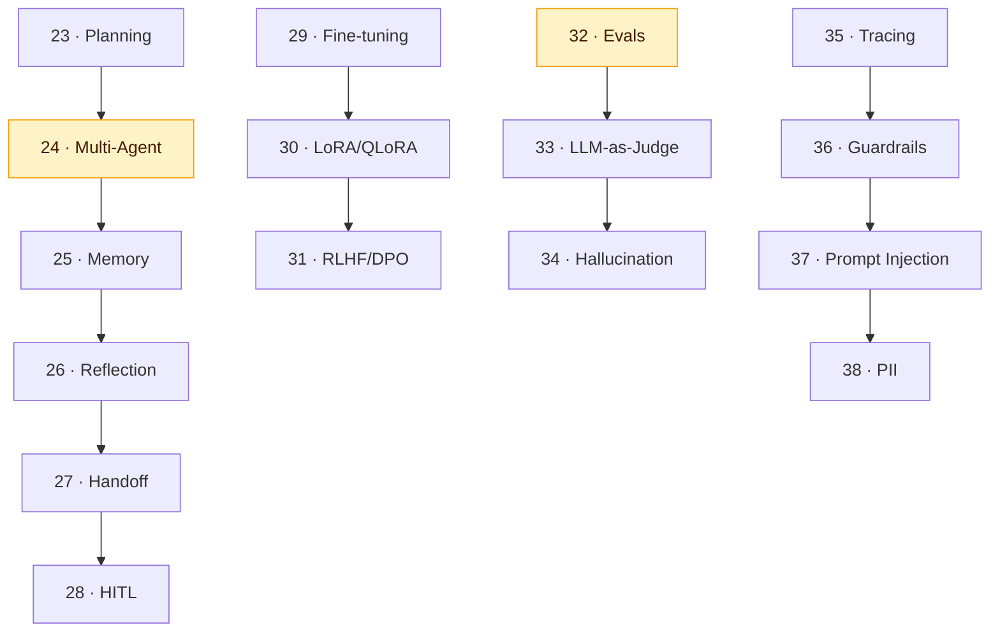

# 🚀 Tier 3 — Advanced

**Pre-requisite:** Tier 2 complete. You've built RAG pipelines and basic agents.

**Goal:** By the end of Tier 3, you can build multi-agent systems, fine-tune models, evaluate output quality, and add safety layers.

---

## Concept Map

## Chapters

| # | Chapter | Time | Lab |
|---|---------|------|-----|
| 23 | Planning & Task Decomposition | 40 min | Planner agent |
| 24 | Multi-Agent Systems | 45 min | Two-agent pipeline |
| 25 | Agent Memory | 40 min | Agent with persistent memory |
| 26 | Reflection & Self-critique | 35 min | Self-improving summarizer |
| 27 | Agent Handoff | 35 min | Router → specialist agents |
| 28 | Human-in-the-Loop | 30 min | Agent that asks before acting |
| 29 | Fine-tuning Basics | 45 min | Prepare a fine-tuning dataset |
| 30 | LoRA / QLoRA | 50 min | Fine-tune a small model |
| 31 | RLHF & DPO | 45 min | DPO dataset construction |
| 32 | Evals / LLM Evaluation | 40 min | Eval a RAG pipeline |
| 33 | LLM-as-Judge | 35 min | Auto-eval pipeline |
| 34 | Hallucination Detection | 35 min | Detect hallucinations in RAG |
| 35 | Tracing & Observability | 35 min | Instrument an agent |
| 36 | Guardrails | 30 min | Safety layer for a chatbot |
| 37 | Prompt Injection (Security) | 35 min | Red-team your agent |
| 38 | PII Handling | 30 min | Strip PII from prompts |

**Total estimated time:** ~10 hours
