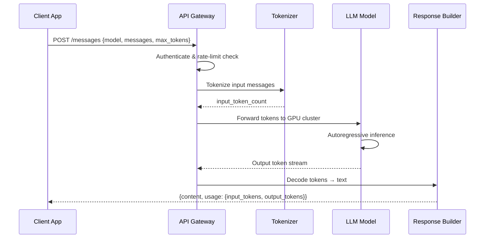
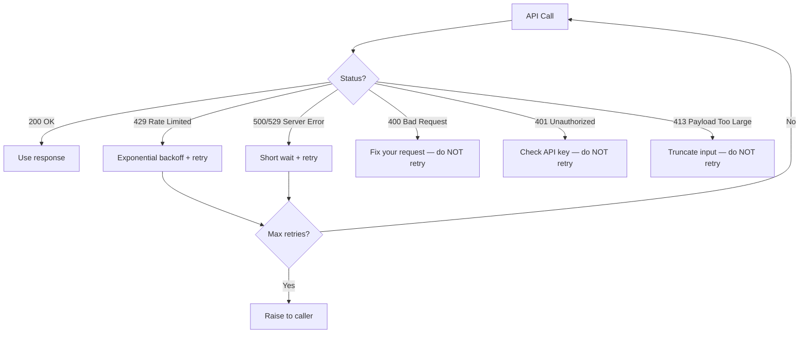

# LLM API Architecture

## The Problem

In development, you fire a few requests at the API and everything works. In production, you hit:

- **Rate limit errors (429)** because 100 users hit the same endpoint at the same time
- **Unexpected bills** because you forgot to set `max_tokens` on an endpoint that writes long responses
- **Timeouts** because you're waiting for a 4,000-token response when you could stream it
- **Silent cost creep** because nobody tracks which feature is burning the token budget

Production apps need fine-grained control: count tokens before sending, retry intelligently, and track cost per feature.

---

## How an API Call Actually Works

When you call `client.messages.create(...)`, this is what happens:



Key insight: **you are charged for tokenized input + generated output**. The pricing is separate for each. Understanding this is the basis for all cost optimization.

---

## Rate Limits: RPM and TPM

Every API account has two kinds of limits:

| Limit | Meaning | What happens when exceeded |
|-------|---------|---------------------------|
| **RPM** (Requests Per Minute) | Max number of API calls per minute | 429 error immediately |
| **TPM** (Tokens Per Minute) | Max total tokens (in + out) per minute | 429 error when budget exhausted |

**Why two limits?** One short request and one long request have very different computational costs. RPM alone doesn't capture this.

```
# Anthropic Claude Sonnet 3.5 (typical tier 1 limits)
RPM: 50
TPM: 40,000
```

At 50 RPM with 40K TPM, you could make 50 tiny requests OR ~8 large requests (5,000 tokens each).

---

## Cost Model

Every model has a per-token price for input and output:

```
cost = (input_tokens / 1_000_000 × input_price_per_M)
     + (output_tokens / 1_000_000 × output_price_per_M)
```

Example with Claude 3.5 Sonnet ($3/$15 per million tokens):

| Scenario | Input tokens | Output tokens | Cost |
|----------|-------------|--------------|------|
| Short query | 500 | 200 | $0.0045 |
| RAG with 10 docs | 8,000 | 500 | $0.0315 |
| Long summarization | 20,000 | 1,000 | $0.075 |
| 1,000 RAG requests/day | 8M | 500K | $31.50/day |

**The multiplier problem:** Small per-token costs look trivial. At scale, they're not. 1,000 users doing daily research at $0.03/request = $900/month just for the LLM calls.

---

## Key Concepts

### Prompt Caching (Anthropic)

Anthropic supports caching the beginning of your context across requests. If you always send the same system prompt + documents, you pay for them only on the first request. Subsequent calls with the same prefix are charged at the cached token rate (roughly 10% of normal input cost).

```python
# Mark a block as cacheable
{
    "type": "text",
    "text": "You are a helpful assistant. Here are your reference documents: ...",
    "cache_control": {"type": "ephemeral"}  # cached for ~5 minutes
}
```

For a RAG system with a 10,000-token document set and 1,000 queries/day, prompt caching can save ~$27/day on Claude Sonnet.

### Batch API

Both Anthropic and OpenAI offer async batch endpoints at 50–60% discount. You submit a JSONL file of requests, they process within 24 hours, you download results. Ideal for:
- Nightly data enrichment
- Bulk evaluation runs
- Offline summarization pipelines

### Streaming

Instead of waiting for the full response, the API sends tokens as they are generated. Benefits:
- **UX**: user sees the first word after ~300ms instead of waiting 10 seconds for a full response
- **Abort early**: if the response is going in the wrong direction, you can cancel mid-stream

---

## Error Handling Flow



**Rule of thumb:**
- **4xx errors (except 429)** = your fault, don't retry
- **429 and 5xx errors** = transient, retry with backoff

---

## Key Terms

| Term | Definition |
|------|-----------|
| **RPM** | Requests Per Minute — how many API calls you can make per minute |
| **TPM** | Tokens Per Minute — total tokens (input + output) you can use per minute |
| **Prompt caching** | Anthropic feature that caches repeated context prefix across requests at ~10% cost |
| **Batch API** | Async endpoint for bulk requests at 50–60% discount, with up to 24-hour turnaround |
| **Exponential backoff** | Retry strategy where wait time doubles on each retry (1s → 2s → 4s → 8s...) |
| **Jitter** | Random delay added to backoff to prevent thundering herd when many clients retry simultaneously |
| **Streaming** | Receiving tokens from the model as they are generated rather than waiting for the full response |
| **Context window** | Maximum total tokens (input + output) the model can process in one call |

---

## Interview Angle

**"How would you reduce LLM API costs in production?"**

A strong answer covers three tiers:

1. **Request-level optimization** — count tokens before sending, set `max_tokens` to avoid over-generation, use smaller/faster models for simple tasks
2. **Caching** — prompt caching for repeated system prompts/documents, semantic caching for similar queries
3. **Batch processing** — defer non-latency-sensitive work to the batch API

The key signal: candidates who only mention "use a cheaper model" are thinking about the 1x lever. Candidates who mention caching and batching understand the 10x lever.

---

## Common Mistakes

| Mistake | What Goes Wrong | Fix |
|---------|----------------|-----|
| Not counting tokens before sending | Expensive surprises, context window errors | Use tiktoken before every call |
| No retry on 429 | App breaks under moderate load | Add exponential backoff |
| Ignoring prompt caching | Pay full price for the same system prompt 1,000 times/day | Add `cache_control` to stable context |
| Not setting `max_tokens` | Model generates 4,000 tokens when you wanted 100 | Always set `max_tokens` |
| Retrying 400 errors | Infinite loop, burns rate limit budget | Only retry 429 and 5xx |

---

➡️ Next: [Patterns — API Patterns & Cost Optimization](./patterns.mdx)
