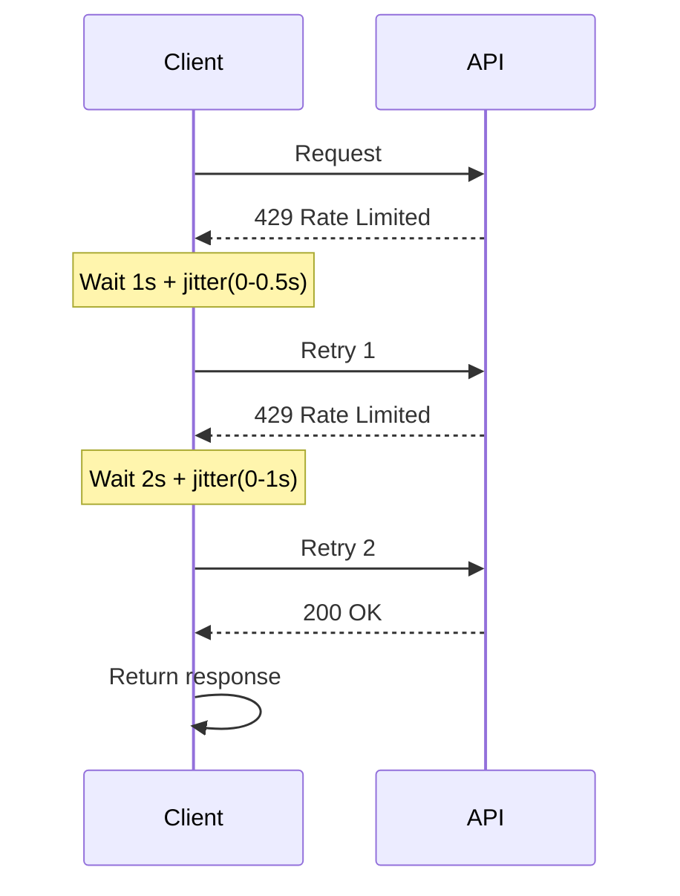

# API Patterns & Cost Optimization

## Pattern 1: Token Budget Guard

Count tokens before sending. Reject or truncate if the request would exceed your budget.

```python
import tiktoken

MAX_INPUT_TOKENS = 8_000

def count_tokens(text: str, model: str = "cl100k_base") -> int:
    enc = tiktoken.get_encoding(model)
    return len(enc.encode(text))

def safe_call(prompt: str, context: str) -> str:
    full_input = f"{context}\n\n{prompt}"
    token_count = count_tokens(full_input)

    if token_count > MAX_INPUT_TOKENS:
        raise ValueError(
            f"Input too large: {token_count} tokens > {MAX_INPUT_TOKENS} limit. "
            f"Reduce context size."
        )

    return call_api(full_input)
```

**Why this matters:** Without a guard, a malformed request with a large document gets sent to the API, costs money, and fails with a 400 error. The guard catches this before the network call.

---

## Pattern 2: Exponential Backoff with Jitter

When you get a 429, wait and retry. The wait time doubles each retry. Add random jitter to prevent all clients retrying at the same moment.



```python
import time
import random
import anthropic

def call_with_backoff(
    client: anthropic.Anthropic,
    max_retries: int = 5,
    **kwargs
) -> anthropic.types.Message:
    """Call the Anthropic API with exponential backoff on rate limit errors."""
    for attempt in range(max_retries):
        try:
            return client.messages.create(**kwargs)
        except anthropic.RateLimitError:
            if attempt == max_retries - 1:
                raise  # last attempt — re-raise
            wait = (2 ** attempt) + random.uniform(0, 0.5 * (2 ** attempt))
            print(f"Rate limited. Waiting {wait:.1f}s (attempt {attempt + 1}/{max_retries})")
            time.sleep(wait)
        except anthropic.APIStatusError as e:
            if e.status_code >= 500:  # server error — retry
                if attempt == max_retries - 1:
                    raise
                time.sleep(2 ** attempt)
            else:
                raise  # 4xx client error — do not retry
```

---

## Pattern 3: Batch API for Offline Processing

For non-latency-sensitive work, submit a batch job. Anthropic charges 50% less for batch requests.

```python
import anthropic
import json

def submit_batch(prompts: list[str], model: str = "claude-3-haiku-20240307") -> str:
    """Submit a list of prompts as a batch job. Returns batch_id."""
    client = anthropic.Anthropic()

    requests = [
        {
            "custom_id": f"request-{i}",
            "params": {
                "model": model,
                "max_tokens": 512,
                "messages": [{"role": "user", "content": prompt}]
            }
        }
        for i, prompt in enumerate(prompts)
    ]

    batch = client.beta.messages.batches.create(requests=requests)
    print(f"Batch submitted: {batch.id}")
    return batch.id


def poll_batch(batch_id: str) -> list[dict]:
    """Poll until batch is complete, then return results."""
    client = anthropic.Anthropic()

    while True:
        batch = client.beta.messages.batches.retrieve(batch_id)
        print(f"Status: {batch.processing_status}")

        if batch.processing_status == "ended":
            results = []
            for result in client.beta.messages.batches.results(batch_id):
                results.append({
                    "id": result.custom_id,
                    "response": result.result.message.content[0].text
                    if result.result.type == "succeeded"
                    else None,
                    "error": str(result.result.error)
                    if result.result.type == "errored"
                    else None,
                })
            return results

        time.sleep(60)  # poll every minute
```

**Use batch API when:**
- Processing is not user-facing (no one waits for the result)
- You have > 100 requests to send
- Turnaround within 24 hours is acceptable

---

## Pattern 4: Anthropic Prompt Caching

Cache the stable part of your context (system prompt, reference documents) so it is only tokenized and charged once per 5-minute window.

```python
import anthropic

SYSTEM_PROMPT = "You are a customer support specialist. Here is our product documentation:\n\n" + open("docs.txt").read()

def ask_with_cache(question: str) -> str:
    client = anthropic.Anthropic()

    response = client.messages.create(
        model="claude-3-5-sonnet-20241022",
        max_tokens=1024,
        system=[
            {
                "type": "text",
                "text": SYSTEM_PROMPT,
                "cache_control": {"type": "ephemeral"}  # cache this prefix
            }
        ],
        messages=[{"role": "user", "content": question}]
    )

    # Check cache hit stats
    usage = response.usage
    print(f"Cache read tokens: {usage.cache_read_input_tokens}")
    print(f"Cache write tokens: {usage.cache_creation_input_tokens}")
    print(f"Regular input tokens: {usage.input_tokens}")

    return response.content[0].text
```

**Savings example:** 10,000-token system prompt, 1,000 calls/day on Claude Sonnet at $3/M tokens:
- Without caching: 1,000 × 10,000 = 10M tokens × $3/M = **$30/day**
- With caching (1 write + 999 reads at $0.30/M): ~**$3/day**

---

## Pattern 5: Cost Estimator / Tracker

Track actual spend per feature. This is the only way to know which part of your app is expensive.

```python
from dataclasses import dataclass, field
from collections import defaultdict

# Per-model pricing (USD per 1M tokens)
MODEL_PRICING = {
    "claude-3-haiku-20240307":     {"input": 0.25,  "output": 1.25},
    "claude-3-5-sonnet-20241022":  {"input": 3.0,   "output": 15.0},
    "gpt-4o-mini":                 {"input": 0.15,  "output": 0.60},
    "gpt-4o":                      {"input": 5.0,   "output": 15.0},
}

@dataclass
class UsageTracker:
    """Track LLM usage and cost per feature."""
    _totals: dict = field(default_factory=lambda: defaultdict(lambda: {"input": 0, "output": 0, "cost": 0.0}))

    def record(self, feature: str, model: str, input_tokens: int, output_tokens: int):
        pricing = MODEL_PRICING.get(model, {"input": 1.0, "output": 3.0})
        cost = (input_tokens / 1_000_000 * pricing["input"]
              + output_tokens / 1_000_000 * pricing["output"])
        self._totals[feature]["input"] += input_tokens
        self._totals[feature]["output"] += output_tokens
        self._totals[feature]["cost"] += cost

    def report(self) -> str:
        lines = [f"{'Feature':<25} {'Input':>10} {'Output':>10} {'Cost':>10}"]
        lines.append("-" * 60)
        for feature, stats in sorted(self._totals.items()):
            lines.append(
                f"{feature:<25} {stats['input']:>10,} {stats['output']:>10,} ${stats['cost']:>9.4f}"
            )
        return "\n".join(lines)
```

---

## Anti-Patterns

| Anti-Pattern | What Goes Wrong | Fix |
|-------------|----------------|-----|
| **Retrying 400 errors** | Infinite loop on your own bug | Only retry 429 and 5xx |
| **No max_tokens** | Model writes 4,000 tokens for a yes/no question | Always set `max_tokens` |
| **Ignoring streaming for UX** | User stares at a blank screen for 8 seconds | Stream long-form responses |
| **Single retry without jitter** | All clients retry at the same second — thundering herd | Add random jitter to backoff |
| **Not tracking costs by feature** | You know total spend but not what's causing it | Use a UsageTracker keyed by feature name |

---

➡️ Next: [Lab — Cost Estimator CLI](./lab.mdx)
