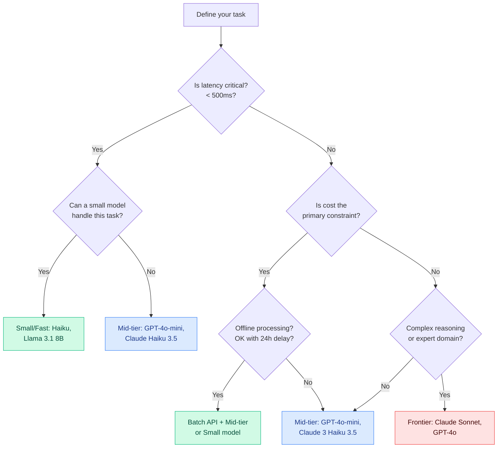
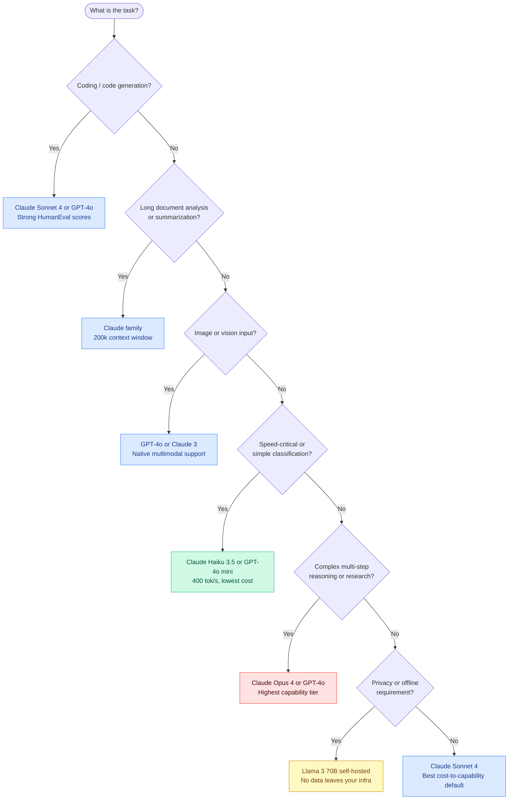

# Choosing the Right LLM

## The Problem

There are hundreds of models available. A developer choosing a model for the first time often picks the most impressive-sounding one — GPT-4 or Claude Opus — and ships it. This works, but usually means they're paying 20–50x more than necessary for most requests.

On the other extreme, some teams always reach for the cheapest model and discover that it can't handle their task reliably.

The goal is to **match the model to the task** based on a systematic evaluation of trade-offs.

---

## The Five Dimensions

When evaluating a model, measure across five dimensions:

| Dimension | What to Measure | Why It Matters |
|-----------|----------------|---------------|
| **Capability** | Benchmark scores on tasks similar to yours | Will it actually do the job? |
| **Cost** | Input + output price per 1M tokens | Direct impact on unit economics |
| **Latency** | Time to first token (TTFT) + total generation time | User experience and timeout risk |
| **Context window** | Max tokens (input + output) | Determines how much context you can send |
| **Deployment options** | API-only, local, fine-tunable | Privacy, latency, control requirements |

No model wins on all five. Model selection is always a trade-off.

---

## Benchmark Families

Benchmarks measure specific capabilities. Understanding what each benchmark tests helps you pick the right one to predict performance on your task.

| Benchmark | What it measures | Best for |
|-----------|-----------------|---------|
| **MMLU** | World knowledge across 57 subjects (science, law, math, etc.) | General knowledge tasks |
| **HumanEval** | Python code generation correctness | Coding assistants |
| **MATH** | Competition math problem solving | Quantitative reasoning |
| **MT-Bench** | Multi-turn conversation quality (judge-rated) | Chatbots, assistants |
| **Arena ELO** | Head-to-head human preference ratings (LMSYS Chatbot Arena) | General-purpose chat quality |
| **GPQA** | Graduate-level science questions — very hard | Research and expert domains |

**Warning:** Benchmarks are proxies. A model that scores high on MMLU may still fail on your specific RAG pipeline. Always benchmark on your own data before committing to a model.

---

## Model Families

### Frontier Models — Highest Capability, Highest Cost

These are the best models available. Use them for the hardest tasks.

| Model | Context window | Input cost (1M tokens) | MMLU (approx) |
|-------|---------------|----------------------|----------------|
| Claude 3.5 Sonnet | 200K | $3.00 | ~89% |
| GPT-4o | 128K | $5.00 | ~88% |
| Gemini 1.5 Pro | 1M | $3.50 | ~86% |
| Claude 3 Opus | 200K | $15.00 | ~87% |

Use when: complex reasoning, multi-step planning, code generation, nuanced writing.

### Mid-Tier Models — Good Capability, Moderate Cost

The sweet spot for most production use cases.

| Model | Context window | Input cost (1M tokens) | MMLU (approx) |
|-------|---------------|----------------------|----------------|
| Claude 3 Haiku (3.5) | 200K | $0.80 | ~75% |
| GPT-4o-mini | 128K | $0.15 | ~82% |
| Gemini 1.5 Flash | 1M | $0.075 | ~78% |

Use when: RAG retrieval synthesis, structured extraction, routine chat.

### Small / Fast Models — Lower Capability, Very Low Cost or Local

For classification, routing, simple extraction, or privacy-sensitive local deployments.

| Model | Deployment | Input cost (1M tokens) | MMLU (approx) |
|-------|-----------|----------------------|----------------|
| Claude 3 Haiku | API | $0.25 | ~75% |
| Llama 3.1 8B | Local/API | Free (local) | ~68% |
| Phi-3 Mini | Local/API | Free (local) | ~68% |
| Gemma 2 9B | Local/API | Free (local) | ~72% |

Use when: intent classification, routing, PII detection, high-volume low-stakes tasks.

---

## Decision Tree for Model Selection



---

## The Model Selection Decision Tree

This task-first flowchart routes you to the right model family based on what you're actually building — not just cost or benchmark score alone.



Use this as a first-pass filter. Then validate with the benchmark table below.

---

## Benchmark Numbers That Matter

Real benchmark data as of early 2025. Use these numbers as a starting point, not a final answer — always validate on your own task.

| Model | MMLU | HumanEval | Context | Cost/1M input tokens | Speed (tok/s) |
|-------|------|-----------|---------|---------------------|---------------|
| Claude Opus 4 | ~88% | ~85% | 200k | $15 | ~50 |
| Claude Sonnet 4 | ~85% | ~80% | 200k | $3 | ~150 |
| Claude Haiku 3.5 | ~75% | ~65% | 200k | $0.25 | ~400 |
| GPT-4o | ~88% | ~90% | 128k | $2.50 | ~100 |
| GPT-4o mini | ~82% | ~87% | 128k | $0.15 | ~200 |
| Llama 3 70B | ~82% | ~81% | 8k | self-hosted | variable |

**How to read this table:**

- **MMLU** is a general knowledge proxy. High MMLU ≠ good at your domain.
- **HumanEval** is coding-specific. If you are building a code assistant, this is the first number to check.
- **Context** determines if the model can hold your entire document. Claude's 200k window is a genuine differentiator for long-doc workflows.
- **Cost** matters at scale. At 10M tokens/day, the difference between $15 and $3 per 1M is $43,800/month.
- **Speed** matters for real-time use cases. Haiku at 400 tok/s feels instant; Opus at 50 tok/s is noticeable.

**Key insight:** GPT-4o mini and Claude Haiku 3.5 are not just cheap — they score well. GPT-4o mini at 87% HumanEval outperforms Claude Opus 4 on raw coding benchmarks at 1/100th the cost. Match the benchmark to your task.

---

## Cost Optimization — Model Cascading

### The Pattern

**Model cascading** routes easy requests to a cheap, fast model and only escalates to an expensive model when the cheap model's output is insufficient. Most production systems discover that 70–80% of requests can be handled by the cheap model.

```
Cheap model (Haiku / GPT-4o mini)  ← handles 70–80% of requests
         ↓ if quality check fails
Expensive model (Sonnet / GPT-4o)  ← handles remaining 20–30%
```

The quality check is the key engineering decision. Common approaches:

1. **Length check** — if the cheap model returns fewer than N tokens, it may have given up
2. **Format check** — did it return valid JSON / follow the schema?
3. **Confidence check** — ask the model to rate its own confidence; escalate below a threshold
4. **LLM-as-judge** — use a fast judge model to score the output; escalate if score &lt; threshold

### Implementation

```python
import anthropic

client = anthropic.Anthropic()

CHEAP_MODEL = "claude-haiku-3-5-20241022"
EXPENSIVE_MODEL = "claude-sonnet-4-5"
CONFIDENCE_THRESHOLD = 0.75


def quality_check(response_text: str, original_prompt: str) -> float:
    """
    Use a fast model to judge whether the response adequately answers the prompt.
    Returns a confidence score from 0.0 to 1.0.
    """
    judge_prompt = f"""Rate how well this response answers the question.
Return ONLY a number from 0.0 to 1.0. Nothing else.

Question: {original_prompt}

Response: {response_text}

Score:"""

    result = client.messages.create(
        model=CHEAP_MODEL,  # use cheap model for judging too
        max_tokens=10,
        messages=[{"role": "user", "content": judge_prompt}],
    )

    try:
        return float(result.content[0].text.strip())
    except ValueError:
        return 0.0  # if parsing fails, escalate


def cascading_completion(prompt: str) -> dict:
    """
    Try cheap model first. Escalate to expensive model if quality check fails.
    Returns dict with response text, model used, and whether escalation occurred.
    """
    # Step 1: Try the cheap model
    cheap_response = client.messages.create(
        model=CHEAP_MODEL,
        max_tokens=1024,
        messages=[{"role": "user", "content": prompt}],
    )
    cheap_text = cheap_response.content[0].text

    # Step 2: Quality check
    score = quality_check(cheap_text, prompt)

    if score >= CONFIDENCE_THRESHOLD:
        return {
            "response": cheap_text,
            "model_used": CHEAP_MODEL,
            "escalated": False,
            "quality_score": score,
        }

    # Step 3: Escalate to expensive model
    expensive_response = client.messages.create(
        model=EXPENSIVE_MODEL,
        max_tokens=1024,
        messages=[{"role": "user", "content": prompt}],
    )

    return {
        "response": expensive_response.content[0].text,
        "model_used": EXPENSIVE_MODEL,
        "escalated": True,
        "quality_score": score,
    }


# Example usage
result = cascading_completion(
    "Explain the difference between a hash table and a binary search tree."
)

print(f"Model used: {result['model_used']}")
print(f"Escalated: {result['escalated']}")
print(f"Quality score from cheap model: {result['quality_score']:.2f}")
print(f"\nResponse:\n{result['response']}")
```

### Expected Cost Impact

| Traffic split | Avg cost per 1M tokens |
|--------------|----------------------|
| 100% Sonnet 4 | $3.00 |
| 75% Haiku + 25% Sonnet (cascade) | ~$0.94 |
| 100% Haiku | $0.25 |

A cascade that handles 75% of requests with Haiku reduces cost by ~69% compared to always using Sonnet, while maintaining quality for hard cases.

**Note:** The quality check itself consumes tokens. Keep your judge prompt short. If your judge prompt is longer than your original prompt, reconsider whether LLM-as-judge is the right quality signal for your case.

---

## Building Your Own Benchmark

### Why Public Benchmarks Are Not Enough

MMLU tests 57 academic subjects. HumanEval tests Python function generation from docstrings. Neither tests your RAG pipeline, your domain-specific extraction, or your particular user population.

Build a task-specific eval set from real data before committing to a model in production.

### The Process

1. **Collect 20–50 real examples** from your use case — actual user queries, actual documents, actual edge cases that have caused problems.
2. **Write expected outputs** — not exact strings, but rubrics: "should contain the correct date," "should return valid JSON with these keys," "should decline to answer."
3. **Run all examples against each candidate model.**
4. **Score automatically where possible** (exact match, JSON validity, regex) and manually where not.
5. **Pick the cheapest model that hits your quality threshold.**

### Implementation

```python
import json
import anthropic

client = anthropic.Anthropic()


# Your eval set — replace with real examples from your use case
EVAL_SET = [
    {
        "id": "q1",
        "prompt": "Extract the invoice number from: 'Invoice #INV-2024-0042 dated March 1'",
        "expected_contains": "INV-2024-0042",
    },
    {
        "id": "q2",
        "prompt": "What is the capital of France?",
        "expected_contains": "Paris",
    },
    {
        "id": "q3",
        "prompt": "Summarize in one sentence: 'The quick brown fox jumps over the lazy dog.'",
        "expected_contains": "fox",  # loose check — just verify it mentions the fox
    },
    # Add 17–47 more examples from your real use case...
]

CANDIDATE_MODELS = [
    "claude-haiku-3-5-20241022",
    "claude-sonnet-4-5",
]


def run_eval(model: str, eval_set: list) -> dict:
    """Run all eval examples against a model and return results."""
    results = []
    total_input_tokens = 0
    total_output_tokens = 0

    for example in eval_set:
        response = client.messages.create(
            model=model,
            max_tokens=256,
            messages=[{"role": "user", "content": example["prompt"]}],
        )

        output_text = response.content[0].text
        passed = example["expected_contains"].lower() in output_text.lower()

        total_input_tokens += response.usage.input_tokens
        total_output_tokens += response.usage.output_tokens

        results.append(
            {
                "id": example["id"],
                "passed": passed,
                "output": output_text[:100],  # truncate for display
            }
        )

    pass_count = sum(1 for r in results if r["passed"])
    pass_rate = pass_count / len(results)

    return {
        "model": model,
        "pass_rate": pass_rate,
        "pass_count": pass_count,
        "total": len(results),
        "total_input_tokens": total_input_tokens,
        "total_output_tokens": total_output_tokens,
        "results": results,
    }


def compare_models(models: list, eval_set: list):
    """Run eval across all candidate models and print a comparison table."""
    print(f"Running eval on {len(eval_set)} examples across {len(models)} models...\n")

    all_results = []
    for model in models:
        result = run_eval(model, eval_set)
        all_results.append(result)
        print(f"  {model}: {result['pass_rate']:.0%} pass rate ({result['pass_count']}/{result['total']})")

    print("\n--- Model Comparison ---")
    print(f"{'Model':<35} {'Pass Rate':<12} {'Input Tokens':<15} {'Output Tokens'}")
    print("-" * 75)
    for r in all_results:
        print(
            f"{r['model']:<35} {r['pass_rate']:<12.0%} "
            f"{r['total_input_tokens']:<15} {r['total_output_tokens']}"
        )

    # Recommend cheapest model above 80% threshold
    print("\n--- Recommendation ---")
    QUALITY_THRESHOLD = 0.80
    qualified = [r for r in all_results if r["pass_rate"] >= QUALITY_THRESHOLD]
    if qualified:
        # Haiku is cheaper, so if it qualifies, recommend it
        best = qualified[0]  # first in list = cheapest (assuming ordered cheap-to-expensive)
        print(f"Cheapest model above {QUALITY_THRESHOLD:.0%} threshold: {best['model']}")
        print(f"Pass rate: {best['pass_rate']:.0%}")
    else:
        print(f"No model reached {QUALITY_THRESHOLD:.0%}. Review your eval set or consider fine-tuning.")

    return all_results


if __name__ == "__main__":
    results = compare_models(CANDIDATE_MODELS, EVAL_SET)
    # Optionally save for tracking over time
    with open("eval_results.json", "w") as f:
        json.dump(results, f, indent=2)
    print("\nFull results saved to eval_results.json")
```

### What to Track Over Time

Run your eval set every time you:
- Switch model versions (e.g., Haiku 3 → Haiku 3.5)
- Change your system prompt significantly
- See a spike in support tickets or error rates

A 5-point drop in pass rate on your eval set is a strong signal that something regressed. Public benchmarks will never catch that — only your eval set will.

---

## Key Terms

| Term | Definition |
|------|-----------|
| **MMLU** | Massive Multitask Language Understanding — 57-subject knowledge benchmark |
| **HumanEval** | OpenAI's coding benchmark: generate code that passes unit tests |
| **Arena ELO** | Chatbot Arena's human preference ranking — crowdsourced head-to-head comparisons |
| **Model cascade** | Try cheap model first; escalate to expensive model only if confidence is low |
| **Task routing** | Classify the incoming request and route to the model best suited for that task type |
| **TTFT** | Time to first token — latency until the first character of the response appears |
| **Frontier model** | The most capable (and most expensive) models: GPT-4o, Claude Opus, Gemini Ultra |
| **Context window** | Maximum tokens (input + output) the model can process in one call |

---

## Interview Angle

**"Walk me through how you'd pick a model for a customer support chatbot."**

Strong answer structure:

1. **Define requirements first**: What's the latency SLA? What's the per-message cost budget? Does it need multi-turn memory? Any compliance requirements (PII, data residency)?

2. **Characterize the tasks**: Mostly FAQ retrieval (simple → small model is fine), complex complaint resolution (needs reasoning → mid-tier), escalation decisions (judgment → mid-tier at minimum).

3. **Benchmark on real data**: Pull 100 real support tickets. Have humans rate responses from 3 models. Compare accuracy, latency, and cost.

4. **Design a cascade**: Route simple FAQ queries to Haiku, complex issues to Sonnet. This keeps the average cost close to Haiku while maintaining quality for hard cases.

5. **Set up monitoring**: Track model usage by query type. If Sonnet handles 30% of queries, the routing is too loose — tighten it.

---

## Common Mistakes

| Mistake | What Goes Wrong | Fix |
|---------|----------------|-----|
| **Always using the biggest model** | 10–50x higher cost for tasks where a small model works fine | Benchmark small models on your actual task first |
| **Trusting benchmark scores blindly** | MMLU doesn't predict performance on your domain | Test on your own data |
| **Ignoring latency** | Frontier model takes 8s per response — users abandon | Measure TTFT and P95 latency, not just average |
| **No cost tracking** | You don't know which use cases are expensive until the bill arrives | Track cost per feature from day one (Ch 39 pattern) |

---

➡️ Next: [Patterns — Model Selection Patterns](./patterns.mdx)
