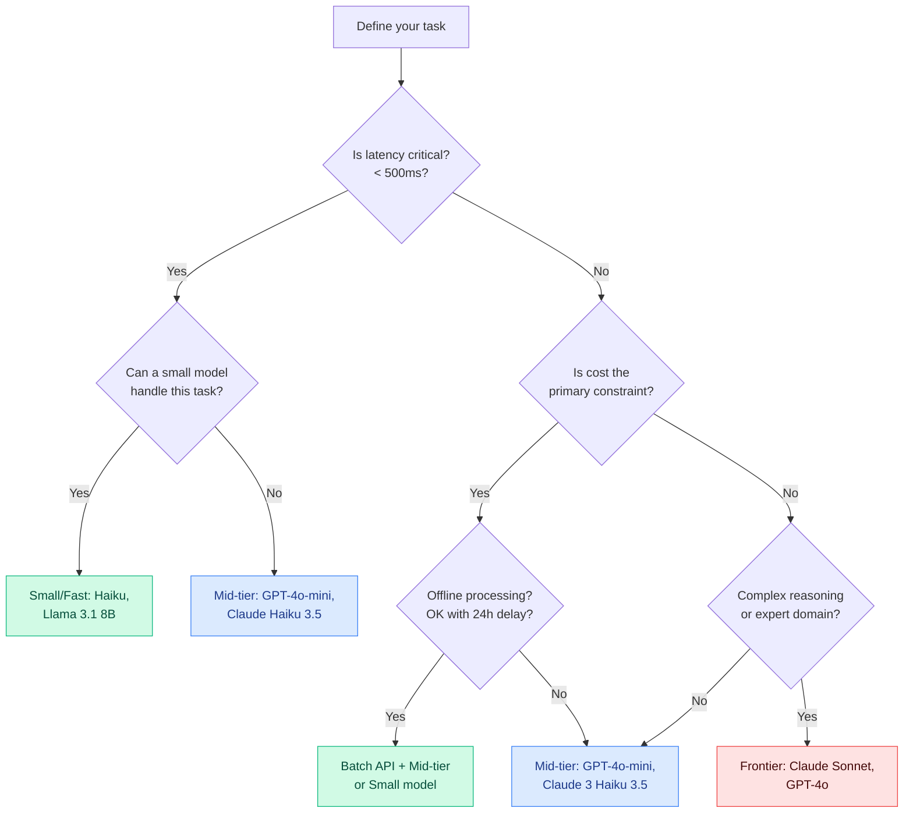

# Choosing the Right LLM

## The Problem

There are hundreds of models available. A developer choosing a model for the first time often picks the most impressive-sounding one — GPT-4 or Claude Opus — and ships it. This works, but usually means they're paying 20–50x more than necessary for most requests.

On the other extreme, some teams always reach for the cheapest model and discover that it can't handle their task reliably.

The goal is to **match the model to the task** based on a systematic evaluation of trade-offs.

---

## The Five Dimensions

When evaluating a model, measure across five dimensions:

| Dimension | What to Measure | Why It Matters |
|-----------|----------------|---------------|
| **Capability** | Benchmark scores on tasks similar to yours | Will it actually do the job? |
| **Cost** | Input + output price per 1M tokens | Direct impact on unit economics |
| **Latency** | Time to first token (TTFT) + total generation time | User experience and timeout risk |
| **Context window** | Max tokens (input + output) | Determines how much context you can send |
| **Deployment options** | API-only, local, fine-tunable | Privacy, latency, control requirements |

No model wins on all five. Model selection is always a trade-off.

---

## Benchmark Families

Benchmarks measure specific capabilities. Understanding what each benchmark tests helps you pick the right one to predict performance on your task.

| Benchmark | What it measures | Best for |
|-----------|-----------------|---------|
| **MMLU** | World knowledge across 57 subjects (science, law, math, etc.) | General knowledge tasks |
| **HumanEval** | Python code generation correctness | Coding assistants |
| **MATH** | Competition math problem solving | Quantitative reasoning |
| **MT-Bench** | Multi-turn conversation quality (judge-rated) | Chatbots, assistants |
| **Arena ELO** | Head-to-head human preference ratings (LMSYS Chatbot Arena) | General-purpose chat quality |
| **GPQA** | Graduate-level science questions — very hard | Research and expert domains |

**Warning:** Benchmarks are proxies. A model that scores high on MMLU may still fail on your specific RAG pipeline. Always benchmark on your own data before committing to a model.

---

## Model Families

### Frontier Models — Highest Capability, Highest Cost

These are the best models available. Use them for the hardest tasks.

| Model | Context window | Input cost (1M tokens) | MMLU (approx) |
|-------|---------------|----------------------|----------------|
| Claude 3.5 Sonnet | 200K | $3.00 | ~89% |
| GPT-4o | 128K | $5.00 | ~88% |
| Gemini 1.5 Pro | 1M | $3.50 | ~86% |
| Claude 3 Opus | 200K | $15.00 | ~87% |

Use when: complex reasoning, multi-step planning, code generation, nuanced writing.

### Mid-Tier Models — Good Capability, Moderate Cost

The sweet spot for most production use cases.

| Model | Context window | Input cost (1M tokens) | MMLU (approx) |
|-------|---------------|----------------------|----------------|
| Claude 3 Haiku (3.5) | 200K | $0.80 | ~75% |
| GPT-4o-mini | 128K | $0.15 | ~82% |
| Gemini 1.5 Flash | 1M | $0.075 | ~78% |

Use when: RAG retrieval synthesis, structured extraction, routine chat.

### Small / Fast Models — Lower Capability, Very Low Cost or Local

For classification, routing, simple extraction, or privacy-sensitive local deployments.

| Model | Deployment | Input cost (1M tokens) | MMLU (approx) |
|-------|-----------|----------------------|----------------|
| Claude 3 Haiku | API | $0.25 | ~75% |
| Llama 3.1 8B | Local/API | Free (local) | ~68% |
| Phi-3 Mini | Local/API | Free (local) | ~68% |
| Gemma 2 9B | Local/API | Free (local) | ~72% |

Use when: intent classification, routing, PII detection, high-volume low-stakes tasks.

---

## Decision Tree for Model Selection

---

## Key Terms

| Term | Definition |
|------|-----------|
| **MMLU** | Massive Multitask Language Understanding — 57-subject knowledge benchmark |
| **HumanEval** | OpenAI's coding benchmark: generate code that passes unit tests |
| **Arena ELO** | Chatbot Arena's human preference ranking — crowdsourced head-to-head comparisons |
| **Model cascade** | Try cheap model first; escalate to expensive model only if confidence is low |
| **Task routing** | Classify the incoming request and route to the model best suited for that task type |
| **TTFT** | Time to first token — latency until the first character of the response appears |
| **Frontier model** | The most capable (and most expensive) models: GPT-4o, Claude Opus, Gemini Ultra |
| **Context window** | Maximum tokens (input + output) the model can process in one call |

---

## Interview Angle

**"Walk me through how you'd pick a model for a customer support chatbot."**

Strong answer structure:

1. **Define requirements first**: What's the latency SLA? What's the per-message cost budget? Does it need multi-turn memory? Any compliance requirements (PII, data residency)?

2. **Characterize the tasks**: Mostly FAQ retrieval (simple → small model is fine), complex complaint resolution (needs reasoning → mid-tier), escalation decisions (judgment → mid-tier at minimum).

3. **Benchmark on real data**: Pull 100 real support tickets. Have humans rate responses from 3 models. Compare accuracy, latency, and cost.

4. **Design a cascade**: Route simple FAQ queries to Haiku, complex issues to Sonnet. This keeps the average cost close to Haiku while maintaining quality for hard cases.

5. **Set up monitoring**: Track model usage by query type. If Sonnet handles 30% of queries, the routing is too loose — tighten it.

---

## Common Mistakes

| Mistake | What Goes Wrong | Fix |
|---------|----------------|-----|
| **Always using the biggest model** | 10–50x higher cost for tasks where a small model works fine | Benchmark small models on your actual task first |
| **Trusting benchmark scores blindly** | MMLU doesn't predict performance on your domain | Test on your own data |
| **Ignoring latency** | Frontier model takes 8s per response — users abandon | Measure TTFT and P95 latency, not just average |
| **No cost tracking** | You don't know which use cases are expensive until the bill arrives | Track cost per feature from day one (Ch 39 pattern) |

---

➡️ Next: [Patterns — Model Selection Patterns](./patterns.mdx)
