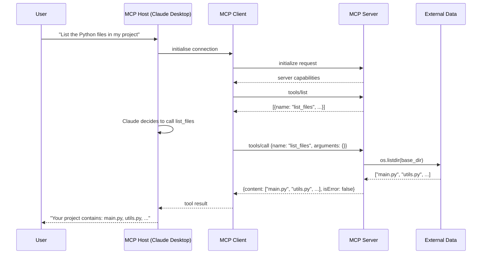
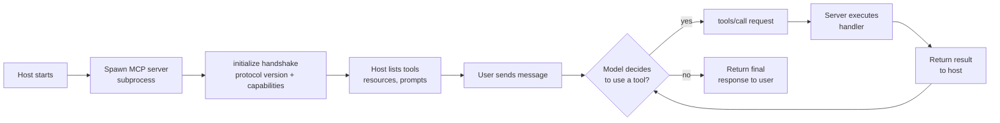
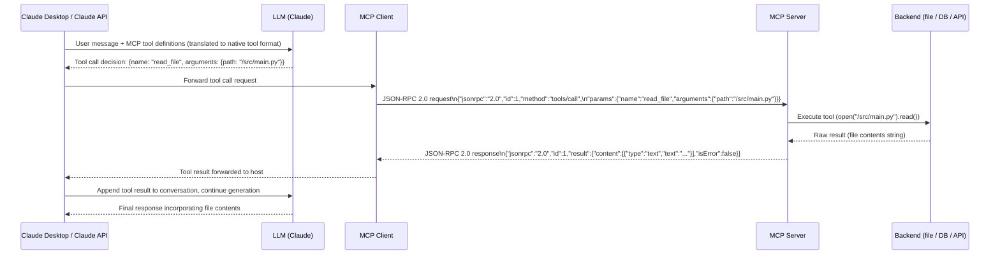

# Concepts: Model Context Protocol Architecture

## The Problem

Before MCP, every AI application reinvented the same wheel:

- Claude application A builds a custom way to call a database
- Claude application B builds a different custom way to call the same database
- A developer who wants to connect their tools to Claude Desktop has to write a one-off integration for every tool

The result is a fragmented ecosystem where integrations cannot be shared, reused, or composed. The AI host and the data/tool providers are tightly coupled.

**MCP solves this with a standard protocol.** If you build an MCP server for your database, any MCP client can use it — today and in the future.

---

## What MCP Is

**Model Context Protocol (MCP)** is an open standard, led by Anthropic, that defines how AI applications (hosts) communicate with external data and tool providers (servers). It is:

- **Open**: published at modelcontextprotocol.io, vendor-neutral, MIT licensed
- **Bidirectional**: servers can push notifications to clients (unlike simple REST)
- **Transport-agnostic**: works over stdio (local process) or HTTP+SSE (remote server)
- **Built on JSON-RPC 2.0**: a well-understood, language-agnostic message format

The analogy is USB-C: before USB-C, every device had its own proprietary connector. USB-C is the standard that lets any device connect to any charger. MCP is the USB-C for AI tool integration.

---

## The MCP Architecture

```
┌─────────────────────────────────────────────┐
│                  MCP Host                   │
│  (Claude Desktop, Cursor, your app, etc.)   │
│                                             │
│  ┌──────────────┐    ┌──────────────┐      │
│  │  MCP Client  │    │  MCP Client  │      │
│  │  (one per    │    │  (one per    │      │
│  │   server)    │    │   server)    │      │
│  └──────┬───────┘    └──────┬───────┘      │
└─────────┼────────────────────┼──────────────┘
          │ stdio / HTTP+SSE   │
          │                    │
   ┌──────▼───────┐   ┌────────▼─────┐
   │  MCP Server  │   │  MCP Server  │
   │ (filesystem) │   │ (database)   │
   └──────────────┘   └──────────────┘
```

### Key Roles

| Role | Description | Example |
|------|-------------|---------|
| **MCP Host** | The application that runs the LLM and manages MCP clients | Claude Desktop, Cursor, your FastAPI app |
| **MCP Client** | A protocol client embedded in the host; maintains one connection per server | Claude Desktop creates one client per configured MCP server |
| **MCP Server** | A lightweight process that exposes tools, resources, and prompts | A Python script that reads your file system |

---

## The Three MCP Primitives

### 1. Tools — The Model Calls Functions

Tools are functions the model can invoke. The model sends a tool call; the server executes it and returns the result. This is analogous to function calling (Chapter 19), but over the MCP protocol rather than embedded in the application.

```json
{
  "name": "list_files",
  "description": "List files in the project directory",
  "inputSchema": {
    "type": "object",
    "properties": {
      "path": {"type": "string", "description": "Directory path to list"}
    }
  }
}
```

**Use tools for:** actions that have side effects or require computation — running a query, sending a message, creating a file.

### 2. Resources — The Model Reads Data

Resources are data sources the model can read. Unlike tools (which execute code), resources provide content: files, database rows, API responses. Each resource has a URI.

```json
{
  "uri": "file:///project/README.md",
  "name": "README",
  "description": "Project readme file",
  "mimeType": "text/markdown"
}
```

**Use resources for:** read-only data the model needs for context — documentation, configuration files, database schemas.

### 3. Prompts — Reusable Prompt Templates

Prompts are server-defined prompt templates that can be parameterised and surfaced to users in the host UI. They let you package common workflows as reusable invocations.

```json
{
  "name": "summarize_document",
  "description": "Summarize a document in a given style",
  "arguments": [
    {"name": "document_uri", "required": true},
    {"name": "style", "required": false}
  ]
}
```

**Use prompts for:** standardising how the model approaches common tasks — code review, document summarisation, bug triage.

---

## Transport Options

| Transport | When to use | How it works |
|-----------|------------|--------------|
| **stdio** | Local MCP servers on the same machine | Host spawns the server as a subprocess; communicates via stdin/stdout |
| **HTTP + SSE** | Remote MCP servers over a network | Server exposes HTTP endpoints; uses Server-Sent Events for server-to-client notifications |

Most development and local integrations (e.g., Claude Desktop config) use stdio. Production deployments and shared team servers use HTTP+SSE.

---

## How It Works: End-to-End Flow



---

## Client-Server Lifecycle



---

## JSON-RPC 2.0 Message Format

MCP uses JSON-RPC 2.0 as its wire format. You rarely write this by hand (the SDK handles it), but understanding it helps when debugging:

```json
// Request: host → server
{
  "jsonrpc": "2.0",
  "id": 1,
  "method": "tools/call",
  "params": {
    "name": "list_files",
    "arguments": {}
  }
}

// Response: server → host
{
  "jsonrpc": "2.0",
  "id": 1,
  "result": {
    "content": [{"type": "text", "text": "main.py\nutils.py"}],
    "isError": false
  }
}
```

---

## MCP Architecture — What Actually Happens

The diagram below shows the complete protocol flow from the moment Claude receives a user message to the point where it incorporates the tool result into its final response. Each arrow represents a real network or process call.



**Key observations:**

- The LLM never calls the MCP server directly. The host translates between the LLM's native tool call format and the JSON-RPC wire protocol.
- `id` on every JSON-RPC message allows the client to match responses to outstanding requests, enabling concurrent tool calls.
- `isError: false` in the result is an MCP-level flag — distinct from an HTTP status code or a Python exception. Always set it correctly so the host can handle errors gracefully.

---

## Building a Minimal MCP Server

The official Python MCP SDK (`pip install mcp`) handles all JSON-RPC serialisation, the initialize handshake, and the stdio transport. You only implement two handlers: `list_tools` (what tools exist) and `call_tool` (what to do when one is invoked).

```python
from mcp.server import Server
from mcp.server.stdio import stdio_server
from mcp.types import Tool, TextContent
import mcp.types as types

server = Server("my-tools")

@server.list_tools()
async def list_tools() -> list[Tool]:
    return [
        Tool(
            name="read_file",
            description="Read a file from the local filesystem",
            inputSchema={
                "type": "object",
                "properties": {
                    "path": {"type": "string", "description": "File path to read"}
                },
                "required": ["path"]
            }
        )
    ]

@server.call_tool()
async def call_tool(name: str, arguments: dict) -> list[TextContent]:
    if name == "read_file":
        path = arguments["path"]
        with open(path) as f:
            content = f.read()
        return [TextContent(type="text", text=content)]
    raise ValueError(f"Unknown tool: {name}")

if __name__ == "__main__":
    import asyncio
    asyncio.run(stdio_server(server))
```

**What each part does:**

- `Server("my-tools")` — creates the server instance with a name Claude will see during the initialize handshake.
- `@server.list_tools()` — registers the handler called when a host sends `tools/list`. Return one `Tool` object per capability.
- `inputSchema` — a JSON Schema object. Claude uses this to populate tool call arguments; the host validates against it before forwarding to the server.
- `@server.call_tool()` — registers the handler for `tools/call`. Must return a list of `TextContent` (or `ImageContent`, `EmbeddedResource`) objects.
- `stdio_server(server)` — starts the transport loop, reading JSON-RPC from stdin and writing responses to stdout. Claude Desktop spawns this script as a subprocess.

**To wire this into Claude Desktop**, add to `~/Library/Application Support/Claude/claude_desktop_config.json`:

```json
{
  "mcpServers": {
    "my-tools": {
      "command": "python",
      "args": ["/absolute/path/to/server.py"]
    }
  }
}
```

---

## MCP vs. Function Calling — When to Use Which

MCP and function calling are complementary, not competing. MCP **uses** function calling under the hood — the host translates MCP tool definitions into the LLM's native tool call format. The distinction is at the infrastructure layer.

| Aspect | Function Calling | MCP |
|--------|-----------------|-----|
| **Scope** | Per-request tools | Persistent server with many tools |
| **Transport** | JSON in API payload | stdio or HTTP (JSON-RPC) |
| **Reuse** | Redefined each call | Register once, used across sessions |
| **State** | Stateless | Can be stateful (DB connections, etc.) |
| **Best for** | Dynamic, per-request tools | Shared infrastructure tools |

**Choose function calling when** the tool is specific to one application, you need to construct the tool definition dynamically at runtime, or you are calling the Claude API directly without a host layer.

**Choose MCP when** the same tools need to be available across multiple applications (Claude Desktop, Cursor, your own app), you want to share tool implementations with your team, or the tools require persistent state such as a database connection pool or an authenticated session.

---

## Security Model

MCP servers run with the **process permissions of the host that spawns them**. If Claude Desktop runs as your user account, every MCP server it starts has full read/write access to your home directory, environment variables, and network. This is intentional for local development convenience — and a serious risk if overlooked in production.

**Principles to follow:**

- **Sandbox MCP servers that access sensitive resources.** Use Docker, a dedicated low-privilege OS user, or a network namespace to confine what the server process can reach. A filesystem MCP server should not be able to open a database socket.

- **Validate all inputs before executing.** Treat every `arguments` value as untrusted user input. Path arguments are especially dangerous — always resolve to a canonical path and assert it falls within the expected root before opening:

  ```python
  import os

  def safe_path(base: str, user_input: str) -> str:
      resolved = os.path.realpath(os.path.join(base, user_input))
      if not resolved.startswith(os.path.realpath(base)):
          raise ValueError("Path traversal attempt blocked")
      return resolved
  ```

- **Use resource limits to prevent runaway tools.** A tool that reads a file with no size cap can exhaust RAM; a tool that writes without a quota can fill disk. Set limits explicitly:

  ```python
  MAX_FILE_SIZE = 1 * 1024 * 1024  # 1 MB

  def read_file_safe(path: str) -> str:
      size = os.path.getsize(path)
      if size > MAX_FILE_SIZE:
          raise ValueError(f"File too large: {size} bytes (max {MAX_FILE_SIZE})")
      with open(path) as f:
          return f.read()
  ```

- **Never return secrets in tool results.** If a tool reads a config file or environment, filter sensitive keys before returning the result. The tool result goes directly into the LLM context window and may appear in logs.

- **Log tool invocations for audit.** Record the tool name, arguments, and calling session. Anomalous patterns (unexpected paths, high call frequency) are your first signal of a prompt injection attack trying to abuse an MCP server.

---

## Key Terms

| Term | Definition |
|------|-----------|
| **MCP host** | The application that runs the LLM and embeds MCP clients |
| **MCP client** | A protocol client within the host that maintains one server connection |
| **MCP server** | A process that exposes tools, resources, and/or prompts over MCP |
| **Tool** | A callable function exposed by a server; the model requests execution |
| **Resource** | A readable data source with a URI; provides context to the model |
| **Prompt** | A reusable, parameterisable prompt template defined by the server |
| **JSON-RPC 2.0** | The wire protocol underlying MCP messages |
| **stdio transport** | Communication via subprocess stdin/stdout (local servers) |
| **HTTP+SSE transport** | Communication via HTTP with Server-Sent Events (remote servers) |
| **initialize handshake** | The first exchange where client and server negotiate protocol version and capabilities |

---

## MCP vs Function Calling

A common confusion:

| | Function Calling (Ch 19) | MCP |
|--|--------------------------|-----|
| **What it is** | LLM API feature | Network protocol |
| **Scope** | Single application | Cross-application standard |
| **Transport** | Part of the API request/response | stdio or HTTP+SSE |
| **Reusability** | Tool definitions are per-app | MCP servers are reusable by any host |
| **Discovery** | Tools defined in the API call | Client calls `tools/list` at runtime |

MCP **uses** function calling under the hood — the host translates MCP tool definitions into the LLM's native tool call format. MCP is the transport and discovery layer; function calling is the LLM capability.

---

## Interview Angle

**"What is MCP and why does it matter for AI agent development?"**

MCP (Model Context Protocol) is Anthropic's open standard for connecting LLMs to external tools and data. Before MCP, every AI application built its own custom integration layer — there was no standard way to share tool implementations between apps.

MCP matters because it decouples the AI host from the data providers. You write an MCP server for your database once, and any MCP-compatible host — Claude Desktop, Cursor, your own application — can use it without modification. This enables an ecosystem of reusable, composable AI integrations.

For agent development specifically, MCP provides a clean boundary between "the agent reasoning loop" and "the tools the agent can use." You can develop, test, and deploy MCP servers independently of the agents that consume them.

---

## Common Mistakes

| Mistake | What Goes Wrong | Fix |
|---------|----------------|-----|
| **Confusing MCP with function calling** | Treating MCP as just another tool call framework | MCP is a transport + discovery standard. Function calling is the LLM capability MCP exposes. |
| **Not handling tool errors** | Unhandled exceptions crash the server process | Always catch exceptions in tool handlers; return `{"content": str(e), "isError": true}` |
| **Putting business logic in the transport** | Embedding auth, caching, and data transformation in JSON-RPC handlers | Keep handlers thin; delegate to proper service classes |
| **Leaking secrets in resource content** | A resource returns a config file that includes API keys | Filter sensitive fields before returning resource content |
| **Not validating tool inputs** | Accepting arbitrary file paths enables directory traversal attacks | Validate and sanitise all inputs; use `os.path.realpath` to prevent path traversal |
| **Running MCP servers with excess permissions** | A compromised or misbehaving server can access any file the host user owns | Sandbox servers with Docker or a dedicated OS user; apply least-privilege principles |

---

Next: [Patterns — MCP Server Patterns](./patterns.mdx)
