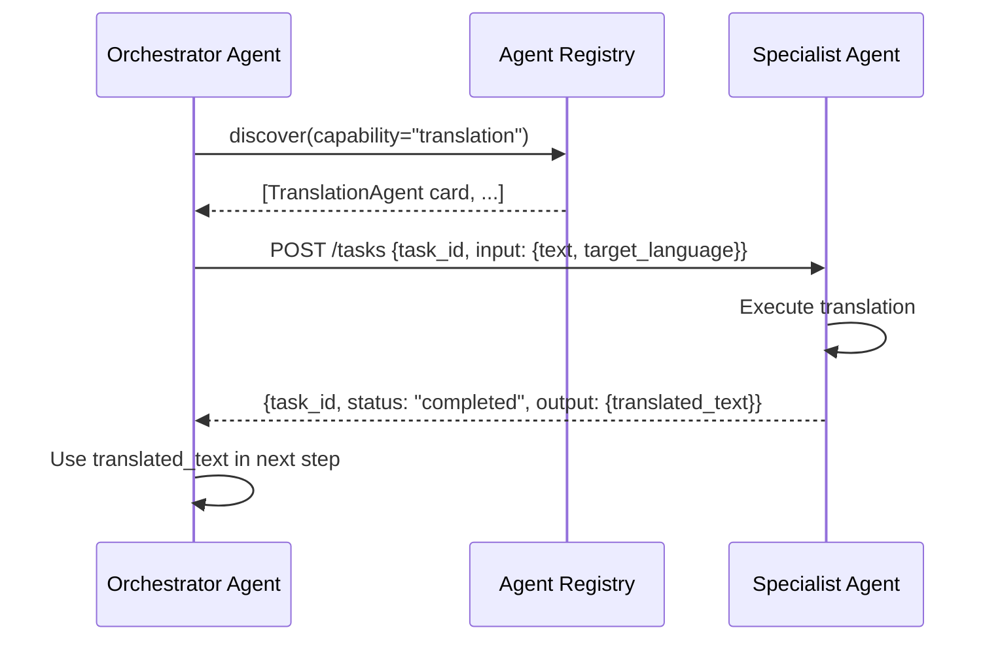
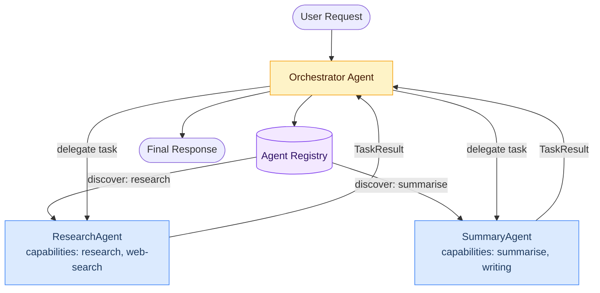
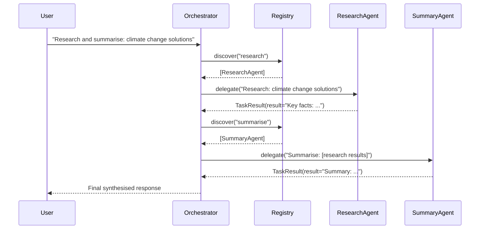

# Concepts: Agent-to-Agent Communication

## The Problem

Chapter 24's orchestrator knew exactly which agents existed because they were all defined in the same Python file. Scaling this to a real production system hits two walls:

1. **Discovery**: How does an orchestrator find a specialist agent it wasn't pre-programmed to know about?
2. **Interoperability**: How does an orchestrator built by Team A delegate to a specialist built by Team B, running on a different server, possibly written in a different language?

The answer is a **standard agent communication protocol** with a **capabilities manifest** — a machine-readable description of what each agent can do.

---

## A2A — Agent-to-Agent Protocol

**A2A** is an open protocol published by Google in 2025 for enabling agents to discover and delegate to each other. Key design goals:

- **Agent cards**: every A2A agent publishes a JSON document at a well-known URL describing its name, description, capabilities, and endpoint
- **Task-based**: agents exchange discrete tasks with defined inputs and outputs
- **Transport-agnostic**: works over HTTP, but the data model is independent of transport
- **Async-first**: supports both synchronous (request/response) and streaming results

### Agent Card Format

An agent card is a JSON manifest that tells other agents what this agent can do:

```json
{
  "name": "TranslationAgent",
  "description": "Translates text between languages with high accuracy",
  "version": "1.0.0",
  "endpoint": "https://agents.example.com/translation",
  "capabilities": ["translation", "language-detection", "multilingual"],
  "inputSchema": {
    "type": "object",
    "properties": {
      "text": {"type": "string"},
      "target_language": {"type": "string"}
    },
    "required": ["text", "target_language"]
  },
  "outputSchema": {
    "type": "object",
    "properties": {
      "translated_text": {"type": "string"},
      "detected_source": {"type": "string"}
    }
  }
}
```

Agents publish their card at `/.well-known/agent.json` — a convention borrowed from OAuth's `.well-known` discovery endpoints.

### How A2A Task Delegation Works



---

## ACP — Agent Communication Protocol

**ACP** is an open protocol from IBM and the BeeAI project, designed for structured agent-to-agent communication with a focus on message threading and conversation context.

Key differences from A2A:

- **Message-centric**: ACP organises communication as threaded messages, more like an email protocol than a task queue
- **Richer metadata**: messages carry structured metadata for traceability and routing
- **BeeAI ecosystem**: tightly integrated with the BeeAI agent framework and IBM's enterprise AI tooling

ACP is less widely adopted than A2A as of 2025, but is gaining traction in enterprise settings where audit trails and structured communication are required.

---

## A2A vs ACP vs MCP vs Raw Function Calls

| | **MCP** | **A2A** | **ACP** | **Raw Function Calls** |
|---|---------|---------|---------|----------------------|
| **Purpose** | Connect LLMs to tools/data | Agent-to-agent task delegation | Structured agent messaging | In-process tool invocation |
| **Led by** | Anthropic | Google | IBM / BeeAI | N/A (LLM API feature) |
| **Discovery** | Host configures servers | Agent cards at `.well-known/agent.json` | Registry-based | Hardcoded in application |
| **Transport** | stdio / HTTP+SSE | HTTP | HTTP | In-process / API call |
| **Unit of work** | Tool call / resource read | Task | Message thread | Function call |
| **Cross-org** | Yes (any MCP host) | Yes (any A2A client) | Yes (any ACP client) | No (same codebase) |
| **Best for** | Tools and data providers | Distributed agent systems | Enterprise agent workflows | Simple single-app agents |

---

## Multi-Agent Network Architecture



---

## Core Concepts Explained

### Agent Card

A machine-readable description of an agent's identity and capabilities. The key fields:

| Field | Description |
|-------|-------------|
| `name` | Unique agent identifier |
| `description` | Human-readable description of what the agent does |
| `capabilities` | List of capability tags (used for discovery) |
| `endpoint` | How to reach the agent (URL, "local", etc.) |
| `inputSchema` | Expected input format |
| `outputSchema` | Output format |

### Capability-Based Discovery

Instead of hardcoding which agent to call, the orchestrator describes what capability it needs:

```python
# Instead of: call_translation_agent(text)
# You do:
agents = registry.discover(capability="translation")
result = delegate_task(task=text, required_capability="translation", registry=registry)
```

This makes the orchestrator resilient to changes: you can swap out the translation agent without touching the orchestrator code.

### Task Delegation

A task has:
- A **task description** (natural language or structured)
- A **required capability** (for routing)
- A **result** (the agent's response)
- A **success flag** (did the agent complete successfully?)

### Result Aggregation

After delegating multiple tasks, the orchestrator collects all `TaskResult` objects and synthesises a final response. Results can arrive in any order if tasks run in parallel.

---

## The Full A2A Flow



---

## Key Terms

| Term | Definition |
|------|-----------|
| **A2A** | Agent-to-Agent Protocol; Google's open standard for inter-agent task delegation |
| **ACP** | Agent Communication Protocol; IBM/BeeAI standard for structured agent messaging |
| **Agent card** | JSON manifest published by an agent describing its capabilities and endpoint |
| **Agent registry** | A directory service where agents register and clients discover them |
| **Capability** | A tag describing a type of task an agent can handle (e.g., "translation", "research") |
| **Task delegation** | Sending a task to a discovered agent and awaiting its result |
| **Result aggregation** | Combining partial results from multiple delegated agents |
| **`.well-known/agent.json`** | The conventional URL where A2A agents publish their agent card |

---

## Interview Angle

**"How do agents in a multi-agent system discover each other's capabilities?"**

In a naive system, the orchestrator hardcodes which agents exist and how to call them. This doesn't scale — adding a new specialist requires changing the orchestrator.

The standard approach is to use an **agent registry** with **capability-based discovery**. Each agent publishes an **agent card** describing its capabilities (in A2A, at `/.well-known/agent.json`). When the orchestrator needs a specific capability, it queries the registry and gets a list of agents that can fulfil it, then delegates the task to the best match.

This decouples orchestrators from specialists: new agents can be added to the registry without changing the orchestrator. It also enables dynamic routing — if one agent is unavailable, the registry returns alternatives.

---

## Common Mistakes

| Mistake | What Goes Wrong | Fix |
|---------|----------------|-----|
| **Hardcoding agent endpoints** | Code breaks when an agent moves or is replaced | Use capability-based discovery; never hardcode endpoints |
| **No timeout on delegated tasks** | A slow or crashed agent blocks the orchestrator indefinitely | Always set a timeout; return a failure TaskResult if the deadline is exceeded |
| **Infinite delegation loops** | Agent A delegates to Agent B which delegates back to A | Track delegation depth; raise an error if depth > N (e.g., 5) |
| **Not handling agent unavailability** | Registry returns no agents for a capability; orchestrator crashes | Handle empty discovery results gracefully; return a clear error to the user |
| **Overly broad capabilities** | An agent declares "I can do everything" and gets routed all tasks | Keep capabilities specific and honest; broad agents defeat the purpose of specialisation |

---

Next: [Patterns — Agent Communication Patterns](./patterns.mdx)
