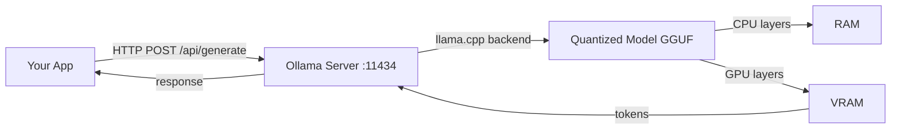
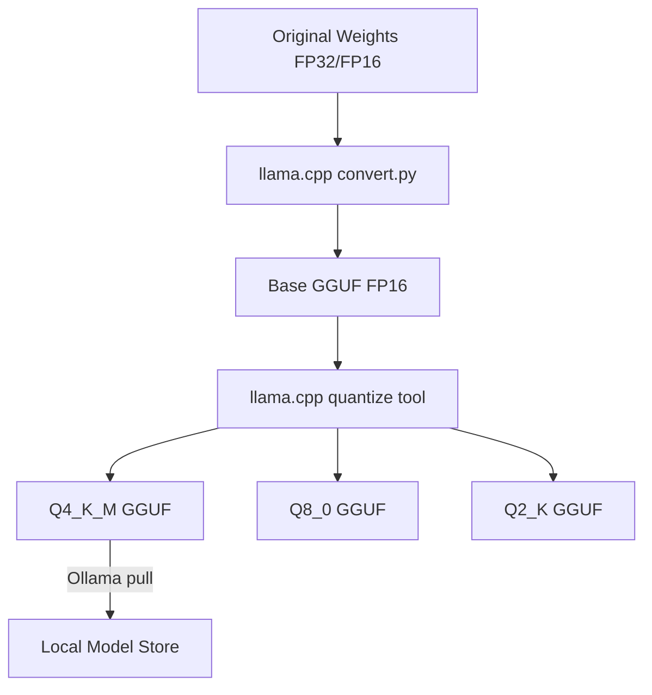

# Self-Hosted LLMs

## The Problem

Every time you call a cloud LLM API you face three constraints:

1. **Cost** — at scale, API costs compound. A high-traffic app calling GPT-4o can spend thousands of dollars per day.
2. **Privacy** — regulated industries (healthcare, finance, legal) cannot send sensitive data to third-party APIs.
3. **Offline / air-gap requirements** — edge devices, CI pipelines without internet access, and on-prem deployments need models that run locally.

Self-hosted LLMs solve all three, at the cost of your own infrastructure investment.

## Self-hosted vs. API — The Decision Matrix

Before picking a deployment strategy, map your requirements against these five dimensions:

| Dimension | Managed API (Claude / OpenAI) | Self-hosted Cloud (Ollama on EC2) | On-Premise |
|-----------|-------------------------------|-----------------------------------|------------|
| **Control** | Low — model version, rate limits, and availability set by provider | Medium — you choose model and runtime; cloud provider controls hardware | Full — every layer under your control |
| **Cost at Scale** | High — per-token pricing compounds; 10 M tokens/day = thousands of dollars | Medium — fixed EC2/GPU instance cost; predictable once saturated | High upfront, near-zero marginal — CapEx model |
| **Latency** | 200–2 000 ms typical; network round-trip to provider data center | 50–500 ms — same VPC reduces network hop; GPU tier determines throughput | 5–50 ms — on-LAN; no external network |
| **Maintenance Burden** | None — Anthropic/OpenAI handles updates, scaling, uptime | Medium — OS patches, model updates, auto-scaling config | High — hardware, drivers, OS, model updates, HA |
| **Compliance** | Risky for HIPAA/GDPR/FedRAMP — data leaves your boundary | Better — data stays in your VPC; cloud region can be constrained | Maximum — data never leaves physical premises |

**Decision heuristic**:
- **Prototype / low volume** → Managed API. Zero ops overhead.
- **Growing product with privacy needs** → Self-hosted cloud. Predictable cost, good compliance posture.
- **Regulated enterprise (defense, healthcare, finance)** → On-premise. Non-negotiable for air-gap or data residency laws.

## Self-Hosting Options

| Tool | Best For | Hardware | Difficulty |
|------|----------|----------|------------|
| **Ollama** | Local dev, quick start | CPU or GPU | Easy |
| **vLLM** | Production GPU serving | GPU (A100/H100) | Medium |
| **llama.cpp** | Embedded, custom builds | CPU or GPU | Hard |
| **LM Studio** | Non-technical users | CPU or GPU | Easy (GUI) |

**Ollama** is the right starting point for development. It wraps llama.cpp, exposes an OpenAI-compatible REST API on `localhost:11434`, and manages model downloads automatically.

**vLLM** is the production choice for GPU clusters. It uses continuous batching and PagedAttention to maximize GPU throughput — essential at scale.

**llama.cpp** is the underlying engine most tools are built on. It runs models on CPU with optional GPU offload and supports every quantization level.

## Running Llama Locally with Ollama — Complete Setup

This walkthrough takes you from zero to running inference in under five minutes.

### Step 1 — Install Ollama

**macOS / Linux (one-liner):**

```bash
curl -fsSL https://ollama.com/install.sh | sh
```

**macOS via Homebrew:**

```bash
brew install ollama
```

**Windows:** Download the installer from [ollama.com](https://ollama.com) and run it. Ollama registers as a background service automatically.

Verify the install:

```bash
ollama --version
# ollama version 0.3.x
```

### Step 2 — Start the Ollama server

On Linux/macOS the install script starts the daemon automatically. To start it manually:

```bash
ollama serve
# Listening on 127.0.0.1:11434
```

### Step 3 — Pull a model

```bash
# Pull Llama 3.1 8B (4-bit quantized, ~4.7 GB download)
ollama pull llama3.1:8b

# Pull a smaller model for resource-constrained machines
ollama pull phi3:mini        # 3.8B, ~2.3 GB

# Pull a code-focused model
ollama pull codellama:7b

# List downloaded models
ollama list
```

### Step 4 — Run inference via the CLI

```bash
# One-shot prompt
ollama run llama3.1:8b "Explain transformer attention in two sentences."

# Interactive chat session
ollama run llama3.1:8b
# Type /bye to exit
```

### Step 5 — Run inference via curl

Ollama exposes a REST API compatible with the OpenAI `/v1/chat/completions` format.

```bash
# Non-streaming completion
curl http://localhost:11434/api/generate \
  -H "Content-Type: application/json" \
  -d '{
    "model": "llama3.1:8b",
    "prompt": "What is the capital of France?",
    "stream": false
  }'
```

OpenAI-compatible endpoint (drop-in replacement for OpenAI SDK):

```bash
curl http://localhost:11434/v1/chat/completions \
  -H "Content-Type: application/json" \
  -d '{
    "model": "llama3.1:8b",
    "messages": [
      {"role": "system", "content": "You are a helpful assistant."},
      {"role": "user", "content": "Explain gradient descent in plain English."}
    ],
    "temperature": 0.7
  }'
```

### Step 6 — Run inference via Python requests

```python
import requests
import json

# Option A: Native Ollama API
def ollama_generate(prompt: str, model: str = "llama3.1:8b") -> str:
    response = requests.post(
        "http://localhost:11434/api/generate",
        json={
            "model": model,
            "prompt": prompt,
            "stream": False,
        },
        timeout=120,
    )
    response.raise_for_status()
    return response.json()["response"]


# Option B: OpenAI-compatible API (works with the openai Python SDK too)
def ollama_chat(messages: list, model: str = "llama3.1:8b") -> str:
    response = requests.post(
        "http://localhost:11434/v1/chat/completions",
        json={
            "model": model,
            "messages": messages,
            "temperature": 0.0,
        },
        timeout=120,
    )
    response.raise_for_status()
    return response.json()["choices"][0]["message"]["content"]


if __name__ == "__main__":
    # Simple generation
    answer = ollama_generate("What is 2 + 2? Answer with just the number.")
    print(answer)  # 4

    # Chat with system prompt
    reply = ollama_chat([
        {"role": "system", "content": "You answer only in haiku."},
        {"role": "user", "content": "Explain neural networks."},
    ])
    print(reply)
```

Using the official `openai` SDK pointed at Ollama (zero code change from OpenAI):

```python
from openai import OpenAI

client = OpenAI(
    base_url="http://localhost:11434/v1",
    api_key="ollama",  # required by the SDK but ignored by Ollama
)

completion = client.chat.completions.create(
    model="llama3.1:8b",
    messages=[{"role": "user", "content": "Write a haiku about Python."}],
)
print(completion.choices[0].message.content)
```

## Quantization: Fitting Big Models on Small Hardware

Modern LLMs are trained in FP32 (32-bit floats). Running them in FP32 requires enormous memory. Quantization reduces precision to shrink model size with a small quality penalty.

```
FP32 → FP16 → INT8 → INT4 (GGUF Q4_K_M)
 2x        4x       8x smaller
```

| Format | Bits per Weight | Quality vs FP16 | Use Case |
|--------|-----------------|-----------------|----------|
| FP32 | 32 | Baseline (reference) | Training only |
| FP16 | 16 | ~100% | Fine-tuning, high-accuracy |
| INT8 (Q8) | 8 | ~99% | Deployment, good GPUs |
| INT4 (Q4_K_M) | 4 | ~97% | Consumer GPU / CPU |

**Q4_K_M** is the sweet spot for local use: 4-bit quantization with medium-quality K-quants. The quality drop vs FP16 is imperceptible in most tasks.

## GPU Memory Requirements

Use this table to match a model to the hardware you have available. Values include a ~20% overhead for the KV cache on top of raw model weights.

| Model Size | FP16 VRAM | INT8 VRAM | INT4 VRAM | Minimum GPU Example |
|------------|-----------|-----------|-----------|---------------------|
| **7B** | ~16 GB | ~9 GB | ~5 GB | INT4: RTX 3060 (12 GB) · INT8: RTX 3090 (24 GB) |
| **13B** | ~28 GB | ~15 GB | ~9 GB | INT4: RTX 3090 (24 GB) · FP16: A100-40G |
| **34B** | ~72 GB | ~38 GB | ~21 GB | INT4: 2× RTX 3090 or A100-40G · FP16: A100-80G ×2 |
| **70B** | ~144 GB | ~75 GB | ~40 GB | INT4: A100-40G ×2 · FP16: H100-80G ×2 |

**How to read this table:**

- **FP16** — highest quality, maximum VRAM. Use for fine-tuning or when you have budget hardware.
- **INT8** — ~99% quality at half the VRAM. Good balance for inference servers with A-series GPUs.
- **INT4** — ~97% quality at one quarter the FP16 VRAM. The practical choice for consumer and edge hardware.

**Rule of thumb**: `model_params_B × bits_per_weight / 8 × 1.2 ≈ VRAM_GB`

For example, 7B model at INT4: `7 × 4 / 8 × 1.2 = 4.2 GB` — fits in an RTX 3060 12 GB with headroom.

If VRAM runs out, Ollama offloads remaining layers to RAM (CPU inference). This works but is 10–100x slower — avoid it in production.

## GGUF Format

GGUF (GPT-Generated Unified Format) is the model file format used by llama.cpp and Ollama.

Key properties:
- **Portable**: single file, all metadata included (tokenizer, architecture config)
- **CPU-friendly**: can run on CPU without a GPU
- **Mixed quantization**: different layers can use different precision
- **Streaming**: can memory-map the file, so only loaded portions use RAM

Model files follow the naming convention:
```
Llama-3.1-8B-Instruct-Q4_K_M.gguf
                        ^^^^^^ quantization level
```

## Ollama Architecture

Ollama wraps llama.cpp and adds:
- Automatic model downloads from the Ollama registry
- Model lifecycle management (load/unload)
- An OpenAI-compatible REST API



## Model Format Conversion Pipeline



## Memory Requirements

| Model Size | INT4 VRAM | INT8 VRAM | FP16 VRAM |
|-----------|-----------|-----------|-----------|
| 3B | 2 GB | 3 GB | 6 GB |
| 7B / 8B | 4 GB | 8 GB | 16 GB |
| 13B | 8 GB | 13 GB | 26 GB |
| 34B | 20 GB | 34 GB | 68 GB |
| 70B | 40 GB | 70 GB | 140 GB |

**Rule of thumb**: model size (B params) × bits / 8 = minimum VRAM (GB). Add ~20% overhead for KV cache.

If VRAM runs out, Ollama offloads remaining layers to RAM (CPU inference). This works but is 10–100x slower.

## Serving with vLLM for Production

Ollama is great for development. For high-throughput production serving, **vLLM** is the industry standard. It implements:

- **Continuous batching** — new requests join an in-flight batch without waiting for the current batch to finish.
- **PagedAttention** — KV cache stored in non-contiguous memory pages, eliminating fragmentation and increasing GPU utilisation to 90%+.
- **OpenAI-compatible API** — drop-in replacement for OpenAI endpoints.

### Start a vLLM server with Docker

```bash
# Serve Llama 3.1 8B Instruct on port 8000
# Requires: NVIDIA GPU with >=16 GB VRAM for fp16, or >=6 GB for int4
docker run --gpus all \
  -p 8000:8000 \
  --ipc=host \
  vllm/vllm-openai:latest \
  --model meta-llama/Llama-3.1-8B-Instruct \
  --dtype auto \
  --max-model-len 8192
```

For a quantized model (saves VRAM, fits on smaller GPUs):

```bash
docker run --gpus all \
  -p 8000:8000 \
  --ipc=host \
  vllm/vllm-openai:latest \
  --model TheBloke/Llama-2-13B-chat-AWQ \
  --quantization awq \
  --dtype auto \
  --max-model-len 4096
```

Environment variable to pass a Hugging Face token for gated models:

```bash
docker run --gpus all \
  -p 8000:8000 \
  --ipc=host \
  -e HUGGING_FACE_HUB_TOKEN=hf_... \
  vllm/vllm-openai:latest \
  --model meta-llama/Llama-3.1-8B-Instruct
```

### Query vLLM with Python requests

```python
import requests

VLLM_BASE = "http://localhost:8000"


def vllm_chat(messages: list, model: str = "meta-llama/Llama-3.1-8B-Instruct") -> str:
    """Send a chat request to a running vLLM server."""
    response = requests.post(
        f"{VLLM_BASE}/v1/chat/completions",
        json={
            "model": model,
            "messages": messages,
            "temperature": 0.0,
            "max_tokens": 512,
        },
        timeout=60,
    )
    response.raise_for_status()
    return response.json()["choices"][0]["message"]["content"]


def vllm_completions(prompt: str, model: str = "meta-llama/Llama-3.1-8B-Instruct") -> str:
    """Use the legacy /v1/completions endpoint."""
    response = requests.post(
        f"{VLLM_BASE}/v1/completions",
        json={
            "model": model,
            "prompt": prompt,
            "max_tokens": 256,
            "temperature": 0.0,
        },
        timeout=60,
    )
    response.raise_for_status()
    return response.json()["choices"][0]["text"]


if __name__ == "__main__":
    answer = vllm_chat([
        {"role": "system", "content": "You are a concise assistant."},
        {"role": "user", "content": "What are the benefits of PagedAttention?"},
    ])
    print(answer)
```

Using the `openai` SDK (identical to Ollama — vLLM is fully OpenAI-compatible):

```python
from openai import OpenAI

client = OpenAI(base_url="http://localhost:8000/v1", api_key="vllm")

stream = client.chat.completions.create(
    model="meta-llama/Llama-3.1-8B-Instruct",
    messages=[{"role": "user", "content": "Write a limerick about GPUs."}],
    stream=True,
)

for chunk in stream:
    delta = chunk.choices[0].delta.content
    if delta:
        print(delta, end="", flush=True)
```

### When to use Ollama vs. vLLM

| | Ollama | vLLM |
|---|--------|------|
| **Best for** | Local dev, prototyping | Production, high-QPS serving |
| **Concurrency** | Sequential requests | Continuous batching (100s of req/s) |
| **GPU efficiency** | Moderate | High — PagedAttention |
| **Setup complexity** | 1 command | Docker + GPU drivers |
| **Model support** | GGUF only | HuggingFace + GGUF + AWQ + GPTQ |

## Interview Angle

**"When would you self-host an LLM vs use an API?"**

A strong answer covers:
- **Use API** when: prototyping fast, using frontier models (GPT-4o, Claude 3.5 Sonnet), no privacy concerns, low volume
- **Self-host** when: data privacy is required, costs are high at scale, offline/edge deployment needed, need reproducible outputs without model version drift
- **Hybrid**: use local models for simple/sensitive tasks, route complex tasks to cloud APIs

## Common Mistakes

- **Running too large a model**: a 70B model on 16GB RAM will OOM or run at unusable speed. Always check memory requirements first.
- **Not using quantization**: running FP16 when INT4 would give 98% of the quality at 4x less memory.
- **Ignoring VRAM limits**: if the model doesn't fit in VRAM, CPU offload makes it ~50x slower.
- **Not pinning model versions**: using `llama3` instead of `llama3.1:8b-instruct-q4_K_M` means the model can change under you.

➡️ Next: [Patterns — Ollama in Practice](./patterns.mdx)
