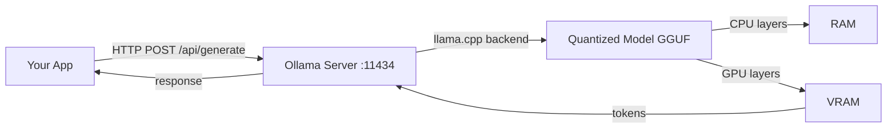
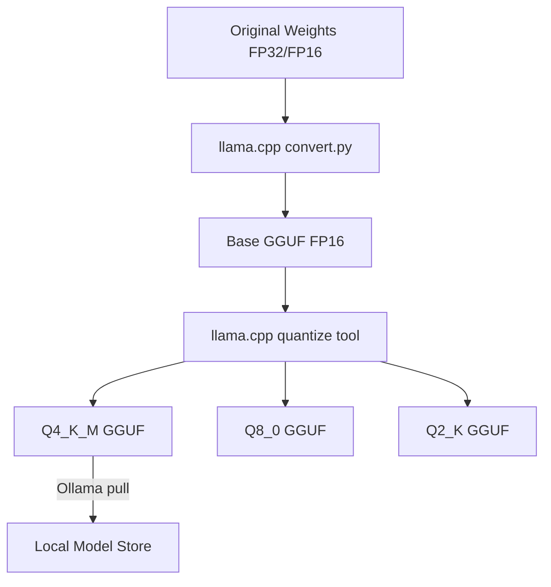

# Self-Hosted LLMs

## The Problem

Every time you call a cloud LLM API you face three constraints:

1. **Cost** — at scale, API costs compound. A high-traffic app calling GPT-4o can spend thousands of dollars per day.
2. **Privacy** — regulated industries (healthcare, finance, legal) cannot send sensitive data to third-party APIs.
3. **Offline / air-gap requirements** — edge devices, CI pipelines without internet access, and on-prem deployments need models that run locally.

Self-hosted LLMs solve all three, at the cost of your own infrastructure investment.

## Self-Hosting Options

| Tool | Best For | Hardware | Difficulty |
|------|----------|----------|------------|
| **Ollama** | Local dev, quick start | CPU or GPU | Easy |
| **vLLM** | Production GPU serving | GPU (A100/H100) | Medium |
| **llama.cpp** | Embedded, custom builds | CPU or GPU | Hard |
| **LM Studio** | Non-technical users | CPU or GPU | Easy (GUI) |

**Ollama** is the right starting point for development. It wraps llama.cpp, exposes an OpenAI-compatible REST API on `localhost:11434`, and manages model downloads automatically.

**vLLM** is the production choice for GPU clusters. It uses continuous batching and PagedAttention to maximize GPU throughput — essential at scale.

**llama.cpp** is the underlying engine most tools are built on. It runs models on CPU with optional GPU offload and supports every quantization level.

## Quantization: Fitting Big Models on Small Hardware

Modern LLMs are trained in FP32 (32-bit floats). Running them in FP32 requires enormous memory. Quantization reduces precision to shrink model size with a small quality penalty.

```
FP32 → FP16 → INT8 → INT4 (GGUF Q4_K_M)
 2x        4x       8x smaller
```

| Format | Bits per Weight | Quality vs FP16 | Use Case |
|--------|-----------------|-----------------|----------|
| FP32 | 32 | Baseline (reference) | Training only |
| FP16 | 16 | ~100% | Fine-tuning, high-accuracy |
| INT8 (Q8) | 8 | ~99% | Deployment, good GPUs |
| INT4 (Q4_K_M) | 4 | ~97% | Consumer GPU / CPU |

**Q4_K_M** is the sweet spot for local use: 4-bit quantization with medium-quality K-quants. The quality drop vs FP16 is imperceptible in most tasks.

## GGUF Format

GGUF (GPT-Generated Unified Format) is the model file format used by llama.cpp and Ollama.

Key properties:
- **Portable**: single file, all metadata included (tokenizer, architecture config)
- **CPU-friendly**: can run on CPU without a GPU
- **Mixed quantization**: different layers can use different precision
- **Streaming**: can memory-map the file, so only loaded portions use RAM

Model files follow the naming convention:
```
Llama-3.1-8B-Instruct-Q4_K_M.gguf
                        ^^^^^^ quantization level
```

## Ollama Architecture

Ollama wraps llama.cpp and adds:
- Automatic model downloads from the Ollama registry
- Model lifecycle management (load/unload)
- An OpenAI-compatible REST API



## Model Format Conversion Pipeline



## Memory Requirements

| Model Size | INT4 VRAM | INT8 VRAM | FP16 VRAM |
|-----------|-----------|-----------|-----------|
| 3B | 2 GB | 3 GB | 6 GB |
| 7B / 8B | 4 GB | 8 GB | 16 GB |
| 13B | 8 GB | 13 GB | 26 GB |
| 34B | 20 GB | 34 GB | 68 GB |
| 70B | 40 GB | 70 GB | 140 GB |

**Rule of thumb**: model size (B params) × bits / 8 = minimum VRAM (GB). Add ~20% overhead for KV cache.

If VRAM runs out, Ollama offloads remaining layers to RAM (CPU inference). This works but is 10–100x slower.

## Interview Angle

**"When would you self-host an LLM vs use an API?"**

A strong answer covers:
- **Use API** when: prototyping fast, using frontier models (GPT-4o, Claude 3.5 Sonnet), no privacy concerns, low volume
- **Self-host** when: data privacy is required, costs are high at scale, offline/edge deployment needed, need reproducible outputs without model version drift
- **Hybrid**: use local models for simple/sensitive tasks, route complex tasks to cloud APIs

## Common Mistakes

- **Running too large a model**: a 70B model on 16GB RAM will OOM or run at unusable speed. Always check memory requirements first.
- **Not using quantization**: running FP16 when INT4 would give 98% of the quality at 4x less memory.
- **Ignoring VRAM limits**: if the model doesn't fit in VRAM, CPU offload makes it ~50x slower.
- **Not pinning model versions**: using `llama3` instead of `llama3.1:8b-instruct-q4_K_M` means the model can change under you.

➡️ Next: [Patterns — Ollama in Practice](./patterns.mdx)
