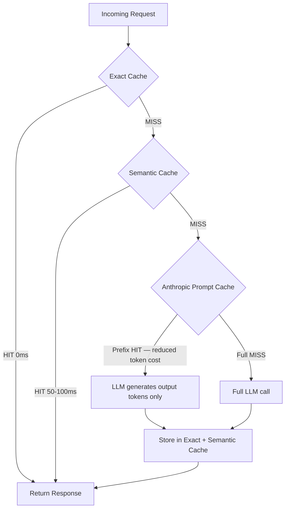
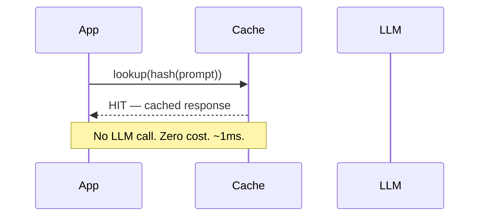
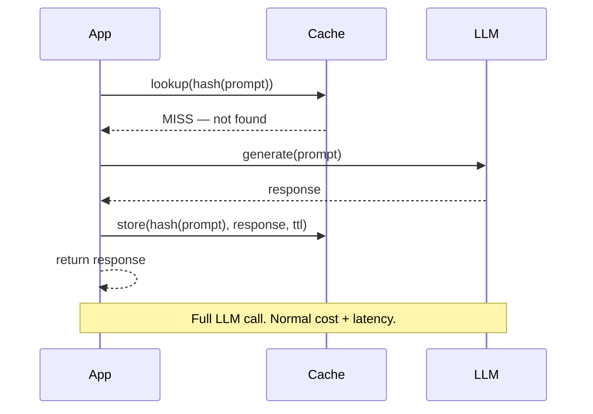
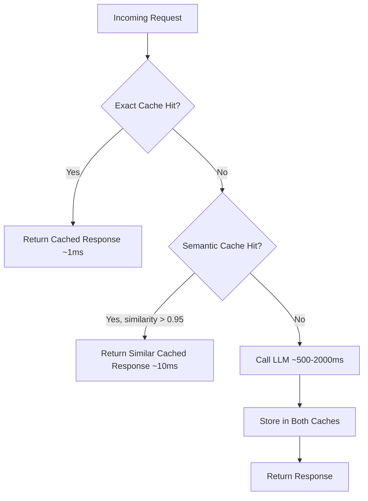

# Caching Strategies for LLMs

## The Problem

A production RAG pipeline serving 10,000 users per day might call an LLM 100,000 times. Many of those calls are identical or near-identical:

- Same FAQ question rephrased slightly
- Same system prompt sent with every request
- Same retrieval context for a popular document

Without caching, every one of these pays full token cost and full latency. With a well-designed cache, 60–80% of calls can be served from cache — at near-zero cost and near-zero latency.

## Three Layers of LLM Caching

LLM caching is not a single technique — it is a stack of three complementary layers, each catching a different class of repeated work.



| Cache Layer | Where it Lives | Cache Key | Hit Latency | Cost Reduction | Best For |
|-------------|----------------|-----------|-------------|----------------|----------|
| **Exact cache** | Your Redis / in-memory | SHA-256 of system\_prompt + user\_message + params | ~0 ms | 100% (no LLM call) | Repeated identical queries, batch jobs |
| **Semantic cache** | Redis + vector index | Embedding similarity &gt; threshold | 50–100 ms | 100% (no LLM call) | Paraphrased questions, FAQ bots |
| **Anthropic Prompt Caching** | Anthropic servers | Automatic — prefix token hash | 200–500 ms (output only) | ~90% on cached prefix tokens | Long system prompts, large retrieval contexts |

### Layer details

**Exact cache** — fastest possible. Hash the full request to a string key. Any byte difference is a miss. Zero false positives.

**Semantic cache** — embeds the incoming prompt, searches a vector store for prompts with cosine similarity above a threshold (typically 0.95). Catches rephrasings the exact cache misses. Requires an embedding call per miss, adding ~10–30 ms overhead.

**Anthropic Prompt Caching** — operates at the API level. You mark a prefix block with `cache_control`. Anthropic caches the KV representation of those tokens for up to 5 minutes (ephemeral). On a cache hit, you pay only for output tokens plus a 0.10× read fee — roughly **90% cost reduction** on the prefix. Cache write costs 1.25× normal input pricing (amortised over many reads).

## Layer 1: Exact Cache

**How it works**: Hash the (model, prompt, params) tuple → use the hash as a cache key → store the response. On a subsequent identical request, return the stored response without calling the LLM.

**Implementation**: SHA256 of the JSON-serialized request. Any dict, Redis, or in-memory store works.

**Characteristics**:
- 100% accuracy — only serves a cached response for byte-identical inputs
- Very fast — O(1) key lookup
- Only helps when prompts are truly identical (same user asking the same question twice, batch jobs with repeated queries)

## Cache Hit Flow vs Cache Miss Flow





## Layer 2: Semantic Cache

**How it works**: Embed the incoming prompt → compare against a vector store of cached prompts using cosine similarity → if similarity > threshold (e.g. 0.95), return the cached response for the most similar prior prompt.

**Why it helps**: "What is the capital of France?" and "Tell me the capital city of France" have ~0.97 cosine similarity. Exact cache misses both as different strings. Semantic cache catches both with one stored entry.

**Threshold tuning**:

| Threshold | Behaviour |
|-----------|-----------|
| 0.99 | Very conservative — near-exact matches only |
| 0.95 | Balanced — catches rephrasing, same intent |
| 0.90 | Aggressive — risks returning wrong cached answer |

**Trade-offs**:
- Requires an embedding model call for every miss (small overhead)
- Approximate — there's a risk of returning a slightly wrong answer for borderline similarity
- Stale risk — cached responses may no longer be accurate if knowledge changes

## Implementing Semantic Cache

The following implementation uses **Redis Stack** (with the `redisearch` module for vector similarity) and the **OpenAI embeddings API**. The same pattern works with any embedding provider.

```python
import hashlib
import json
import os
import time
from typing import Optional

import numpy as np
import redis
import openai

# ---------------------------------------------------------------------------
# Configuration
# ---------------------------------------------------------------------------
REDIS_URL = os.getenv("REDIS_URL", "redis://localhost:6379")
EMBED_MODEL = "text-embedding-3-small"          # 1536-dimensional embeddings
SIMILARITY_THRESHOLD = 0.95                      # tune per use-case
TTL_SECONDS = 3600                               # 1-hour TTL
INDEX_NAME = "semantic_cache_idx"
VECTOR_DIM = 1536

openai_client = openai.OpenAI()
redis_client = redis.from_url(REDIS_URL, decode_responses=False)


# ---------------------------------------------------------------------------
# Index bootstrap (run once on startup)
# ---------------------------------------------------------------------------
def bootstrap_index() -> None:
    """Create the Redis vector index if it does not already exist."""
    try:
        redis_client.execute_command("FT.INFO", INDEX_NAME)
    except Exception:
        redis_client.execute_command(
            "FT.CREATE", INDEX_NAME,
            "ON", "HASH",
            "PREFIX", "1", "scache:",
            "SCHEMA",
            "prompt_text", "TEXT",
            "embedding", "VECTOR", "FLAT", "6",
                "TYPE", "FLOAT32",
                "DIM", str(VECTOR_DIM),
                "DISTANCE_METRIC", "COSINE",
        )
        print(f"Created Redis index: {INDEX_NAME}")


# ---------------------------------------------------------------------------
# Embedding helper
# ---------------------------------------------------------------------------
def embed(text: str) -> np.ndarray:
    """Return a normalised float32 embedding vector."""
    response = openai_client.embeddings.create(model=EMBED_MODEL, input=text)
    vec = np.array(response.data[0].embedding, dtype=np.float32)
    return vec / np.linalg.norm(vec)      # normalise for cosine similarity


# ---------------------------------------------------------------------------
# Cache operations
# ---------------------------------------------------------------------------
def cache_key(prompt: str) -> str:
    """Deterministic Redis key from prompt text."""
    digest = hashlib.sha256(prompt.encode()).hexdigest()[:16]
    return f"scache:{digest}"


def semantic_cache_get(prompt: str) -> Optional[str]:
    """
    Search the semantic cache.
    Returns the cached LLM response if a similar-enough prompt was found,
    otherwise returns None.
    """
    query_vec = embed(prompt).tobytes()

    # KNN search — find the 1 nearest neighbour
    query = (
        f"*=>[KNN 1 @embedding $vec AS score]"
    )
    results = redis_client.execute_command(
        "FT.SEARCH", INDEX_NAME, query,
        "PARAMS", "2", "vec", query_vec,
        "RETURN", "3", "prompt_text", "llm_response", "score",
        "SORTBY", "score",
        "DIALECT", "2",
    )

    if not results or results[0] == 0:
        return None

    # results layout: [count, key, [field, value, ...], ...]
    fields = dict(zip(results[2][::2], results[2][1::2]))
    score = float(fields.get(b"score", b"1.0"))

    # Redis COSINE distance = 1 - cosine_similarity, so invert
    similarity = 1.0 - score
    if similarity >= SIMILARITY_THRESHOLD:
        return fields[b"llm_response"].decode("utf-8")

    return None


def semantic_cache_set(prompt: str, response: str) -> None:
    """Store a prompt + LLM response in the semantic cache."""
    key = cache_key(prompt)
    vec = embed(prompt).tobytes()

    redis_client.hset(key, mapping={
        "prompt_text": prompt,
        "llm_response": response,
        "embedding": vec,
        "created_at": str(int(time.time())),
    })
    redis_client.expire(key, TTL_SECONDS)


# ---------------------------------------------------------------------------
# Cached LLM call
# ---------------------------------------------------------------------------
def llm_with_semantic_cache(
    user_message: str,
    system_prompt: str = "You are a helpful assistant.",
) -> tuple[str, bool]:
    """
    Call the LLM with semantic caching.

    Returns:
        (response_text, cache_hit)
    """
    # Combine system + user for the cache key so different system prompts
    # don't cross-contaminate each other.
    cache_prompt = f"[SYS]{system_prompt}[USR]{user_message}"

    # 1. Try semantic cache first
    cached = semantic_cache_get(cache_prompt)
    if cached is not None:
        return cached, True

    # 2. Cache miss — call the LLM
    completion = openai_client.chat.completions.create(
        model="gpt-4o-mini",
        messages=[
            {"role": "system", "content": system_prompt},
            {"role": "user", "content": user_message},
        ],
        temperature=0.0,          # deterministic output is safer to cache
    )
    response_text = completion.choices[0].message.content

    # 3. Store in semantic cache
    semantic_cache_set(cache_prompt, response_text)

    return response_text, False


# ---------------------------------------------------------------------------
# Demo
# ---------------------------------------------------------------------------
if __name__ == "__main__":
    bootstrap_index()

    questions = [
        "What is the capital of France?",
        "Tell me the capital city of France.",   # paraphrase — should hit cache
        "Which city is the capital of France?",  # paraphrase — should hit cache
        "What is the capital of Germany?",       # different question — should miss
    ]

    for q in questions:
        text, hit = llm_with_semantic_cache(q)
        status = "HIT " if hit else "MISS"
        print(f"[{status}] Q: {q!r}\n       A: {text[:80]}\n")
```

## Layer 3: Anthropic Prompt Caching

Anthropic supports server-side caching of prompt prefixes. When you mark a portion of your prompt with `cache_control: {"type": "ephemeral"}`, Anthropic caches the KV representation of those tokens on their servers for up to 5 minutes (ephemeral) or 1 hour (extended).

**Cost impact**:
- Cache write: 1.25× normal input token price (one-time cost)
- Cache read: 0.10× normal input token price (10% of full cost)
- Net effect: if a 10,000-token system prompt is cached and read 20 times, you save ~87% on those prefix tokens

**Typical use case**: Long system prompts, large retrieval contexts, tool definitions sent with every request.

```python
import anthropic

client = anthropic.Anthropic()

response = client.messages.create(
    model="claude-3-5-sonnet-20241022",
    max_tokens=1024,
    system=[
        {
            "type": "text",
            "text": "You are an expert assistant. " + LARGE_KNOWLEDGE_BASE,
            "cache_control": {"type": "ephemeral"},  # Cache this prefix
        }
    ],
    messages=[{"role": "user", "content": user_question}],
)

# Check cache usage
print(response.usage.cache_read_input_tokens)   # tokens served from cache
print(response.usage.cache_creation_input_tokens)  # tokens written to cache
```

## Cache Invalidation Strategy

Cached responses become stale when the underlying data, model, or prompt changes. Three strategies handle different invalidation triggers:

### 1. TTL (Time-based)

Set an expiry at write time. The simplest strategy — no external trigger needed.

```python
import redis
import hashlib
import json

r = redis.from_url("redis://localhost:6379")

def exact_cache_get(request: dict) -> str | None:
    key = "exact:" + hashlib.sha256(
        json.dumps(request, sort_keys=True).encode()
    ).hexdigest()
    value = r.get(key)
    return value.decode() if value else None

def exact_cache_set(
    request: dict,
    response: str,
    ttl_seconds: int = 3600,   # 1 hour default; tune per content type
) -> None:
    key = "exact:" + hashlib.sha256(
        json.dumps(request, sort_keys=True).encode()
    ).hexdigest()
    r.setex(key, ttl_seconds, response)

# Usage — short TTL for time-sensitive content, long TTL for stable facts
exact_cache_set(request, response, ttl_seconds=300)    # news: 5 minutes
exact_cache_set(request, response, ttl_seconds=86400)  # static docs: 1 day
```

### 2. Event-based (Document Update)

When source data changes (e.g., a knowledge base document is edited), delete all cache entries that were derived from it. Tag entries with their source document IDs at write time.

```python
import redis
import json

r = redis.from_url("redis://localhost:6379")

CACHE_PREFIX = "llmcache:"
DOC_TAG_PREFIX = "doc_tag:"


def cache_set_with_doc_tags(
    cache_key: str,
    response: str,
    source_doc_ids: list[str],
    ttl: int = 3600,
) -> None:
    """Store response and register the cache key under each source document."""
    full_key = CACHE_PREFIX + cache_key

    pipe = r.pipeline()
    pipe.setex(full_key, ttl, response)

    # For each source document, maintain a set of cache keys that depend on it
    for doc_id in source_doc_ids:
        tag_key = DOC_TAG_PREFIX + doc_id
        pipe.sadd(tag_key, full_key)
        pipe.expire(tag_key, ttl + 60)   # slightly longer than the cache itself

    pipe.execute()


def invalidate_by_document(doc_id: str) -> int:
    """
    Called when document `doc_id` is updated.
    Deletes all cache entries that included this document in their context.
    Returns the number of invalidated keys.
    """
    tag_key = DOC_TAG_PREFIX + doc_id
    cache_keys = r.smembers(tag_key)

    if not cache_keys:
        return 0

    pipe = r.pipeline()
    for key in cache_keys:
        pipe.delete(key)
    pipe.delete(tag_key)
    pipe.execute()

    return len(cache_keys)


# Example usage
cache_set_with_doc_tags(
    cache_key="q_what_is_refund_policy",
    response="Our refund policy allows returns within 30 days...",
    source_doc_ids=["policy_doc_v3", "faq_doc_2024"],
)

# When the policy document is updated:
n = invalidate_by_document("policy_doc_v3")
print(f"Invalidated {n} cache entries due to policy_doc_v3 update")
```

### 3. Version-based (Model or Prompt Change)

Bake the model version and prompt version into the cache key. A model upgrade or prompt edit automatically invalidates all old entries without any manual purge.

```python
import hashlib
import json

CURRENT_MODEL = "gpt-4o-mini"
PROMPT_VERSION = "v2.1"          # bump this when you change the system prompt


def versioned_cache_key(
    user_message: str,
    system_prompt: str,
    model: str = CURRENT_MODEL,
    prompt_version: str = PROMPT_VERSION,
) -> str:
    """
    Cache key that encodes model + prompt version.
    Changing either automatically creates a new key namespace.
    """
    payload = json.dumps({
        "model": model,
        "prompt_version": prompt_version,
        "system": system_prompt,
        "user": user_message,
    }, sort_keys=True)
    return "vc:" + hashlib.sha256(payload.encode()).hexdigest()


# key before upgrade:  vc:a3f8...  (model=gpt-4o-mini, prompt_version=v2.0)
# key after upgrade:   vc:b91c...  (model=gpt-4o,      prompt_version=v2.1)
# Old entries expire via TTL; no manual cleanup needed.
```

### When to use each strategy

| Strategy | Invalidation Trigger | Overhead | Best For |
|----------|----------------------|----------|----------|
| **TTL** | Time elapsed | None | Most caches — safe default |
| **Event-based** | Source document updated | Maintain doc→key mapping | RAG pipelines, knowledge bases |
| **Version-based** | Model or prompt changed | None (key namespace shift) | Prompt engineering iteration, model upgrades |

## Two-Level Cache Architecture



## Cost-Benefit Analysis

Let's run the numbers for a realistic production workload to show where caching pays off.

### Workload assumptions

| Parameter | Value |
|-----------|-------|
| Daily queries | 10,000 |
| Average input tokens per query | 800 (200 user + 600 system/context) |
| Average output tokens per query | 200 |
| Model | GPT-4o-mini |
| Input price | $0.150 / 1M tokens |
| Output price | $0.600 / 1M tokens |
| Cache hit rate | 30% (conservative for a diverse FAQ workload) |

### Baseline cost (no cache)

```
Input cost:  10,000 queries × 800 tokens × $0.150 / 1,000,000 = $1.20 / day
Output cost: 10,000 queries × 200 tokens × $0.600 / 1,000,000 = $1.20 / day
Total:       $2.40 / day  →  $876 / year
```

### With 30% exact/semantic cache hit rate

On a cache hit, the LLM is not called — cost is effectively $0 (Redis lookup is negligible).

```
Cache hits:   10,000 × 0.30 = 3,000 queries served from cache
Cache misses: 10,000 × 0.70 = 7,000 queries call the LLM

Input cost:  7,000 × 800 × $0.150 / 1,000,000 = $0.84 / day
Output cost: 7,000 × 200 × $0.600 / 1,000,000 = $0.84 / day
Total:       $1.68 / day  →  $613 / year

Savings vs. baseline: $0.72 / day  →  $263 / year (30% reduction)
```

### Adding Anthropic Prompt Caching on top

Even on the 7,000 cache misses, Anthropic Prompt Caching can cache the 600-token system prompt / context prefix.

```
Cache write (first call per 5-min window, ~5% of miss calls):
  350 calls × 600 tokens × $0.150 × 1.25 / 1,000,000 = $0.004 / day (negligible)

Cache read (remaining 95% of miss calls):
  6,650 calls × 600 tokens × $0.150 × 0.10 / 1,000,000 = $0.060 / day

Without prompt caching those 6,650 prefix reads cost:
  6,650 × 600 × $0.150 / 1,000,000 = $0.599 / day

Prompt cache savings: $0.599 - $0.060 = $0.539 / day  →  $197 / year
```

### Combined savings

| Strategy | Annual Cost | Annual Saving |
|----------|-------------|---------------|
| No cache | $876 | — |
| 30% exact + semantic cache | $613 | $263 (30%) |
| + Anthropic Prompt Caching | $541 | $335 (38%) |

**Latency improvement**: 30% of queries return in &lt;1 ms instead of 500–2,000 ms — a meaningful improvement to p50 and p95 latency for end users.

**Break-even for Redis infrastructure**: A `cache.t3.micro` Redis instance on ElastiCache costs ~$12/month ($144/year). At 10,000 queries/day the cache pays for itself on day 1.

### Sensitivity to hit rate

| Cache Hit Rate | Annual LLM Cost | Annual Saving vs. No Cache |
|----------------|-----------------|----------------------------|
| 10% | $788 | $88 |
| 30% | $613 | $263 |
| 50% | $438 | $438 |
| 70% | $263 | $613 |

Even a 10% hit rate on a $876/year workload pays for Redis many times over. At 50%+ (achievable for FAQ bots and RAG over stable documents), caching nearly halves your LLM bill.

## Cache Invalidation Strategies

| Strategy | How | When to Use |
|----------|-----|-------------|
| **TTL-based** | Expire after N seconds | Most cases — prevents stale data accumulation |
| **Version-based** | Include model version in cache key | When model upgrades change responses |
| **Manual purge** | Delete cache entries on source update | When underlying data changes (e.g., knowledge base updated) |
| **Capacity eviction** | LRU/LFU eviction when cache is full | Memory-constrained environments |

## Interview Angle

**"How would you add caching to a RAG pipeline to reduce costs?"**

A strong answer covers:
1. Use exact cache for repeated identical queries (FAQ bots)
2. Use semantic cache for paraphrased queries with cosine similarity threshold
3. Use Anthropic prompt caching for the system prompt + retrieved context prefix (large token savings)
4. Set TTL based on how frequently the underlying data changes
5. Never cache with temperature > 0 (non-deterministic outputs make caching unsafe)

## Common Mistakes

- **Caching with `temperature > 0`**: Non-deterministic outputs mean the cached response may not be what the user expects on a follow-up call. Always cache with `temperature=0` only.
- **No TTL**: An infinite cache accumulates stale responses forever. Always set a TTL.
- **Over-broad semantic threshold**: A threshold of 0.85 might match "What's the weather?" to a cached response about climate change. Start at 0.95 and tune down carefully.
- **Caching PII**: Never cache prompts or responses containing personal data unless your cache store is encrypted and access-controlled.
- **No cache eviction**: A cache that grows without bound will eventually exhaust memory. Use LRU eviction or a max-size policy.

➡️ Next: [Patterns — Caching in Code](./patterns.mdx)
