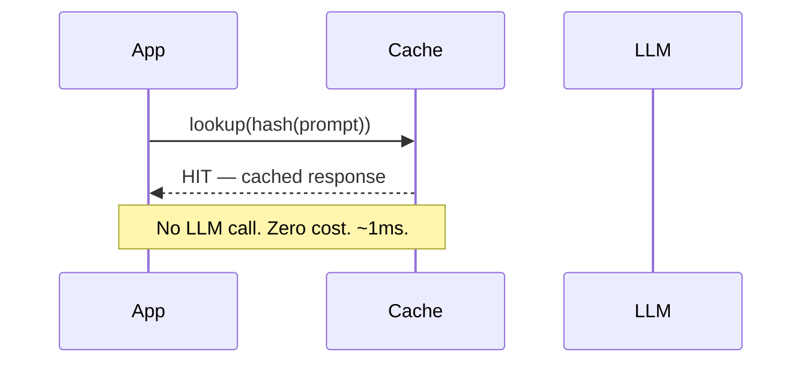
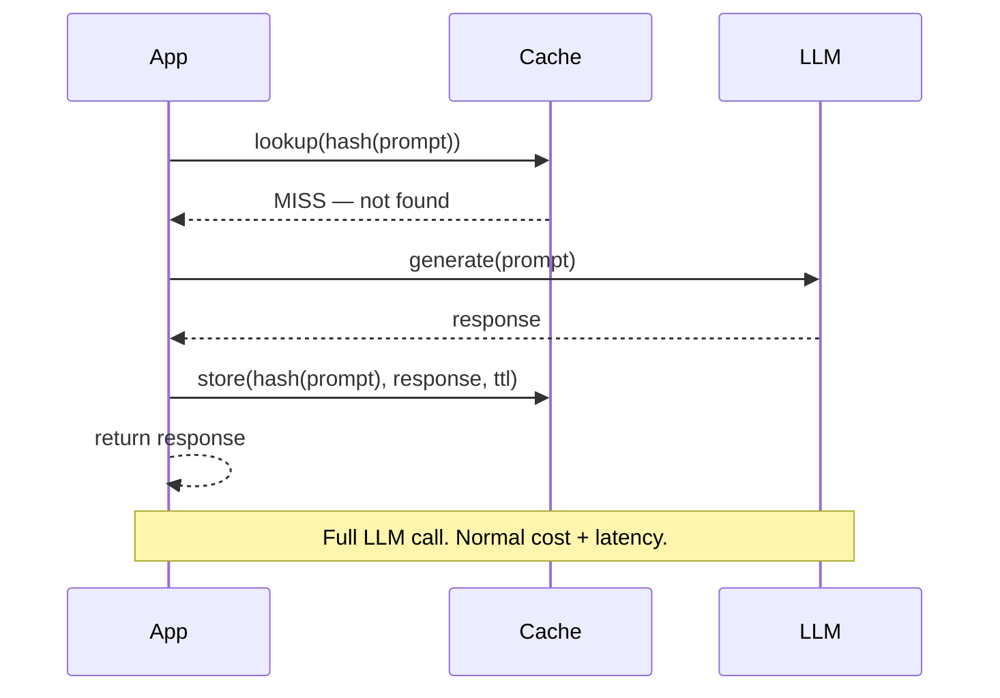
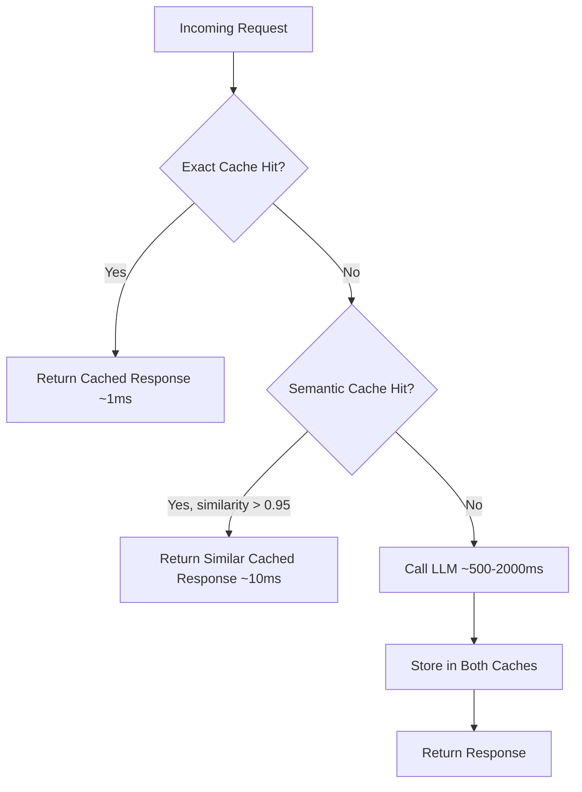

# Caching Strategies for LLMs

## The Problem

A production RAG pipeline serving 10,000 users per day might call an LLM 100,000 times. Many of those calls are identical or near-identical:

- Same FAQ question rephrased slightly
- Same system prompt sent with every request
- Same retrieval context for a popular document

Without caching, every one of these pays full token cost and full latency. With a well-designed cache, 60–80% of calls can be served from cache — at near-zero cost and near-zero latency.

## Layer 1: Exact Cache

**How it works**: Hash the (model, prompt, params) tuple → use the hash as a cache key → store the response. On a subsequent identical request, return the stored response without calling the LLM.

**Implementation**: SHA256 of the JSON-serialized request. Any dict, Redis, or in-memory store works.

**Characteristics**:
- 100% accuracy — only serves a cached response for byte-identical inputs
- Very fast — O(1) key lookup
- Only helps when prompts are truly identical (same user asking the same question twice, batch jobs with repeated queries)

## Cache Hit Flow vs Cache Miss Flow





## Layer 2: Semantic Cache

**How it works**: Embed the incoming prompt → compare against a vector store of cached prompts using cosine similarity → if similarity > threshold (e.g. 0.95), return the cached response for the most similar prior prompt.

**Why it helps**: "What is the capital of France?" and "Tell me the capital city of France" have ~0.97 cosine similarity. Exact cache misses both as different strings. Semantic cache catches both with one stored entry.

**Threshold tuning**:

| Threshold | Behaviour |
|-----------|-----------|
| 0.99 | Very conservative — near-exact matches only |
| 0.95 | Balanced — catches rephrasing, same intent |
| 0.90 | Aggressive — risks returning wrong cached answer |

**Trade-offs**:
- Requires an embedding model call for every miss (small overhead)
- Approximate — there's a risk of returning a slightly wrong answer for borderline similarity
- Stale risk — cached responses may no longer be accurate if knowledge changes

## Layer 3: Anthropic Prompt Caching

Anthropic supports server-side caching of prompt prefixes. When you mark a portion of your prompt with `cache_control: {"type": "ephemeral"}`, Anthropic caches the KV representation of those tokens on their servers for up to 5 minutes (ephemeral) or 1 hour (extended).

**Cost impact**:
- Cache write: 1.25× normal input token price (one-time cost)
- Cache read: 0.10× normal input token price (10% of full cost)
- Net effect: if a 10,000-token system prompt is cached and read 20 times, you save ~87% on those prefix tokens

**Typical use case**: Long system prompts, large retrieval contexts, tool definitions sent with every request.

```python
import anthropic

client = anthropic.Anthropic()

response = client.messages.create(
    model="claude-3-5-sonnet-20241022",
    max_tokens=1024,
    system=[
        {
            "type": "text",
            "text": "You are an expert assistant. " + LARGE_KNOWLEDGE_BASE,
            "cache_control": {"type": "ephemeral"},  # Cache this prefix
        }
    ],
    messages=[{"role": "user", "content": user_question}],
)

# Check cache usage
print(response.usage.cache_read_input_tokens)   # tokens served from cache
print(response.usage.cache_creation_input_tokens)  # tokens written to cache
```

## Cache Invalidation Strategies

| Strategy | How | When to Use |
|----------|-----|-------------|
| **TTL-based** | Expire after N seconds | Most cases — prevents stale data accumulation |
| **Version-based** | Include model version in cache key | When model upgrades change responses |
| **Manual purge** | Delete cache entries on source update | When underlying data changes (e.g., knowledge base updated) |
| **Capacity eviction** | LRU/LFU eviction when cache is full | Memory-constrained environments |

## Two-Level Cache Architecture



## Interview Angle

**"How would you add caching to a RAG pipeline to reduce costs?"**

A strong answer covers:
1. Use exact cache for repeated identical queries (FAQ bots)
2. Use semantic cache for paraphrased queries with cosine similarity threshold
3. Use Anthropic prompt caching for the system prompt + retrieved context prefix (large token savings)
4. Set TTL based on how frequently the underlying data changes
5. Never cache with temperature > 0 (non-deterministic outputs make caching unsafe)

## Common Mistakes

- **Caching with `temperature > 0`**: Non-deterministic outputs mean the cached response may not be what the user expects on a follow-up call. Always cache with `temperature=0` only.
- **No TTL**: An infinite cache accumulates stale responses forever. Always set a TTL.
- **Over-broad semantic threshold**: A threshold of 0.85 might match "What's the weather?" to a cached response about climate change. Start at 0.95 and tune down carefully.
- **Caching PII**: Never cache prompts or responses containing personal data unless your cache store is encrypted and access-controlled.
- **No cache eviction**: A cache that grows without bound will eventually exhaust memory. Use LRU eviction or a max-size policy.

➡️ Next: [Patterns — Caching in Code](./patterns.mdx)
