# Reducing LLM Latency

## The Problem

Users abandon pages that take more than 3 seconds to respond. LLMs frequently take 5–30 seconds for a full response. The gap between user expectation and LLM reality is one of the biggest UX challenges in AI product development.

Closing that gap requires understanding *where* the time goes — because the fix for "slow first token" is completely different from the fix for "slow full response".

## Anatomy of LLM Latency

Every LLM request has three time components:

```
Total Latency = Network Round Trip + Prefill Time (TTFT) + Generation Time
```



```mermaid
gantt
    title LLM Request Waterfall
    dateFormat  X
    axisFormat  %Lms

    section Network
    DNS + TCP + TLS     :0, 150
    section Prefill
    Prompt processing (TTFT) :150, 400
    section Generation
    Token 1             :400, 450
    Token 2             :450, 500
    Token 3–N           :500, 2000
    section Network
    Response transfer   :2000, 2100
```

### Network Round Trip
- DNS lookup, TCP handshake, TLS negotiation
- Typically 50–200ms for cloud APIs
- Fixed overhead — not reducible without geographic proximity

### TTFT: Time to First Token

**What it is**: The time from sending your request until the *first token* of the response arrives.

**What drives it**:
- **Prefill**: processing your input prompt through the transformer. O(n²) in prompt length.
- Longer prompts → slower TTFT
- KV cache (on the server) can speed up repeated prefixes

**How to reduce TTFT**:
- Shorter prompts (remove unnecessary context)
- Anthropic prompt caching (cached prefix = free prefill)
- Use a model closer to your users geographically
- Speculative decoding (for local models)

### Generation Time (Time-to-Last-Token)

**What drives it**:
- Tokens per second — determined by model size and hardware
- Output length — more tokens = more time
- Sequential: each token depends on the previous one

**How to reduce generation time**:
- Use a smaller model (8B vs 70B = ~8× faster)
- Use quantization (4-bit vs 16-bit = ~2× faster)
- Use faster hardware (A100 vs consumer GPU)
- Reduce max output tokens where appropriate

## Perceived Latency vs Actual Latency

This is the most important insight in LLM UX:

| Scenario | Actual Latency | User Experience |
|----------|----------------|-----------------|
| Full response in 2s (no streaming) | 2s | "Feels slow — 2s blank screen" |
| First token in 0.3s, full in 10s (streaming) | 10s | "Feels fast — content appearing immediately" |

**Streaming reduces perceived latency dramatically.** Show the first token as fast as possible. Users read at ~200–300 WPM — they cannot keep up with a fast LLM anyway, so partial display is fine.

## Latency Optimization Techniques

| Technique | Reduces | Trade-off |
|-----------|---------|-----------|
| **Streaming** | Perceived latency | More complex client implementation |
| **Smaller model** | Generation time | Lower quality ceiling |
| **Caching** | All latency (cache hits = ~1ms) | Stale responses, complexity |
| **Parallel tool calls** | Multi-step pipeline time | More complex orchestration |
| **Speculative decoding** | Generation time | Requires a small draft model |
| **Prompt shortening** | TTFT | Risk of losing important context |
| **Geographic proximity** | Network RTT | Infrastructure cost |

## Speculative Decoding

A clever technique for local inference (llama.cpp, vLLM):

1. A small fast **draft model** (e.g., 1B) generates K candidate tokens speculatively
2. The large **target model** (e.g., 70B) verifies all K tokens in a single forward pass (parallelizable)
3. All tokens that match the target model's distribution are accepted; divergence is corrected
4. Net effect: 2–3× speedup with no quality loss

This works because the draft model is correct ~60–80% of the time on common text, and verification is much cheaper than generation.

## Profiling: Measure Before You Optimize

**You cannot optimize what you don't measure.** Profile before assuming where the bottleneck is.

```python
import time

start = time.perf_counter()
# ... send request ...
ttft = first_token_time - start   # when first token arrives
total = end_time - start          # when response is complete
```

**Use percentiles, not averages**. p95 latency tells you what 95% of users experience. Average latency can look good while p95 is terrible.

| Metric | Meaning |
|--------|---------|
| p50 (median) | Typical user experience |
| p95 | What "unlucky" users experience |
| p99 | Worst-case SLA boundary |

**Common bottlenecks by symptom**:

| Symptom | Likely Bottleneck | Fix |
|---------|------------------|-----|
| High TTFT, fast generation | Long prompt (prefill) | Shorten prompt, use prompt caching |
| Fast TTFT, slow total | Long output, slow model | Smaller model, limit max tokens |
| High p99, normal p50 | Rate limits / cold start | Connection pooling, warming |
| All latency high | Network or model too large | CDN, local model, quantization |

## Interview Angle

**"How would you optimize a slow AI chatbot?"**

Structure your answer:
1. **Measure first** — profile TTFT, generation time, p50/p95. Don't assume.
2. **Stream immediately** — this is the highest-impact UX fix with the least engineering cost.
3. **Cache aggressively** — exact cache for repeated queries, semantic cache for similar ones.
4. **Identify bottleneck** — is it TTFT (long prompt)? generation (large model)? network (far servers)?
5. **Right-size the model** — use the smallest model that meets quality requirements.
6. **Parallelize** — if multiple tool calls are independent, run them concurrently.

## Common Mistakes

- **Optimizing TTFT when generation is the bottleneck**: Cutting your 100-token prompt in half saves 50ms of prefill on a 5s total latency. That's 1%. Profile first.
- **Not streaming**: A 5s response with streaming feels acceptable. A 5s blank screen feels broken.
- **Sequential tool calls**: If a pipeline calls three APIs sequentially (300ms each), parallelizing cuts 900ms to 300ms — no model change needed.
- **Measuring average instead of p95**: An average of 1s with a p99 of 30s means 1% of users have a terrible experience.

➡️ Next: [Patterns — Latency Optimization in Code](./patterns.mdx)
