# Reducing LLM Latency

## The Problem

Users abandon pages that take more than 3 seconds to respond. LLMs frequently take 5–30 seconds for a full response. The gap between user expectation and LLM reality is one of the biggest UX challenges in AI product development.

Closing that gap requires understanding *where* the time goes — because the fix for "slow first token" is completely different from the fix for "slow full response".

## Anatomy of LLM Latency

Every LLM request has three time components:

```
Total Latency = Network Round Trip + Prefill Time (TTFT) + Generation Time
```



```mermaid
gantt
    title LLM Request Waterfall
    dateFormat  X
    axisFormat  %Lms

    section Network
    DNS + TCP + TLS     :0, 150
    section Prefill
    Prompt processing (TTFT) :150, 400
    section Generation
    Token 1             :400, 450
    Token 2             :450, 500
    Token 3–N           :500, 2000
    section Network
    Response transfer   :2000, 2100
```

### Network Round Trip
- DNS lookup, TCP handshake, TLS negotiation
- Typically 50–200ms for cloud APIs
- Fixed overhead — not reducible without geographic proximity

### TTFT: Time to First Token

**What it is**: The time from sending your request until the *first token* of the response arrives.

**What drives it**:
- **Prefill**: processing your input prompt through the transformer. O(n²) in prompt length.
- Longer prompts → slower TTFT
- KV cache (on the server) can speed up repeated prefixes

**How to reduce TTFT**:
- Shorter prompts (remove unnecessary context)
- Anthropic prompt caching (cached prefix = free prefill)
- Use a model closer to your users geographically
- Speculative decoding (for local models)

### Generation Time (Time-to-Last-Token)

**What drives it**:
- Tokens per second — determined by model size and hardware
- Output length — more tokens = more time
- Sequential: each token depends on the previous one

**How to reduce generation time**:
- Use a smaller model (8B vs 70B = ~8× faster)
- Use quantization (4-bit vs 16-bit = ~2× faster)
- Use faster hardware (A100 vs consumer GPU)
- Reduce max output tokens where appropriate

---

## Where Latency Comes From — A Breakdown

A concrete breakdown of a typical LLM API request and what you can actually do about each component:

| Component | Typical Time | Optimization Lever |
|-----------|-------------|-------------------|
| Network round trip (client → API) | 50–200ms | Use nearest region or edge deployment |
| Time to first token (TTFT) | 300–800ms | Smaller model, prompt caching, shorter prompt |
| Token generation (per token) | 20–50ms per token | Smaller model, streaming so user sees tokens as they arrive |
| Post-processing (parsing, formatting) | 10–50ms | Run async, cache parsed results |
| **Total (100-token response, no cache)** | **~2,500–5,000ms** | All of the above combined |

**Reading the table:**
- A 500-token response at 30ms/token adds **15 seconds** of generation time alone.
- Streaming does not reduce total time — it reduces *perceived* time because the user reads the first tokens while generation continues.
- Prompt caching (Anthropic, OpenAI) can eliminate TTFT entirely for repeated system prompts, dropping 300–800ms from every call that reuses a cached prefix.
- Post-processing is often overlooked: parsing a large JSON response, running regex validation, or calling a second model to reformat output all add latency. Move this work off the critical path.

---

## Perceived Latency vs Actual Latency

This is the most important insight in LLM UX:

| Scenario | Actual Latency | User Experience |
|----------|----------------|-----------------|
| Full response in 2s (no streaming) | 2s | "Feels slow — 2s blank screen" |
| First token in 0.3s, full in 10s (streaming) | 10s | "Feels fast — content appearing immediately" |

**Streaming reduces perceived latency dramatically.** Show the first token as fast as possible. Users read at ~200–300 WPM — they cannot keep up with a fast LLM anyway, so partial display is fine.

---

## Measuring Latency — The Right Metrics

### p50, p95, p99 — Why averages lie

Averages hide the tail. If your p50 latency is 800ms but your p99 is 12,000ms, that means 1 in 100 users waits 12 seconds. SLAs are defined on percentiles, not averages.

| Metric | Meaning | When to use |
|--------|---------|-------------|
| **p50 (median)** | Typical user experience — half of requests are faster, half are slower | Day-to-day performance monitoring |
| **p95** | What "unlucky" users experience — 95% of requests are faster than this | User-facing SLA targets |
| **p99** | Worst-case boundary — 99% of requests complete within this time | SLA contracts, alerting thresholds |
| **p99.9** | One-in-a-thousand worst case | High-volume, latency-sensitive applications |

### Measuring TTFT vs total time in Python

```python
import time
import anthropic

client = anthropic.Anthropic()

def measure_latency(prompt: str, model: str = "claude-haiku-4-5") -> dict:
    """
    Measure TTFT and total latency separately using streaming.
    Returns a dict with ttft_ms, total_ms, tokens_generated, ms_per_token.
    """
    start = time.perf_counter()
    ttft: float | None = None
    token_count = 0

    with client.messages.stream(
        model=model,
        max_tokens=256,
        messages=[{"role": "user", "content": prompt}],
    ) as stream:
        for text in stream.text_stream:
            if ttft is None:
                # First token received
                ttft = (time.perf_counter() - start) * 1000
            token_count += 1   # approximate: 1 chunk ≈ 1 token

    total_ms = (time.perf_counter() - start) * 1000

    return {
        "ttft_ms":        round(ttft or 0, 1),
        "total_ms":       round(total_ms, 1),
        "generation_ms":  round(total_ms - (ttft or 0), 1),
        "tokens_approx":  token_count,
        "ms_per_token":   round((total_ms - (ttft or 0)) / max(token_count, 1), 1),
    }

result = measure_latency("Explain quantum entanglement in two sentences.")
print(result)
# {'ttft_ms': 312.4, 'total_ms': 1843.7, 'generation_ms': 1531.3, 'tokens_approx': 52, 'ms_per_token': 29.4}
```

### Computing percentiles from a batch of measurements

```python
import statistics
from typing import List

def latency_report(measurements_ms: List[float]) -> dict:
    """
    Given a list of latency measurements in milliseconds,
    compute the standard percentile report.
    """
    sorted_ms = sorted(measurements_ms)
    n = len(sorted_ms)

    def percentile(p: float) -> float:
        # nearest-rank method
        idx = max(0, int(p / 100 * n) - 1)
        return round(sorted_ms[idx], 1)

    return {
        "count":   n,
        "mean_ms": round(statistics.mean(sorted_ms), 1),
        "p50_ms":  percentile(50),
        "p75_ms":  percentile(75),
        "p95_ms":  percentile(95),
        "p99_ms":  percentile(99),
        "max_ms":  round(sorted_ms[-1], 1),
    }

# Example: simulate 200 requests and report
import random
samples = [random.gauss(900, 200) for _ in range(200)]   # mean ~900ms, stddev 200ms
samples += [random.gauss(8000, 500) for _ in range(4)]   # 4 slow outliers (cold starts)
print(latency_report(samples))
# {'count': 204, 'mean_ms': 1046.3, 'p50_ms': 902.1, 'p75_ms': 1041.5, 'p95_ms': 1287.4, 'p99_ms': 7944.8, 'max_ms': 8712.3}
# Note: p99 is 8x higher than p50 — averages would have hidden this completely
```

**Key insight from the example above:** mean of ~1,046ms looks reasonable. But p99 is ~7,945ms — those are the users who churn. Always profile with percentiles.

---

## Latency Optimization Techniques

| Technique | Reduces | Trade-off |
|-----------|---------|-----------|
| **Streaming** | Perceived latency | More complex client implementation |
| **Smaller model** | Generation time | Lower quality ceiling |
| **Caching** | All latency (cache hits = ~1ms) | Stale responses, complexity |
| **Parallel tool calls** | Multi-step pipeline time | More complex orchestration |
| **Speculative decoding** | Generation time | Requires a small draft model |
| **Prompt shortening** | TTFT | Risk of losing important context |
| **Geographic proximity** | Network RTT | Infrastructure cost |

---

## Optimization Techniques — Prioritized

Work through this list from top to bottom. The highest ROI items come first and require the least implementation effort.

### 1. Use Streaming (Perceived latency drops ~80%, near-zero implementation cost)

The single highest-impact change you can make. Users see tokens arriving immediately; the blank-screen wait disappears.

```python
# Before: blocking call — user waits N seconds before seeing anything
response = client.messages.create(model="claude-opus-4-5", max_tokens=1024, messages=[...])
print(response.content[0].text)   # nothing visible until this line

# After: streaming — user sees output within ~300ms
with client.messages.stream(model="claude-opus-4-5", max_tokens=1024, messages=[...]) as stream:
    for text in stream.text_stream:
        print(text, end="", flush=True)   # renders progressively
```

Cost: one extra line of code. Impact: transforms a 10s blank wait into a 0.3s-to-first-character experience.

### 2. Prompt Caching (Reduces TTFT by 50–80% on repeated system prompt prefixes)

Anthropic's prompt caching lets you mark a prefix (system prompt, reference documents) as cacheable. Subsequent requests that share the same prefix skip prefill for the cached portion entirely.

```python
# Cache a long system prompt that is reused across all requests
response = client.messages.create(
    model="claude-opus-4-5",
    max_tokens=1024,
    system=[
        {
            "type": "text",
            "text": "You are a helpful assistant. [... 2000 tokens of context ...]",
            "cache_control": {"type": "ephemeral"},   # mark for caching
        }
    ],
    messages=[{"role": "user", "content": user_message}],
)
# First call: pays full prefill cost (~600ms)
# Subsequent calls with same prefix: ~80ms TTFT (cache hit)
```

Rule of thumb: any system prompt over ~200 tokens that is reused across requests is a caching candidate.

### 3. Smaller Model for Non-Critical Steps (Haiku is ~10x faster than Opus)

Not every step in your pipeline needs the most capable model. Classification, routing, summarisation, and extraction can often use a smaller, faster model.

| Task | Use This Model |
|------|---------------|
| Intent classification | claude-haiku-4-5 |
| Simple data extraction | claude-haiku-4-5 |
| Summarisation (&lt;500 words) | claude-haiku-4-5 |
| Complex reasoning, synthesis | claude-sonnet-4-5 or claude-opus-4-5 |
| Code generation | claude-sonnet-4-5 |

```python
# Routing example: use Haiku to classify, then route to appropriate model
def route_and_respond(user_message: str) -> str:
    # Step 1: cheap classification with Haiku (~200ms)
    classification = client.messages.create(
        model="claude-haiku-4-5",
        max_tokens=10,
        messages=[{
            "role": "user",
            "content": f"Classify as 'simple' or 'complex': {user_message}\nAnswer with one word."
        }]
    ).content[0].text.strip().lower()

    # Step 2: route to appropriate model
    model = "claude-haiku-4-5" if classification == "simple" else "claude-opus-4-5"
    return client.messages.create(
        model=model,
        max_tokens=1024,
        messages=[{"role": "user", "content": user_message}]
    ).content[0].text
```

### 4. Async/Parallel Tool Calls (Run independent tools concurrently)

Sequential tool calls are the most common avoidable latency in agentic pipelines. See the dedicated section below.

### 5. Response Caching (0ms for cache hits)

Cache complete responses for semantically identical or near-identical prompts. Two levels:

- **Exact cache**: hash the full prompt; if seen before, return stored response immediately.
- **Semantic cache**: embed the prompt; if cosine similarity to a cached prompt exceeds a threshold (~0.95), return cached response.

```python
import hashlib
import json
from functools import lru_cache

# Simple in-process exact cache (use Redis for production)
_cache: dict = {}

def cached_completion(prompt: str, model: str = "claude-haiku-4-5") -> str:
    cache_key = hashlib.sha256(f"{model}:{prompt}".encode()).hexdigest()
    if cache_key in _cache:
        return _cache[cache_key]   # 0ms

    response = client.messages.create(
        model=model,
        max_tokens=1024,
        messages=[{"role": "user", "content": prompt}]
    ).content[0].text

    _cache[cache_key] = response
    return response
```

### 6. Speculative Decoding (Advanced, model-level optimization)

A technique for local inference (llama.cpp, vLLM):

1. A small fast **draft model** (e.g., 1B) generates K candidate tokens speculatively
2. The large **target model** (e.g., 70B) verifies all K tokens in a single forward pass (parallelizable)
3. All tokens that match the target model's distribution are accepted; divergence is corrected
4. Net effect: 2–3× speedup with no quality loss

This works because the draft model is correct ~60–80% of the time on common text, and verification is much cheaper than generation.

---

## Async Parallel Tool Calls — Code

The most common avoidable latency pattern: calling tools sequentially when they are independent.

```
Sequential:  [tool_A: 300ms] → [tool_B: 400ms] → [tool_C: 250ms] = 950ms total
Parallel:    [tool_A, tool_B, tool_C running concurrently]          = 400ms total
```

### Example: sequential vs parallel

```python
import asyncio
import time
import httpx

# --- Simulated tool functions (async) ---

async def get_user_profile(user_id: str) -> dict:
    """Fetch user profile from CRM."""
    await asyncio.sleep(0.3)   # simulate 300ms network call
    return {"user_id": user_id, "name": "Jane Smith", "tier": "premium"}

async def get_order_history(user_id: str) -> list:
    """Fetch last 5 orders from order service."""
    await asyncio.sleep(0.4)   # simulate 400ms database query
    return [{"order_id": "ORD-001", "total": 49.99}]

async def get_support_tickets(user_id: str) -> list:
    """Fetch open support tickets."""
    await asyncio.sleep(0.25)   # simulate 250ms
    return [{"ticket_id": "TKT-123", "status": "open"}]


# --- Sequential (slow) ---

async def gather_context_sequential(user_id: str) -> dict:
    start = time.perf_counter()

    profile  = await get_user_profile(user_id)
    orders   = await get_order_history(user_id)
    tickets  = await get_support_tickets(user_id)

    elapsed = (time.perf_counter() - start) * 1000
    print(f"Sequential: {elapsed:.0f}ms")   # ~950ms
    return {"profile": profile, "orders": orders, "tickets": tickets}


# --- Parallel (fast) ---

async def gather_context_parallel(user_id: str) -> dict:
    start = time.perf_counter()

    profile, orders, tickets = await asyncio.gather(
        get_user_profile(user_id),
        get_order_history(user_id),
        get_support_tickets(user_id),
    )

    elapsed = (time.perf_counter() - start) * 1000
    print(f"Parallel:   {elapsed:.0f}ms")   # ~400ms (bounded by slowest call)
    return {"profile": profile, "orders": orders, "tickets": tickets}


# Run both for comparison
async def main():
    await gather_context_sequential("user_42")
    await gather_context_parallel("user_42")

asyncio.run(main())
# Sequential: 951ms
# Parallel:   401ms
```

### Parallel tool calls with error handling

Real pipelines need independent failure handling so one slow or failing tool does not block others.

```python
async def gather_context_safe(user_id: str) -> dict:
    """
    Run all tools in parallel. If one fails, return a fallback value
    instead of raising and losing all results.
    """
    results = await asyncio.gather(
        get_user_profile(user_id),
        get_order_history(user_id),
        get_support_tickets(user_id),
        return_exceptions=True,   # don't raise; return Exception objects
    )

    profile, orders, tickets = results

    return {
        "profile":  profile  if not isinstance(profile,  Exception) else {},
        "orders":   orders   if not isinstance(orders,   Exception) else [],
        "tickets":  tickets  if not isinstance(tickets,  Exception) else [],
    }
```

### When to parallelize vs when not to

| Situation | Strategy |
|-----------|----------|
| Tools are fully independent | `asyncio.gather()` — always parallelize |
| Tool B needs output from Tool A | Sequential — must wait for A |
| Tools share a rate-limited API | Semaphore + `asyncio.gather()` to cap concurrency |
| One tool is much slower than others | Parallel — slowest sets the ceiling; don't let it block the fast ones |

```python
# Rate-limited parallel calls: at most 3 concurrent requests
async def fetch_all_with_limit(items: list, limit: int = 3):
    sem = asyncio.Semaphore(limit)

    async def fetch_one(item):
        async with sem:
            return await get_user_profile(item)

    return await asyncio.gather(*[fetch_one(item) for item in items])
```

---

## Speculative Decoding

A clever technique for local inference (llama.cpp, vLLM):

1. A small fast **draft model** (e.g., 1B) generates K candidate tokens speculatively
2. The large **target model** (e.g., 70B) verifies all K tokens in a single forward pass (parallelizable)
3. All tokens that match the target model's distribution are accepted; divergence is corrected
4. Net effect: 2–3× speedup with no quality loss

This works because the draft model is correct ~60–80% of the time on common text, and verification is much cheaper than generation.

---

## Profiling: Measure Before You Optimize

**You cannot optimize what you don't measure.** Profile before assuming where the bottleneck is.

```python
import time

start = time.perf_counter()
# ... send request ...
ttft = first_token_time - start   # when first token arrives
total = end_time - start          # when response is complete
```

**Use percentiles, not averages**. p95 latency tells you what 95% of users experience. Average latency can look good while p95 is terrible.

| Metric | Meaning |
|--------|---------|
| p50 (median) | Typical user experience |
| p95 | What "unlucky" users experience |
| p99 | Worst-case SLA boundary |

**Common bottlenecks by symptom**:

| Symptom | Likely Bottleneck | Fix |
|---------|------------------|-----|
| High TTFT, fast generation | Long prompt (prefill) | Shorten prompt, use prompt caching |
| Fast TTFT, slow total | Long output, slow model | Smaller model, limit max tokens |
| High p99, normal p50 | Rate limits / cold start | Connection pooling, warming |
| All latency high | Network or model too large | CDN, local model, quantization |

---

## Interview Angle

**"How would you optimize a slow AI chatbot?"**

Structure your answer:
1. **Measure first** — profile TTFT, generation time, p50/p95. Don't assume.
2. **Stream immediately** — this is the highest-impact UX fix with the least engineering cost.
3. **Cache aggressively** — exact cache for repeated queries, semantic cache for similar ones.
4. **Identify bottleneck** — is it TTFT (long prompt)? generation (large model)? network (far servers)?
5. **Right-size the model** — use the smallest model that meets quality requirements.
6. **Parallelize** — if multiple tool calls are independent, run them concurrently.

## Common Mistakes

- **Optimizing TTFT when generation is the bottleneck**: Cutting your 100-token prompt in half saves 50ms of prefill on a 5s total latency. That's 1%. Profile first.
- **Not streaming**: A 5s response with streaming feels acceptable. A 5s blank screen feels broken.
- **Sequential tool calls**: If a pipeline calls three APIs sequentially (300ms each), parallelizing cuts 900ms to 300ms — no model change needed.
- **Measuring average instead of p95**: An average of 1s with a p99 of 30s means 1% of users have a terrible experience.

➡️ Next: [Patterns — Latency Optimization in Code](./patterns.mdx)
