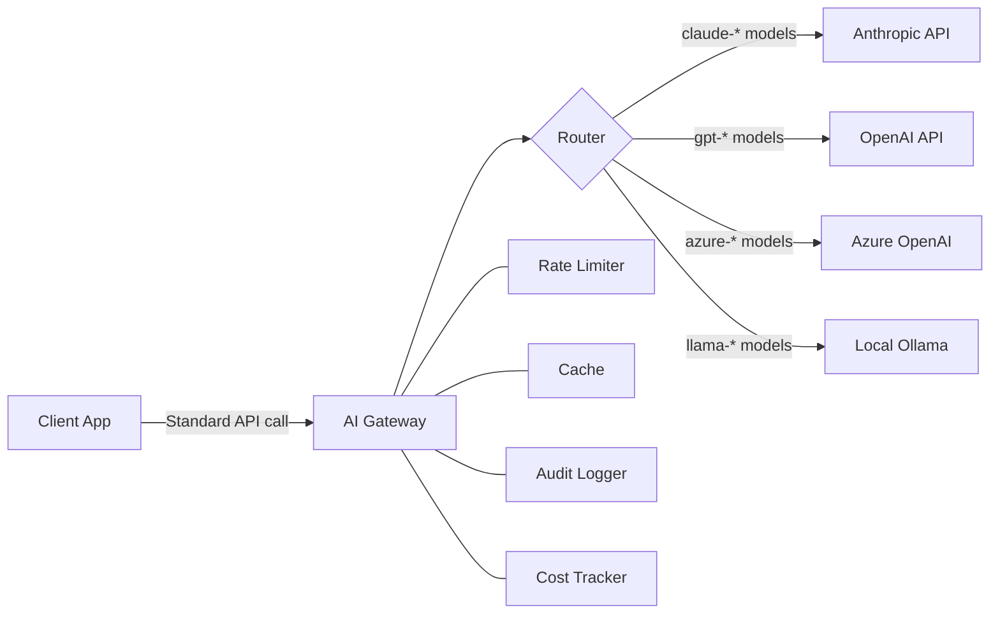
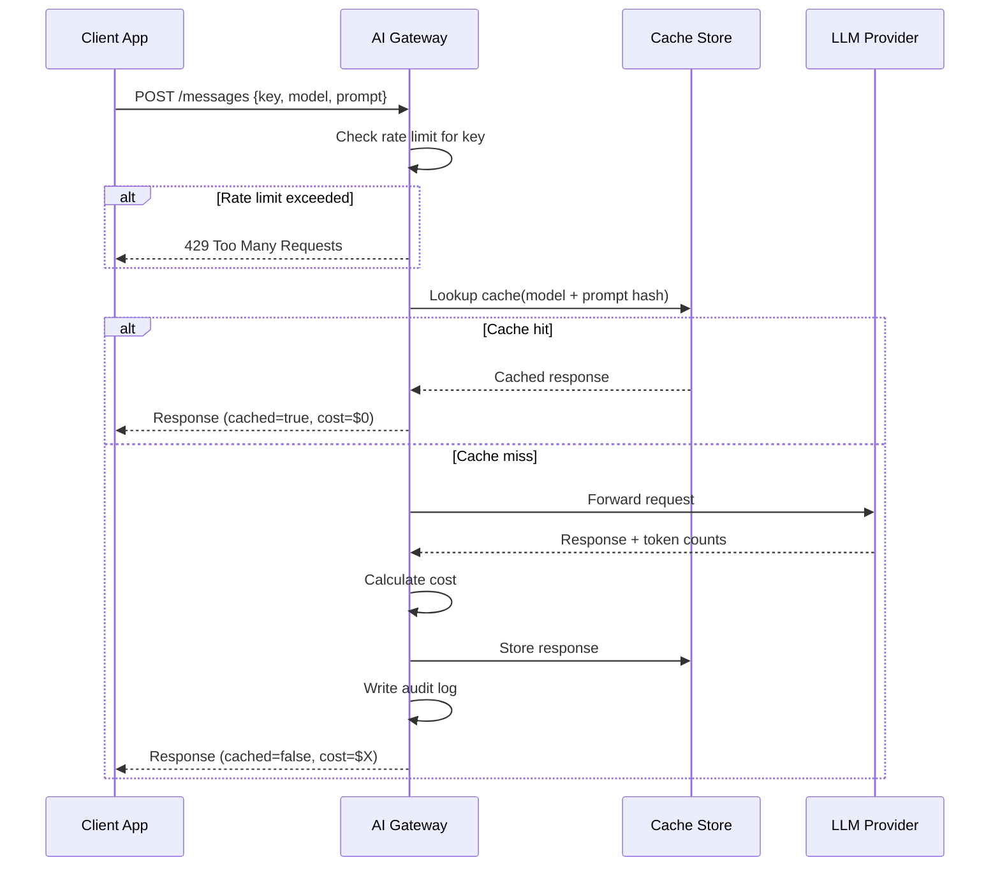

# Building an AI Gateway

## The Problem

In the early days of an LLM project, you call one API. As the project grows:

- **Multiple providers**: One team uses Claude for reasoning, another uses GPT-4o for structured output, a third uses a local Llama model for sensitive data.
- **No cost visibility**: Finance asks "how much did the recommendation feature cost last month?" Nobody knows.
- **No rate limiting**: A misconfigured script hammers the API at 3 AM, burns the monthly budget, and trips the global rate limit for all teams.
- **No audit trail**: A security incident happens and you have no log of what prompts were sent.
- **No fallback**: Anthropic returns 529 errors during an outage and your entire product goes down even though OpenAI is up.

An AI gateway solves all of these with a single layer of indirection.

---

## What an AI Gateway Does

An AI gateway is an HTTP proxy that sits between your application and LLM providers. Your application calls the gateway using a standardized API (usually OpenAI-compatible), and the gateway handles everything else.

| Responsibility | Without Gateway | With Gateway |
|---|---|---|
| Routing | Hard-coded in each service | Centralized routing table |
| Cost tracking | None or manual | Per-key attribution in logs |
| Rate limiting | None (or per-service) | Enforced globally per key/team |
| Caching | Each service rolls its own | Shared semantic cache |
| Fallback | Manual retry code everywhere | Automatic provider fallback |
| Audit log | None | Every request/response logged |

---

## Gateway Architecture



Every request passes through the gateway components in order:

1. **Rate Limiter** — check if the API key is within its quota
2. **Cache** — return cached response if available
3. **Router** — select the appropriate backend provider
4. **Provider Call** — forward the request
5. **Cost Tracker** — calculate and record token costs
6. **Audit Logger** — write the request + response to the log

---

## Request Flow



---

## Real Examples

| Tool | Type | Notes |
|------|------|-------|
| **LiteLLM** | Open-source proxy | OpenAI-compatible API for 100+ providers |
| **Portkey** | SaaS + self-hosted | Observability, guardrails, routing |
| **Kong AI Gateway** | Enterprise proxy | Built on Kong, multi-protocol |
| **AWS Bedrock** | Managed | AWS-native gateway for multiple foundation models |
| **Custom proxy** | DIY | FastAPI/Express wrapper with your own logic |

Most companies start with LiteLLM for its easy setup and OpenAI-compatible API, then migrate to a custom gateway when they need deeper integration with internal systems.

---

## Key Capabilities

### Provider Routing

The gateway maps model name prefixes (or explicit model IDs) to provider backends:

```python
MODEL_PROVIDER_MAP = {
    "claude":  "anthropic",
    "gpt":     "openai",
    "llama":   "local",
    "azure":   "azure",
}
```

This means your application code never hard-codes a provider URL. When you want to switch from GPT-4o to Claude Sonnet, you change the gateway config, not the application.

### Model Fallback

If the primary provider fails (429, 500, 529), the gateway automatically retries on an alternative provider:

```
Request for "gpt-4o"
  → Try OpenAI → 529 Server Error
  → Try Azure OpenAI → Success
```

This is transparent to the calling application.

### Cost Attribution

Every request is tagged with an API key (representing a team, project, or user). The gateway computes and logs the token cost for each request, enabling reports like:

```
Team        | Model         | Requests | Total Cost
------------|---------------|----------|------------
search-team | claude-sonnet | 12,400   | $87.20
rec-engine  | gpt-4o        | 3,100    | $62.00
qa-bot      | llama-3       | 45,000   | $0.00
```

### Request/Response Audit Log

Every prompt sent through the gateway is stored with metadata:

```json
{
  "timestamp": 1710000000.123,
  "key": "team-search",
  "model": "claude-sonnet-4-5",
  "provider": "anthropic",
  "input_tokens": 842,
  "output_tokens": 156,
  "cost_usd": 0.00486,
  "cached": false
}
```

Note: Full prompt text is often stored separately (or not at all) for PII reasons. See the Common Mistakes section.

---

## Key Terms

| Term | Definition |
|------|-----------|
| **AI Gateway** | HTTP proxy between applications and LLM providers providing routing, rate limiting, logging, and cost tracking |
| **Provider routing** | Mapping model names to the correct backend API endpoint |
| **Cost attribution** | Tagging each API call with the team/project/user responsible for it |
| **Circuit breaker** | Pattern that stops routing to a provider after repeated failures to prevent cascade |
| **Rate limiter** | Component that enforces maximum requests per time window per API key |
| **Audit log** | Immutable record of every request and response for compliance and debugging |
| **LiteLLM** | Popular open-source gateway that exposes an OpenAI-compatible API for 100+ providers |

---

## Interview Angle

**"Why would a company build an internal AI gateway instead of calling APIs directly?"**

Strong answers cover four concerns:

1. **Operational visibility** — Without a gateway, you have no centralized view of cost or usage. With 20 microservices calling LLMs, you can't answer "which team spent $500 last week?"
2. **Policy enforcement** — Rate limits, PII filtering, and prompt guardrails need to be enforced at one layer, not duplicated across services.
3. **Resilience** — Provider outages should not take down your product. A gateway can automatically fall back to a secondary provider in milliseconds.
4. **Developer experience** — Teams use a single internal API (`POST /api/llm/messages`) with an internal key. The gateway handles provider credentials, model routing, and retries.

The follow-up signal: candidates who mention circuit breakers and PII log masking are thinking at production scale.

---

## Common Mistakes

| Mistake | What Goes Wrong | Fix |
|---------|----------------|-----|
| Single gateway instance without HA | Gateway becomes a SPOF — one crash takes down all LLM calls | Deploy multiple instances behind a load balancer |
| Logging full prompt text | PII in prompts ends up in your log store, creating compliance risk | Log metadata only; store prompt text in a separate encrypted store or not at all |
| No circuit breaker | A slow/erroring provider holds connections open, causing latency spikes across your system | Implement circuit breaker with failure threshold + reset timeout |
| Rate limiting only per provider | A runaway script uses up the entire organization's quota | Rate limit per API key AND per provider |
| No fallback model | Single provider outage = full product outage | Configure at least one fallback provider for critical paths |

---

➡️ Next: [Patterns — Gateway Design Patterns](./patterns.mdx)
