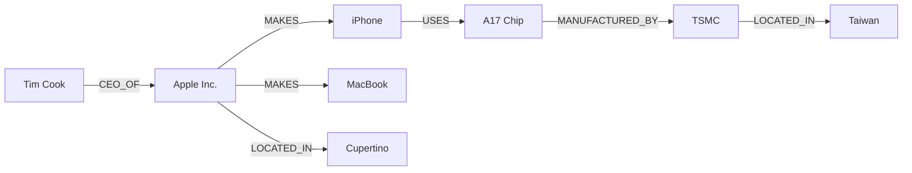
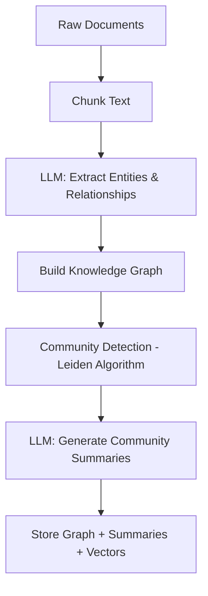
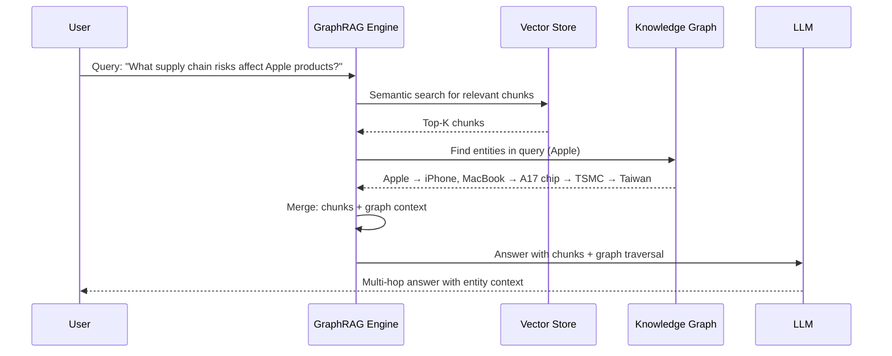

# Beyond Flat RAG: Knowledge Graphs

## The Problem with Flat RAG

Standard vector RAG retrieves the top-K chunks most similar to a query and passes them to the LLM. This works well for:

- "What does the return policy say?"
- "Summarize the key findings of the Q3 report"
- "What is the capital of France?"

But it breaks down for *relational* questions:

- "Which engineers worked on projects that depend on the authentication service?" (multi-hop)
- "Which products does Apple make, and which of those are affected by the supply chain issue?" (graph traversal)
- "What are the main themes across all 500 research papers in this corpus?" (global synthesis)

The problem: a text chunk about a supply chain issue might mention "iPhone" but not "Apple". A chunk about Apple might not mention the supply chain. The relationship exists in the graph of the knowledge base, not in any individual chunk.

---

## What Is a Knowledge Graph?

A knowledge graph is a directed graph where:

- **Nodes** represent entities (people, organizations, products, locations, concepts)
- **Edges** represent typed relationships between entities



This graph captures that Tim Cook is CEO of Apple, which makes iPhone, which uses the A17 chip, which is manufactured by TSMC in Taiwan. No single text chunk would contain all of this — but you can traverse the graph to answer multi-hop questions.

---

## Knowledge Representation: Triples

The fundamental unit in a knowledge graph is a **triple** (also called an RDF triple or SPO triple):

```
(subject, predicate, object)
```

Examples:

| Subject | Predicate | Object |
|---------|-----------|--------|
| Apple Inc. | MAKES | iPhone |
| Tim Cook | CEO_OF | Apple Inc. |
| iPhone | USES | A17 Chip |
| TSMC | MANUFACTURES | A17 Chip |
| TSMC | LOCATED_IN | Taiwan |

Triples are how you represent structured knowledge extracted from unstructured text.

---

## GraphRAG (Microsoft)

Microsoft Research published GraphRAG in 2024. The pipeline has two phases:

### Phase 1: Indexing (Build the Graph)



1. **Chunk** the documents into passages
2. **Extract entities and relationships** from each chunk using an LLM (NER + relation extraction)
3. **Build the knowledge graph** from extracted triples
4. **Run community detection** (Leiden algorithm) to cluster related entities into communities
5. **Generate community summaries** — ask an LLM to write a summary for each cluster of entities

### Phase 2: Query



GraphRAG offers two query modes:
- **Local search**: specific entity-focused questions (use vector + graph traversal)
- **Global search**: broad thematic questions across entire corpus (use community summaries)

---

## Entity Extraction

Before building a graph, you need to extract entities and relationships from text. There are two approaches:

### Rule-Based / NLP (spaCy)

```python
import spacy

nlp = spacy.load("en_core_web_sm")
doc = nlp("Apple CEO Tim Cook announced the iPhone 16 in Cupertino.")

entities = [(ent.text, ent.label_) for ent in doc.ents]
# [("Apple", "ORG"), ("Tim Cook", "PERSON"), ("iPhone 16", "PRODUCT"), ("Cupertino", "GPE")]
```

Fast and deterministic, but limited to recognizing entity types. It does not extract relationships.

### LLM-Based (More Powerful)

```python
prompt = """
Extract all entities and relationships from this text as triples.
Format: (subject, predicate, object)

Text: Apple CEO Tim Cook announced the iPhone 16 in Cupertino.

Triples:
"""
# LLM output:
# (Tim Cook, IS_CEO_OF, Apple)
# (Apple, ANNOUNCED, iPhone 16)
# (Tim Cook, ANNOUNCED_IN, Cupertino)
```

LLM-based extraction captures relationships but is 10-100x slower and more expensive than NLP.

---

## Graph Traversal

Once you have a knowledge graph, you answer relational queries by traversal:

```python
from collections import deque

def bfs(graph, start, max_hops=2):
    visited = {start}
    queue = deque([(start, 0)])
    connected = []

    while queue:
        node, depth = queue.popleft()
        if depth >= max_hops:
            continue
        for predicate, neighbor in graph.adjacency[node]:
            if neighbor not in visited:
                visited.add(neighbor)
                connected.append(neighbor)
                queue.append((neighbor, depth + 1))

    return connected
```

Query: "What is connected to Apple within 2 hops?"

Result: iPhone, MacBook, Tim Cook, A17 Chip, Cupertino (1 hop) → TSMC, Taiwan (2 hops)

---

## When GraphRAG Beats Flat RAG

| Question Type | Flat RAG | GraphRAG |
|---|---|---|
| Factual lookup ("What is X?") | Excellent | Overkill |
| Simple summarization | Excellent | Overkill |
| Multi-hop: "Who works with people at company X?" | Poor | Excellent |
| Relationship: "What depends on service Y?" | Poor | Excellent |
| Global synthesis across 1000+ docs | Impossible | Good (community summaries) |
| Real-time document Q&A | Fast | Too slow to build graph |

**Rule of thumb:** Use GraphRAG when:
- Your questions require following relationships across documents
- You have a large, stable corpus (graph indexing is expensive)
- You need global thematic questions, not just local lookups

---

## Community Detection and the Leiden Algorithm

Microsoft GraphRAG uses the **Leiden algorithm** for community detection. Leiden is a graph clustering algorithm that groups densely connected nodes into communities.

```
Knowledge graph with 10,000 entities →
Leiden clustering →
300 communities →
LLM generates a summary for each community →
Global search uses community summaries to answer broad questions
```

This solves the "no single chunk contains the global picture" problem. Community summaries represent the themes and relationships across entire subgraphs.

---

## Key Terms

| Term | Definition |
|------|-----------|
| **Knowledge graph** | A directed graph where nodes are entities and edges are typed relationships |
| **Triple** | The fundamental unit of knowledge: (subject, predicate, object) |
| **Entity extraction** | Identifying named entities (people, orgs, products) in text |
| **Relation extraction** | Identifying relationships between entities ("works at", "makes", "located in") |
| **NER** | Named Entity Recognition — classifying text spans as entity types |
| **Graph traversal** | Walking the graph from a starting node to find connected entities |
| **Community detection** | Clustering densely connected graph nodes into thematic groups |
| **Leiden algorithm** | Graph clustering algorithm used in Microsoft GraphRAG |
| **Global search** | GraphRAG query mode that uses community summaries for broad thematic questions |
| **Local search** | GraphRAG query mode that uses vector + graph traversal for specific entity questions |

---

## Interview Angle

**"When would you use GraphRAG over standard vector RAG?"**

Strong answers identify three conditions:

1. **Multi-hop reasoning**: the user's questions require traversing relationships across documents, not just finding similar chunks
2. **Relationship queries**: questions about how entities are connected ("which teams work on projects that depend on service X")
3. **Large stable corpora**: you have 1,000+ documents that don't change frequently (graph indexing is expensive — rebuilding it daily for a live document set isn't practical)

The follow-up trap: saying "GraphRAG is always better than flat RAG." It is not. For simple Q&A on a small document set, graph indexing adds overhead without benefit. Match the tool to the question type.

---

## Common Mistakes

| Mistake | What Goes Wrong | Fix |
|---------|----------------|-----|
| Using GraphRAG for simple Q&A | Graph indexing costs 10-50x more than embedding chunks; no improvement in answer quality for simple questions | Use flat RAG for simple factual Q&A |
| Poor entity extraction quality | Graph is full of duplicate/misspelled entities ("Apple Inc.", "Apple", "APPLE"); traversal produces garbage | Normalize entity names; deduplicate before building graph |
| Not validating extracted triples | LLM hallucinated relationships ("Apple OWNS Google") pollute the graph | Spot-check extracted triples; use confidence filtering |
| Building graph for small datasets | Overhead not worth it for &lt;100 documents | Use GraphRAG only for larger, relationship-rich corpora |
| Ignoring reverse edges | Graph traversal only works in one direction | Store both `(A → B)` and `(B → A_REVERSE)` |

---

➡️ Next: [Patterns — GraphRAG Implementation Patterns](./patterns.mdx)
