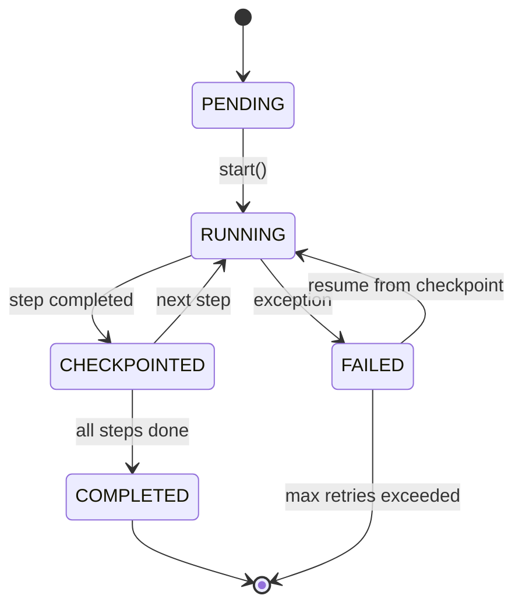
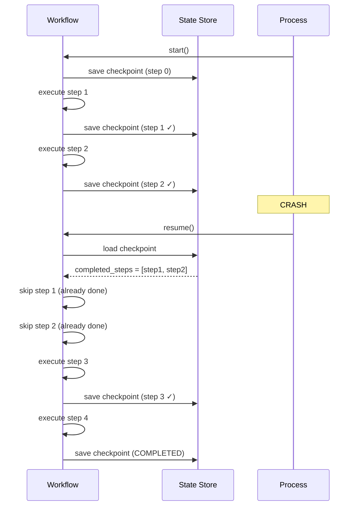

# Concepts: Making Agent Workflows Durable

## The Problem

AI agents that run complex tasks can take a long time — fetching dozens of data sources, calling LLMs multiple times, processing large documents. Consider a research pipeline that:

1. Searches 10 web sources (2 min)
2. Summarises each source with an LLM (3 min)
3. Synthesises a final report (1 min)

If the process crashes at step 3, all 5 minutes of work — and the associated API costs — are gone. The entire workflow starts over.

**The core issue: ephemeral state.** By default, an agent's progress lives only in memory. One crash and it's gone.

---

## What Durable Workflows Provide

| Capability | Description |
|-----------|-------------|
| **Persistent state** | Workflow progress is saved to disk or a database after every step |
| **Automatic resume** | On restart, the workflow loads its last checkpoint and continues from there |
| **Step-level retry** | A failing step is retried without re-running successful earlier steps |
| **Exactly-once semantics** | Each step is executed exactly once, even if the process restarts |
| **Audit trail** | A record of every step, its output, and its completion time |

---

## The State Machine Model

A durable workflow is best modelled as a state machine. Each step transitions the workflow from one state to the next. The state is persisted at every transition.



---

## Crash and Resume Flow



---

## Durability Primitives

### Checkpoint

A checkpoint is a snapshot of the workflow's current state saved to a persistent store (file, database, Redis). At minimum it records:

```python
{
    "workflow_id": "report-2024-01-15",
    "completed_steps": ["fetch_sources", "summarise_sources"],
    "step_outputs": {
        "fetch_sources": [...],
        "summarise_sources": [...]
    },
    "status": "running"
}
```

### Resume

On startup, the workflow loads the checkpoint. Steps already in `completed_steps` are skipped. Execution continues from the first step not yet completed.

### Idempotency Key

An idempotency key is a unique identifier for each (workflow, step) pair. Before executing a step, check whether a result for that key already exists. If it does, return the cached result without re-executing.

```python
key = f"{workflow_id}:{step_name}"
if key in completed:
    return completed[key]  # skip re-execution
```

This prevents double-execution even if the process crashes between "mark as done" and "save checkpoint".

---

## Workflow Engines

| Engine | Strength | Best For |
|--------|----------|---------|
| **Temporal** | Enterprise-grade, durable execution, language-agnostic | Complex, long-running business workflows; teams that need SLAs |
| **Prefect** | Python-native, data pipeline focus, easy local setup | Data engineering, ETL, scheduled AI pipelines |
| **LangGraph** | LLM-first, state graph with built-in persistence | LLM agent workflows with branching and cycles |
| **Celery** | Task queue with retry, mature ecosystem | Async task processing, background jobs, simple retry logic |

**LangGraph** is the most relevant for AI-native development. It models workflows as a graph where nodes are LLM calls or tool executions and edges are transitions between them. State is automatically persisted via a configurable checkpointer (memory, SQLite, PostgreSQL).

```python
from langgraph.graph import StateGraph, END
from langgraph.checkpoint.sqlite import SqliteSaver

def step_one(state):
    return {"result_one": "..."}

def step_two(state):
    return {"result_two": state["result_one"] + "..."}

builder = StateGraph(dict)
builder.add_node("step_one", step_one)
builder.add_node("step_two", step_two)
builder.set_entry_point("step_one")
builder.add_edge("step_one", "step_two")
builder.add_edge("step_two", END)

checkpointer = SqliteSaver.from_conn_string("./workflows.db")
graph = builder.compile(checkpointer=checkpointer)

# run with a thread_id so state is persisted per-run
config = {"configurable": {"thread_id": "run-001"}}
graph.invoke({"goal": "..."}, config=config)
```

---

## The Saga Pattern

The saga pattern extends durability with **compensating transactions**. For every step that can fail, you define an undo action. If the workflow fails after step N, all completed steps run their compensation in reverse order.

```
Step 1: book_flight()        ↔  cancel_flight()
Step 2: charge_card()        ↔  refund_card()
Step 3: send_confirmation()  ↔  send_cancellation_email()
```

If `send_confirmation` fails, the saga runs `refund_card` → `cancel_flight` to leave the system in a consistent state.

For AI workflows, compensations might be: deleting a partially generated document, revoking an API key provisioned mid-workflow, or rolling back a database write.

---

## Key Terms

| Term | Definition |
|------|-----------|
| **Checkpoint** | Snapshot of workflow state saved to persistent storage |
| **Idempotency** | Property where running an operation multiple times produces the same result as running it once |
| **Idempotency key** | A unique key per (workflow, step) that prevents re-execution |
| **Saga pattern** | A sequence of steps where each step has a corresponding compensating transaction |
| **Compensating transaction** | An action that undoes the effect of a completed step |
| **At-least-once** | A step may run more than once; idempotency prevents side-effects from re-runs |
| **Exactly-once** | A step runs exactly once; achieved by idempotency keys + atomic checkpointing |
| **Durable execution** | Workflow progress survives process restarts |

---

## Interview Angle

**"How would you make a multi-step AI workflow fault-tolerant?"**

The key insight is that without durability, any failure forces a complete restart — wasting time and money. The solution involves three layers:

1. **Checkpointing** after every step so the workflow can resume from where it left off
2. **Idempotency keys** so re-running a step after a partial failure never executes it twice
3. **Step-level retry** so transient failures (network timeouts, rate limits) resolve without manual intervention

For production systems, use a dedicated workflow engine (LangGraph for LLM workflows, Temporal for enterprise requirements). For simpler cases, a JSON checkpoint file with a resume-aware runner is often sufficient.

---

## Common Mistakes

| Mistake | What Goes Wrong | Fix |
|---------|----------------|-----|
| Storing entire LLM responses in checkpoints | Checkpoint files become 100MB+; slow to read and write | Store only step output summaries or IDs; fetch full content from the source if needed |
| No idempotency keys on LLM calls | A resume re-runs LLM calls that already succeeded, doubling cost | Hash (workflow_id, step_id) into a key; cache results keyed by it |
| Checkpointing inside a step | Partial step state is saved; resume starts from the middle of a step | Only checkpoint after a step is fully complete and its output is final |
| No maximum retry limit | A permanently broken step retries forever | Set `max_retries` per step; after N failures, mark the workflow as FAILED |

---

Next: [Patterns — Durable Workflow Patterns](./patterns.mdx)
