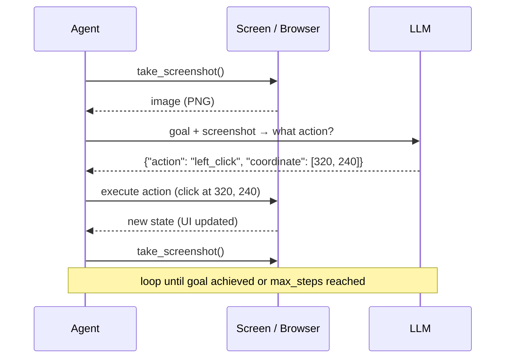

# Concepts: Agents That Control Computers

## The Problem

The modern web has thousands of UIs that offer no programmatic API. Consider:

- A government benefits portal that only works through its web form
- A legacy internal tool where the vendor refuses to build an API
- A desktop application for data entry with no automation interface
- A competitor's website you want to monitor for price changes

The only way to automate these is to interact with them the same way a human does: look at the screen, decide what to do, and act. **Computer use gives AI agents exactly this capability.**

---

## How Computer Use Works

Computer use is a perception-action loop:

1. **Screenshot** — capture the current state of the screen as an image
2. **LLM perceives** — the model receives the screenshot and the goal
3. **LLM decides** — the model outputs a structured action (e.g., click at coordinates, type text)
4. **Execute** — the action is executed on the real screen (or a virtual display)
5. **Repeat** — take another screenshot and loop until the goal is achieved



---

## The Anthropic Computer Use API

Anthropic's computer use is a beta feature available on Claude 3.5 Sonnet (and later). It adds a special **computer tool** to the tools list.

```python
import anthropic

client = anthropic.Anthropic()

response = client.messages.create(
    model="claude-3-5-sonnet-20241022",
    max_tokens=1024,
    tools=[
        {
            "type": "computer_20241022",
            "name": "computer",
            "display_width_px": 1280,
            "display_height_px": 800,
            "display_number": 1,
        }
    ],
    messages=[
        {
            "role": "user",
            "content": [
                {
                    "type": "image",
                    "source": {"type": "base64", "media_type": "image/png", "data": screenshot_b64},
                },
                {"type": "text", "text": "Click the Login button"}
            ]
        }
    ]
)

# The model returns a tool call like:
# {"type": "tool_use", "name": "computer",
#  "input": {"action": "left_click", "coordinate": [640, 400]}}
```

### Supported Actions

| Action | Description | Parameters |
|--------|-------------|-----------|
| `screenshot` | Capture current screen state | none |
| `left_click` | Click at coordinates | `coordinate: [x, y]` |
| `right_click` | Right-click at coordinates | `coordinate: [x, y]` |
| `double_click` | Double-click at coordinates | `coordinate: [x, y]` |
| `type` | Type text at current cursor position | `text: str` |
| `key` | Press a keyboard key or combination | `text: str` (e.g., `"Return"`, `"ctrl+c"`) |
| `scroll` | Scroll at coordinates | `coordinate: [x, y]`, `direction: up/down`, `amount: int` |
| `mouse_move` | Move cursor without clicking | `coordinate: [x, y]` |

---

## Architecture: Running Computer Use Safely

Computer use must run in a **sandboxed environment**. An agent with access to a real desktop can:
- Delete files
- Send emails
- Make purchases
- Access private data

The standard architecture uses a virtual display:

```
┌─────────────────────────────┐
│  Your Application (Python)  │
│  ┌───────────────────────┐  │
│  │  Computer Use Agent   │  │
│  │  (screenshots → LLM   │  │
│  │   → actions)          │  │
│  └──────────┬────────────┘  │
│             │               │
│  ┌──────────▼────────────┐  │
│  │  Playwright / X11     │  │  ← executes actions
│  └──────────┬────────────┘  │
│             │               │
│  ┌──────────▼────────────┐  │
│  │  xvfb / VNC           │  │  ← virtual display (no real screen)
│  └───────────────────────┘  │
│                             │
│  [Isolated Docker container]│
└─────────────────────────────┘
```

**xvfb** (X Virtual Framebuffer) provides a virtual X11 display without a physical monitor. The agent can see and click on this virtual display, completely isolated from the host system.

---

## Computer Use vs Playwright

| | Computer Use | Playwright |
|--|-------------|-----------|
| **How it works** | LLM sees pixels, clicks coordinates | Code controls browser DOM directly |
| **What it can automate** | Any UI visible on screen, including non-web | Web pages only |
| **Reliability** | Lower — depends on visual understanding and coordinate precision | Higher — uses stable CSS selectors and element IDs |
| **Speed** | Slow — screenshot + LLM call per action | Fast — direct DOM manipulation |
| **Maintenance** | Low — adapts to UI changes automatically | High — selectors break when UI changes |
| **Setup** | Complex — needs sandbox, virtual display | Simple — `pip install playwright` |

**Decision rule:**

```
Has a stable API? → Use the API
Has stable DOM structure? → Use Playwright
Dynamic/unknown/legacy UI? → Computer Use
No DOM access at all? → Computer Use
```

The best production pattern is **Playwright-first with computer use fallback**: try structured automation first, fall back to computer use when the DOM approach fails.

---

## Key Challenges

### 1. Visual Grounding

The LLM must map a natural-language description ("click the blue Submit button") to exact pixel coordinates on a 1280×800 screenshot. Small UI changes — button moved 20px, color changed — can break the grounding.

### 2. Coordinate Precision

A click at coordinate `[325, 241]` vs `[325, 255]` can hit completely different elements. The model must be accurate to within a few pixels. Zooming in on specific UI regions before clicking improves accuracy.

### 3. Dynamic UIs

Single-page applications re-render asynchronously. The model takes a screenshot, decides to click element X, but by the time the action executes, element X has moved or disappeared. Agents need to verify the screenshot after each action.

### 4. Infinite Loops

If the model's action does not change the UI state (e.g., clicking a disabled button), it may keep trying the same action. A maximum step limit and "state changed" verification are essential.

### 5. Security

An unrestricted computer use agent on a developer's machine can read SSH keys, send emails, make API calls. **Always run computer use in an isolated container.**

---

## Key Terms

| Term | Definition |
|------|-----------|
| **Computer use** | An LLM capability where the model sees screenshots and outputs UI actions |
| **Action space** | The set of actions an agent can take (click, type, scroll, key, screenshot) |
| **Observation space** | The inputs available to the agent (screenshots, page text, HTML) |
| **Grounding** | The ability to map a natural-language description to a specific location on screen |
| **VNC** | Virtual Network Computing — a protocol for remote desktop access, used to expose virtual displays |
| **xvfb** | X Virtual Framebuffer — runs a virtual X11 display without a physical monitor |
| **Sandbox** | An isolated environment (VM or container) where the agent's actions cannot affect the host system |
| **Computer tool** | Anthropic's specific tool definition that enables the computer use API |

---

## Interview Angle

**"What are the main challenges with computer use agents vs API-based automation?"**

Computer use trades reliability for flexibility:

1. **Coordinate precision** — clicking pixels is fragile compared to selecting DOM elements by ID
2. **Latency** — every action requires a screenshot + LLM call (1-3 seconds) vs milliseconds for Playwright
3. **Grounding failures** — the model may misidentify UI elements, especially on dense or non-standard UIs
4. **Security** — unrestricted computer use on a real system is a serious attack surface; sandboxing is mandatory
5. **State verification** — the agent must confirm each action had the intended effect, not just trust the LLM's plan

The right answer is: use computer use only when no structured API or DOM approach is available, always sandbox it, and combine with human-in-the-loop approval for destructive actions.

---

## Common Mistakes

| Mistake | What Goes Wrong | Fix |
|---------|----------------|-----|
| No sandboxing | Agent running on a real desktop can read private files, send emails, make purchases | Always run in a Docker container with xvfb or a cloud VM |
| Not verifying action effects | Agent assumes the click worked; the UI was still loading | Take a new screenshot after each action and verify state changed |
| No step limit | Stuck UI causes the agent to loop forever, burning API credits | Set `max_steps = 20` and break if no progress in N steps |
| Trusting LLM coordinates blindly | Model hallucinates a coordinate off-screen or on the wrong element | Log every action; add a "did the page change?" check after each click |
| Using computer use when Playwright works | 10× slower and less reliable than DOM automation for structured sites | Default to Playwright; use computer use only as a fallback |

---

Next: [Patterns — Computer Use Agent Patterns](./patterns.mdx)
