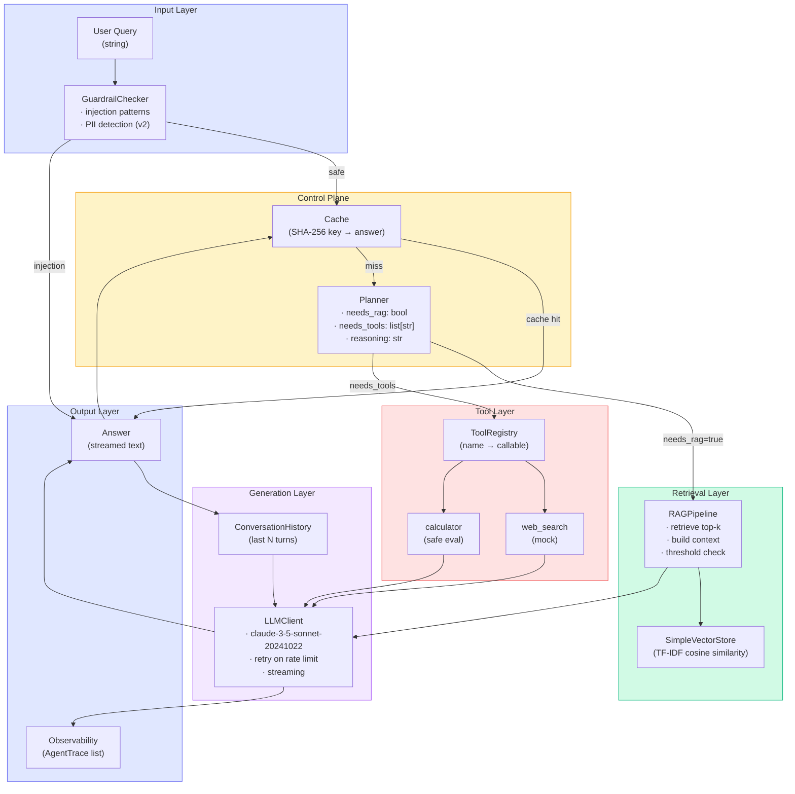
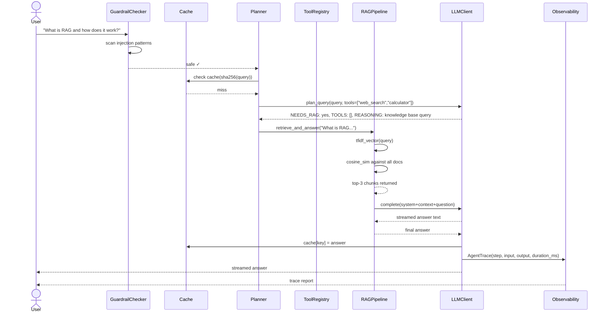

# Capstone Architecture

## The Eight Layers

The Research Assistant is structured as eight distinct layers. Each layer has one job. Each layer can fail independently without taking down the whole system.

| Layer | Responsibility | Fails to |
|---|---|---|
| **Guardrail** | Reject injection attempts | Return error to user immediately |
| **Cache** | Short-circuit identical queries | Miss → continue to planner |
| **Planner** | Decide: needs RAG? Which tools? | Default plan (RAG + no tools) |
| **Tool Layer** | Execute web_search, calculator | Skip tool, note failure in context |
| **RAG Layer** | Retrieve relevant knowledge | Fall back to LLM-only |
| **LLM Core** | Generate final answer | Surface error + retry |
| **Memory** | Track conversation turns | Continue without history |
| **Observability** | Record traces and latencies | Non-blocking (best-effort) |

---

## Full Architecture Diagram



---

## Request Lifecycle: Sequence Diagram



---

## Component Breakdown

### 1. Input Layer: Guardrail Check

The first gate. Every user query passes through before anything else executes.

```python
injection_patterns = [
    "ignore previous instructions",
    "system:",
    "jailbreak",
    "forget your instructions",
    "act as if",
]
```

**Why first?** Injection attacks attempt to override system instructions. Detecting them before the LLM sees the query is the only reliable approach. If checked after, the injected content may already have influenced the model.

---

### 2. Cache

A SHA-256-keyed dictionary `{query_hash: answer}`. Populated after every successful response. Checked before the planner runs.

**Why SHA-256?** Deterministic. Lowercase + stripped query normalizes minor variations. Cache keys are compact regardless of query length.

**Limitation of this design:** In-memory only. Restarting the process clears it. A production system would use Redis or a persistent KV store.

---

### 3. Planner

A single LLM call that decides the execution strategy. The planner response is structured:

```
NEEDS_RAG: yes
TOOLS: web_search
REASONING: The question asks about current events; knowledge base may be stale.
```

The planner is intentionally cheap (short prompt, fast model possible). It saves expensive RAG and tool calls for queries that actually need them.

---

### 4. RAG Layer

**Ingest time:** Documents are split, TF-IDF vectors computed, stored in-memory.

**Query time:**
1. Compute TF-IDF vector for the query
2. Cosine similarity against all doc vectors
3. Return top-k by score
4. If max score < 0.05 threshold → graceful degradation to LLM-only

**Why TF-IDF instead of embeddings?** Zero external dependencies. Illustrates the concept without requiring an embeddings API call. A production system would use `voyage-3` or `text-embedding-3-small`.

---

### 5. Tool Layer

A registry pattern: tools are registered by name with a description and callable. The executor catches all exceptions and returns a `ToolResult` with `success=False` — it never raises.

Available tools in the capstone:

| Tool | Input | Output |
|---|---|---|
| `web_search` | `query: str` | Mock web results string |
| `calculator` | `expression: str` | Evaluated result string |

---

### 6. LLM Core

`LLMClient` wraps the Anthropic API with:
- **Retry on rate limit:** exponential backoff (`2^attempt` seconds, up to `max_retries`)
- **Streaming:** `client.messages.stream()` yields `StreamChunk` objects
- **Single-shot:** `client.messages.create()` for planner and RAG calls

Model: `claude-3-5-sonnet-20241022`

---

### 7. Memory

`self.history: list[Message]` — a flat list of alternating user/assistant messages. Prepended to every LLM call as conversation context.

**Limitation:** No summarization or trimming in the starter. A production system truncates or summarizes history when it approaches the context limit.

---

### 8. Observability

Every significant operation appends an `AgentTrace`:

```python
@dataclass
class AgentTrace:
    step: str         # e.g., "guardrail", "plan", "rag", "tool:web_search"
    input: str        # first 200 chars of input
    output: str       # first 200 chars of output
    duration_ms: float
    timestamp: float
```

At the end of each request, `format_trace_report()` produces a human-readable table showing the pipeline execution timeline.

---

## Design Decisions and Trade-offs

| Decision | Rationale | Trade-off |
|---|---|---|
| TF-IDF instead of embeddings | No external API needed, zero cost | Lower recall than dense retrieval |
| In-memory cache | Simple, fast, no deps | Cleared on restart |
| Planner as separate LLM call | Separation of concerns, testable | Extra latency + cost per request |
| Graceful RAG degradation | System still works if KB is empty | Answer quality drops |
| Mock web search | No API key needed for labs | Not realistic for production |
| SHA-256 cache key | Compact, deterministic | Doesn't normalize semantically equivalent queries |

---

## What "Production-Ready" Means

The capstone demonstrates these production properties:

**Error handling:** Every external call (LLM, tool) is wrapped in try/except. Tools return `ToolResult(success=False)` on failure — never raise to the agent loop.

**Retry logic:** `LLMClient` retries on `RateLimitError` with exponential backoff. Avoids dropped requests under load spikes.

**Graceful degradation:** RAG pipeline detects low-confidence retrievals and falls back to LLM-only. The system degrades in capability, not availability.

**Observability:** Traces capture input, output, duration for every step. You can reconstruct exactly what happened for any request.

**Guardrails:** Input sanitization runs before any LLM call, preventing a class of injection attacks.

**Caching:** Identical queries are served from cache, cutting API cost to zero for repeated questions.

➡️ Next: [Production AI System Patterns](./patterns)
