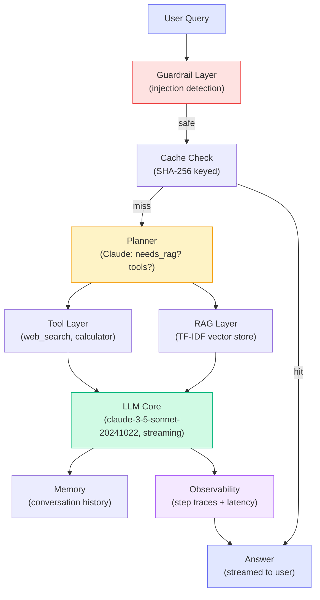

import ConceptMap from '@site/src/components/ConceptMap';

# Chapter 50 — Capstone: Build a Production AI System

## What You'll Build

This is the final chapter of the course. You will build a **Research Assistant** — a complete, production-quality AI agent that ties together every major concept from all four tiers.

The system accepts a natural-language research question and returns a well-sourced answer. Under the hood it runs a full agentic pipeline:

| Capability | Chapter(s) it comes from |
|---|---|
| RAG: embed, store, retrieve | Ch 14, Ch 15, Ch 16 |
| Tool calling (web search, calculator) | Ch 17, Ch 18 |
| Agentic loop with planning | Ch 20, Ch 21 |
| Streaming responses | Ch 19 |
| Conversation history | Ch 22 |
| Prompt injection guardrails | Ch 32, Ch 33 |
| Tracing and observability | Ch 36, Ch 37 |
| Caching for cost reduction | Ch 44 |
| Graceful degradation | Ch 45 |

---

## Time Estimate

| Section | Time |
|---|---|
| Concepts (architecture) | 30 min |
| Patterns (production decisions) | 20 min |
| Lab (6 milestones) | ~3 hours |
| Quiz | 15 min |
| **Total** | **~4 hours** |

---

## Prerequisites

All prior chapters. This capstone assumes you can:

- Call the Anthropic API with streaming and retry logic
- Build and query an in-memory vector store
- Implement a tool registry and executor
- Design a planner that picks tools and strategies
- Write guardrails that detect prompt injection
- Instrument code with structured traces

---

## System Overview

The Research Assistant is composed of eight interconnected layers. Each layer has a single responsibility and fails gracefully when its upstream dependency is unavailable.

---

## What "Production-Ready" Means Here

A production AI system is not just "code that calls an LLM." It is a system that:

1. **Fails gracefully** — if RAG retrieval returns nothing, fall back to direct LLM. If a tool errors, log and continue.
2. **Is observable** — every step is traced with input, output, and duration.
3. **Is safe** — user input is checked for injection before reaching the LLM.
4. **Is efficient** — identical queries hit cache, not the API.
5. **Is testable** — each component can be tested independently by mocking the LLM.

---

## How This Chapter Connects

<ConceptMap
  current="capstone"
  related={["rag-core", "agentic-loop", "tool-use", "streaming", "guardrails", "tracing"]}
/>

---

## What's Next After This Course

Completing this capstone means you can design, build, and reason about production AI systems end to end. The natural next steps are:

- Add a streaming React UI (Chapter 51 preview)
- Connect a persistent vector store (Chroma, Pinecone, Weaviate)
- Add user authentication and per-user history
- Fine-tune a reranker on your domain's query-document pairs
- Deploy behind an AI gateway with rate limiting and cost controls

➡️ Start with: [Capstone Architecture](./concepts)
