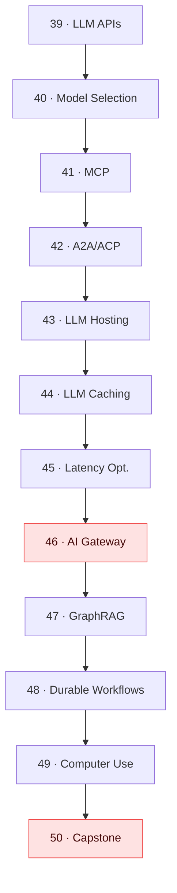

# 🏗️ Tier 4 — Architect

**Pre-requisite:** Tier 3 complete. You can build multi-agent systems, fine-tune models, and run evaluations.

**Goal:** By the end of Tier 4, you can design, deploy, and operate production-grade AI systems — with the cost controls, reliability, and observability that real products require.

---

## Concept Map

## Chapters

| # | Chapter | Time | Lab |
|---|---------|------|-----|
| 39 | LLM APIs Deep-dive | 35 min | Cost estimator CLI |
| 40 | Model Selection Trade-offs | 35 min | Benchmark across models |
| 41 | MCP (Model Context Protocol) | 40 min | Build an MCP server |
| 42 | A2A & ACP Protocols | 35 min | Agent-to-agent delegation |
| 43 | LLM Hosting | 35 min | Run Llama locally with Ollama |
| 44 | LLM Caching | 35 min | Add caching to RAG pipeline |
| 45 | Latency Optimization | 40 min | Benchmark + optimize agent |
| 46 | AI Gateway / Proxy | 40 min | Build a simple LLM gateway |
| 47 | Knowledge Graphs (GraphRAG) | 45 min | GraphRAG vs flat RAG |
| 48 | Durable Agentic Workflows | 40 min | Workflow with checkpoints |
| 49 | Computer Use / UI Agents | 35 min | Simple browser agent |
| 50 | Capstone — Build an AI System | 3–4 hrs | Full production AI system |

**Total estimated time:** ~18 hours

## Milestone Project

The capstone (Ch50) asks you to build a production AI system from scratch that demonstrates everything from Tier 4:
- An **LLM gateway** with provider fallback and caching (Ch44, Ch46)
- **GraphRAG** retrieval for a knowledge domain you choose (Ch47)
- A **multi-step durable workflow** with checkpointed state (Ch48)
- **Cost tracking** and latency monitoring (Ch39, Ch45)
- **Evals** validating output quality (Ch32, from Tier 3)

import DocCardList from '@theme/DocCardList';

<DocCardList />
