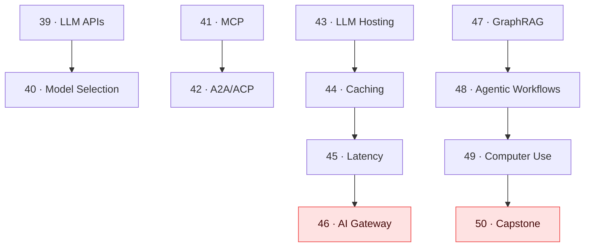

# 🏗️ Tier 4 — Architect

**Pre-requisite:** Tier 3 complete. You've shipped something real.

**Goal:** By the end of Tier 4, you can design production-grade AI systems, implement LLM protocols, optimize for latency and cost, and build a full agent system from scratch.

---

## Concept Map

## Chapters

| # | Chapter | Time | Lab |
|---|---------|------|-----|
| 39 | LLM APIs Deep-dive | 40 min | Cost estimator CLI |
| 40 | Model Selection Trade-offs | 35 min | Benchmark across models |
| 41 | MCP (Model Context Protocol) | 50 min | Build an MCP server |
| 42 | A2A & ACP Protocols | 45 min | Agent-to-agent delegation |
| 43 | LLM Hosting | 40 min | Run Llama with Ollama |
| 44 | LLM Caching | 35 min | Semantic cache for RAG |
| 45 | Latency Optimization | 40 min | Benchmark + optimize an agent |
| 46 | AI Gateway / Proxy | 45 min | Build a simple LLM gateway |
| 47 | Knowledge Graphs (GraphRAG) | 50 min | GraphRAG vs flat RAG |
| 48 | Agentic Workflows | 50 min | Durable workflow with checkpoints |
| 49 | Computer Use / UI Agents | 45 min | Simple browser agent |
| 50 | Capstone | 3–4 hrs | Full agent system from scratch |

**Total estimated time:** ~12 hours + capstone
